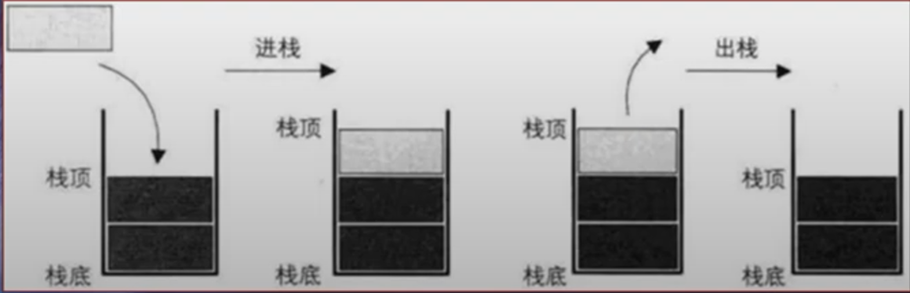

<!--
 * @Author: East
 * @Date: 2021-12-08 01:03:38
 * @LastEditTime: 2021-12-08 02:07:09
 * @LastEditors: Please set LastEditors
 * @Description: 栈结构
 * @FilePath: \forGreaterGood\algorithm\03-栈.md
-->

# 栈结构

## 认识栈

- 数组
  - 数组是一种线性结构，并且可以在数组的任意位置插入和删除数据
  - 但是有时候，我们为了实现某些功能，必须对这种任意性加以限制
  - 而栈和队列就是比较常见的受限的线性结构
- 栈结构示意图 
  - 受限的线性表，后进先出(LIFO last in first out)
  - 栈顶 --- 栈底
  - 入栈 --- 出栈

## 栈的应用

- 生活中类似于栈的结构
  - 自助餐的托盘
  - 收到的邮件
- 函数调用栈
  - 例：A 调用 B，B 调用 C，C 调用 D
    1. 调用 --> 入栈
    2. 栈的顺序：栈底 A -> B -> C -> D 栈顶
    3. 执行完毕 --> 出栈

## 实现栈结构

- 实现栈结构有两种比较常见的方式
  - 基于数组实现
  - 基于链表实现

### 基于数组实现

> 对数组进行包装，外部是栈，内部其实是数组

1. function 的实现

   ```js
   function Stack() {
     // 栈中的属性
     this.items = [];

     //* 栈的相关操作 */
     // 1. push(item)
     this.push = (item) => {
       this.items.push(item);
     };

     // 都有的方法更适合用原型方法 -- 我的 js 都学到哪里去了呜呜呜，完全忘记了
     Stack.prototype.push = function (item) {
       this.items.push(item);
     };

     // 2. pop()
     Stack.prototype.pop = function () {
       return this.items.pop();
     };

     // 3. peek() -- 返回栈顶元素，但不对栈做任何修改
     Stack.prototype.peek = function () {
       return this.items[this.items.length - 1];
     };

     // 4. isEmpty() -- 如果栈里没有任何元素，就返回 true，否则 false
     Stack.prototype.isEmpty = function () {
       return this.items.length === 0;
     };

     // 5. size() -- 返回元素个数
     Stack.prototype.size = function () {
       return this.items.length;
     };

     // 6. toString() -- 将栈结构的内容以字符串形式返回
     Stack.prototype.toString = function () {
       return this.items.join(" ");
     };
   }

   // 栈的使用
   var s = new Stack();
   ```

2. class 的实现 见 03-code.js
