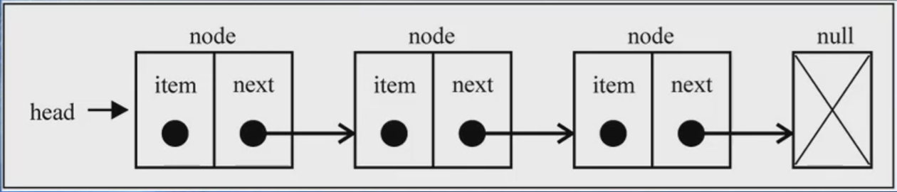
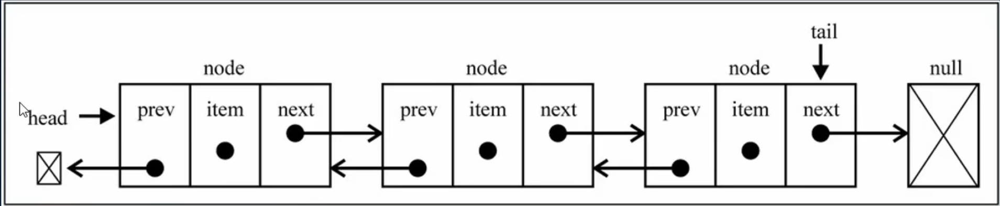

<!--
 * @Author: East
 * @Date: 2021-12-16 21:54:40
 * @LastEditTime: 2022-02-14 05:56:34
 * @LastEditors: Please set LastEditors
 * @Description: 链表
 * @FilePath: \forGreaterGood\algorithm\05-链表.md
-->

# 链表

## 一、链表以及数组的缺点

> 链表和数组一样，可以用于存储一系列的元素，但是链表和数组的实现机制完全不同。(学了链表就开始厌旧了 hhh)

### 1.1 回顾数组

1. 要存储多个元素，数组(或称为列表)可能是最常用的数据结构
2. 几乎每种编程语言都有默认实现数组结构
3. 但数组也有很多缺点
   1. 数组的创建通常需要申请一段**连续的内存空间(一整块的内存)**，并且大小是固定的(大多数编程语言的数组都是固定的)，所以当**当前数组不能满足容量需求**时，需要**扩容**。(一般情况下是申请一个更大的数组，比如 2 倍，然后将原数组中的元素复制过去)
   2. 在**数组开头或中间位置插入数据的成本很高**，需要进行大量**元素的位移**
   3. 尽管 JavaScript 的 Array 类方法可以帮助我们做这些事，但背后的原理依然是这样

### 1.2 链表的优势

- 不同于数组，链表中的元素在内存中**不必是连续的空间**
- 链表的每个元素由一个存储**元素本身的节点**和一个**指向下一个元素的引用**(有些语言成为指针 or 连接)组成
- 链表的优点
  1. 内存空间不是必须连续的，可以充分利用计算机的内存，实现灵活的内存动态管理
  2. 链表不需要在创建时就确定大小，并且大小可以无限地延伸下去
  3. 链表在**插入和删除**数据时，时间复杂度可以达到 O(1)，相对数组效率高很多
- 链表的缺点
  1. 链表访问任何一个位置的元素时，都需要从头开始访问。(无法跳过第一个元素访问任何一个元素)
  2. 无法通过下标直接访问元素，也需要从头一个个访问，直到找到对应元素

## 二、链表到底是什么？



1. 类似于火车头

## 三、链表结构的封装

### 3.1 单向列表

```js
function LinkedList() {
  // 1. 封装内部类：节点类
  function Node(data) {
    this.data = data;
    this.next = null;
  }
  // 2. 属性
  this.head = null;
  this.length = 0; // 用于记录链表的长度

  // 3. 封装方法
  //   3.1 append(data) --- 向列表尾部添加一个新的项
  //      3.1.1 创建新节点
  //      3.1.2 判断是否添加的是第一个节点，是，则 header 指向 新节点
  //      3.1.3 不是，则找到最后一个节点，将该节点的 next 指向新节点
  //      3.1.3 长度需要 +1
  //   3.2 insert(position, data) --- 向列表的特定位置插入一个新的项
  //      3.2.1 对 position 进行越界判断，过大过小都哒咩
  //      3.2.2 根据 data 创建新节点
  //      3.2.3 情况一：插入 position= 0 位置
  //      3.2.3 情况二：插入其他位置
  //      3.2.3 length +=1
  //   3.3 get(position) --- 获取对应位置的元素
  //   3.4 indexOf(data) --- 返回元素在列表中的索引。如果没有则返回 -1
  //   3.5 update(position, data) --- 修改某个位置的元素
  //   3.6 removeAt(position) --- 从列表的特定位置移除一项
  //      3.6.1 越界判断
  //      3.6.2 if position === 0, this.header = this.header.next
  //      3.6.2 else, ...
  //   3.7 remove(data) --- 从列表移除一项
  //   3.8 isEmpty()
  //   3.9 size()
  //   3.10 toString() --- 只输出元素的值
}
```

### 3.2 双向链表



#### 3.2.1 单向链表与双向链表的对比

- 单向链表
  - 原理
    - 只能**从头遍历到尾**(一般)，或者**从尾遍历到头**
    - 也就是说链表相连的过程是**单向**的
    - 实现的原理是上一个链表中有一个指向下一个的引用
  - 缺点
    - 可以很轻松地到达下一个节点，但回到上一个节点却很难
- 双向链表
  - 原理
    - 既可以**从头遍历到尾**，又可以**从尾遍历到头**
    - 即链表的过程是**双向**的
    - 实现原理：一个节点既有**向前连接的引用**，又有一个**向后连接的引用**
  - 缺点
    - 每次插入 or 删除某个节点时，需要**处理四个引用**，而不是两个，即实现起来更困难
    - 相比于单向链表，占用的内存空间更大一些
  - 特点
    1. 一个 head 和一个 tail 分别指向头部和尾部的节点
    2. 每个节点都由三部分组成：prev, item, next
    3. 双向链表第一个节点的 prev = null
    4. 双向链表的最后一个节点的 next = null

#### 3.2.2 双向链表的实现

```js
function DoublyLinkedList() {
  // 1. 包含的属性
  this.head = null;
  this.tail = null;
  this.length = 0;

  // 2. 内部类：节点类
  function Node(data) {
    this.prev = null;
    this.data = data;
    this.next = null;
  }

  /* 3. 常见操作的封装 */
  // 3.1 append(data)
  // 3.2 insert(position, data)
  // 3.3 get(position)
  // 3.4 indexOf(data)
  // 3.5 update(position, data)
  // 3.6 removeAt(position)
  // 3.7 remove(data)
  // 3.8 isEmpty()
  // 3.9 size()
  // 3.10 toString()
  // 3.11 forwardString() --- 返回正向遍历的节点字符串形式
  // 3.12 backwordString() --- 返回反向遍历的节点字符串形式
}
```
