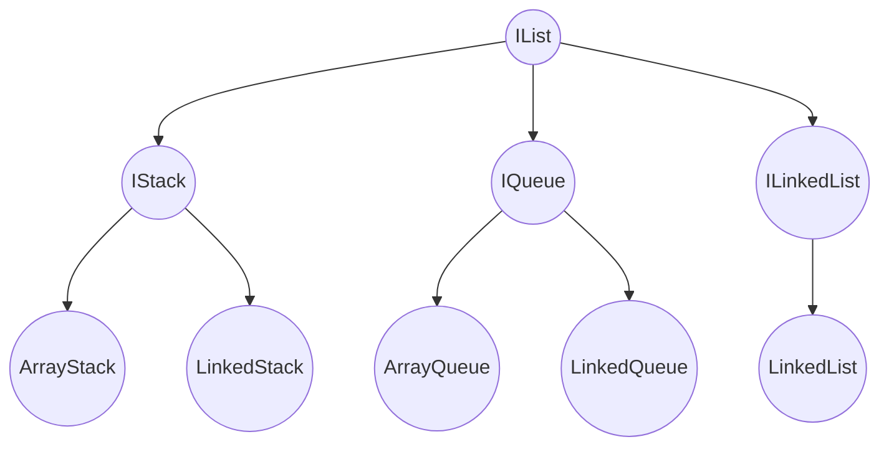

# 数据结构与算法

编程尽头，数据结构。—— coderwhy

- 编程的目的：对数据进行处理
  - 开发能力的重要指标：以什么样的方式存储和处理数据更加方便、高效
- 数据结构与算法的本质：**一门专门研究数据如何组织、存储和操作的科目**
  - Nicklaus Wirth: Algorithm + Data Structures = Programs
- 数据结构
  - 组织和管理数据的方式
  - 常见的数据结构
    - 数组 Array
    - 栈结构 Stack
    - 队列 Queue
    - 链表 LinkedList
    - 堆结构 Heap
    - 树结构 Tree
    - 散列表(哈希表) Hash
    - 图结构 Graph
- 算法

  - 解决问题的方法和步骤
  - 定义

    - 一个有限的指令集，每条指令的描述不依赖于语言
    - 接受一些输入(有些情况不需要输入)
    - 产生输出
    - 在有限步骤之后终止

## 零、总结

### 0.1 大 O 表示法 Big O notation

- 在德国数论学家爱德蒙·兰道的著作中推广，因此有时又被称为兰道符号(Landau symbols)
- 常用于分析算法效率
- 常用函数阶
  | 符号 | 名称 |
  | --- | --- |
  | O(1) | 常数 |
  | O(logn) | 对数 |
  | O(n) | 线性，次线性 |
  | O(nlogn) | 线性对数 or 对数线性、拟线性、超线性 |
  | O(n²) | 平方 |
  | O(n^c) | 多项式 or 代数阶 |
  | O(c^n) | 指数 or 几何阶 |

### 0.2 各种数据结构对比

- 数组
  - 优点：
    1. 根据下标值访问效率很高
  - 缺点：
    1. 插入 / 删除 时需要有大量的位移操作，效率很低
- 链表
  - 优点：
    1. 插入 / 删除 效率很高
  - 缺点：
    1. 查找效率很低，需从头依次访问
    2. 插入和删除之前需从头访问至对应的数据
- 哈希表
  - 优点：
    1. 插入 / 查询 / 删除 时 效率都很高
  - 缺点：
    1. 空间利用率不高
    2. 元素无序，不能按照固定的顺序遍历所有元素
    3. 不能快速找到哈希表中的最大值 or 最小值
- 树

### 0.3 延伸

#### 0.3.1 二叉搜索树

> 二叉搜索树的节点为类(以 Person 为例)

- 比较大小：对类添加一个方法 `valueOf()`
  - 比较时才有效，`===` 没有意义且为 `false`

```ts
class Person {
  name: string;
  age: number;

  constructor(name: string, age: number) {
    this.name = name;
    this.age = age;
  }

  valueOf() {
    return this.age;
  }
}
```

- 打印出想要的数据格式

```ts
import { PrintableNode } from 'hy-algokit';

class TreeNode<T> extends Node<T> implements PrintableNode {
  get value() {
    const data = this.data as Product;
    return data.name + data.age;
  }
}
```

### 0.4 一些网站

- 在线数据结构演练
  - [https://www.cs.usfca.edu/~galles/visualization/Algorithms.html](https://www.cs.usfca.edu/~galles/visualization/Algorithms.html)
  - [https://visualgo.net/en/heap?slide=1](https://visualgo.net/en/heap?slide=1)
  - [http://btv.melezinek.cz/binary-heap.html](http://btv.melezinek.cz/binary-heap.html)

## 一、线性结构 - 数组

### 1.1 线性结构 Linear List

- 定义
  - 由 n(n>=0) 个数据元素(结点) a[0], a[1], a[2], ..., a[n-1] 组成的有限序列
- 分类
  - 受限的线性结构
    - 栈
    - 队列
  - 不受限的线性结构
    - 数组
    - 链表

### 1.2 数组 Array 结构

- 重要的数据结构
  - 几乎每种编程语言都会提供的一种**原生数据结构**
  - 可以借助于数组来实现其他的数据结构，如 Stack, Queue, Heap
- 内存连续(通常情况下)

  - if 知道下标值 -> 访问效率非常高

- 补充知识
  1. 早期的 JS 实现数组时，内存不是连续的：以类似链表的方式实现

## 二、栈结构 Stack

### 2.1 特性

- 受限的线性结构
  - 可以在数组的**任意位置**插入和删除数据 => 对这种任意性加以限制
  - => 后进先出 Last In First Out LIFO
- 概念
  - 栈顶 -- 栈底
  - 进栈/入栈/压栈 -- 出栈/退栈

### 2.2 代码实现

- 常见操作
  - `push(element)`: 入栈
  - `pop()`: 出栈
  - `peek()`: 返回栈顶元素，不对栈做任何修改
  - `isEmpty(): boolean`
  - `size()`
- 定义栈的接口 IStack
  ```ts
  interface IStack<T> {
    push(element: T): void;
    pop(): T | undefined;
    peek(): T | undefined;
    isEmpty(): boolean;
    size(): number;
  }
  ```

#### 2.2.1 ArrayStack 基于数组实现

```ts
class ArrayStack<T> implements IStack<T> {
  private data: T[] = [];

  push(element: T): void {
    this.data.push(element);
  }
  pop(): T | undefined {
    return this.data.pop();
  }
  peek(): T | undefined {
    return this.data[this.data.length - 1];
  }
  isEmpty(): boolean {
    return this.data.length === 0;
  }
  size(): number {
    return this.data.length;
  }
}
```

#### 2.2.2 LinkedStack 基于链表实现

TODO

### 2.3 笔试题

#### 2.3.1 十进制转二进制

```ts
function decimalToBinary(decimal: number): string {
  const stack = new ArrayStack<number>();

  while (decimal > 0) {
    stack.push(decimal % 2);
    decimal = Math.floor(decimal / 2);
  }

  let res = '';
  while (!stack.isEmpty()) {
    res += stack.pop()!;
  }

  return res;
}
```

#### 2.3.2 有效的括号

```ts
function isValid(s: string): boolean {
  const stack = new ArrayStack<string>();
  const len = s.length;
  for (let i = 0; i < len; i++) {
    switch (s[i]) {
      case '(':
        stack.push(')');
        break;
      case '[':
        stack.push(']');
        break;
      case '{':
        stack.push('}');
        break;
      default:
        if (s[i] !== stack.pop()) {
          return false;
        }
        break;
    }
  }
  return stack.isEmpty();
}
```

## 三、队列结构 Queue

### 3.1 特性

- 受限的线性结构
  - 先进先出 First In First Out
    - 在树的层序遍历中使用
- 概念
  - 前端 front
  - 后端 rear

### 3.2 代码实现

- 常见操作
  - `enqueue(element)`：入队
  - `dequeue()`：出队
  - `peek()`：队列第一个元素
  - `isEmpty()`
  - `size()`
- 定义队列的接口 IQueue
  ```ts
  interface IQueue<T> {
    enqueue(element: T): void;
    dequeue(): T | undefined;
    peek(): T | undefined;
    isEmpty(): boolean;
    size(): number;
  }
  ```

#### 3.2.1 基于数组实现

```ts
class ArrayQueue<T> implements IQueue<T> {
  private data: T[] = [];

  enqueue(element: T): void {
    this.data.push(element);
  }
  dequeue(): T | undefined {
    return this.data.shift();
  }
  peek(): T | undefined {
    return this.data[0];
  }
  isEmpty(): boolean {
    return this.data.length === 0;
  }
  size(): number {
    return this.data.length;
  }
}
```

#### 3.2.1 基于链表实现

> 更合适

### 3.3 笔试题

#### 3.3.1 击鼓传花

> 一组数据，每次数到 n 的人淘汰，直至剩下最后一个人

```ts
// 烫手山芋（笑
function hotPotato(names: string[], num: number): number {
  if (names.length === 0) return -1;

  const queue = new ArrayQueue<string>();

  for (const name of names) {
    queue.enqueue(name);
  }

  while (queue.size() > 1) {
    for (let i = 1; i < num; i++) {
      queue.enqueue(queue.dequeue()!);
    }
    queue.dequeue();
  }

  const leftName = queue.dequeue()!;
  const index = names.findIndex((name) => name === leftName);
  return index;
}
```

#### 3.3.2 约瑟夫环

```ts
function lastRemaining(n: number, m: number): number {
  const queue = new ArrayQueue<number>();
  for (let i = 1; i < n + 1; i++) {
    queue.enqueue(i);
  }

  while (queue.size() > 1) {
    for (let i = 1; i < m; i++) {
      queue.enqueue(queue.dequeue()!);
    }
    queue.dequeue();
  }

  return queue.dequeue()!;
}
```

## 四、链表结构 LinkedList

### 4.1 特性

- 数组的缺点
  1. 创建时需要申请一段**连续的内存空间**，大小固定 => if 不能满足容量需求 => need 扩容
  2. 在数组的开头 or 中间位置插入数据的成本很高，需要进行大量元素的位移
- 链表的优点
  1. 内存空间不是必须连续的 => 实现灵活的内存动态管理
  2. 不需要在创建时就确定大小，可以无限延伸下去
  3. 插入和删除数据时，时间复杂度可以达到 O(1)
- 链表的缺点
  1. 访问任何一个位置的元素，都需要从头开始访问
  2. 无法通过下标值直接访问元素，需从头开始访问

### 4.2 代码实现

> ILinkedList 继承自 IList 接口

- 节点类 `Node`
  - properties
    - `value`
    - `next`
- 链表类 `LinkedList`
  - properties
    - `private head`
    - `private length`
  - methods
    - `append(element)`
    - `traverse()`: 遍历
    - `insert(position, element): boolean`: 越界情况判断
    - `removeAt(position): T | null`
    - `get(position): T | null`
    - `update(position, element)`
    - `indexOf(element)`
    - `remove(element)`
    - `isEmpty()`
    - `size(): number`
    - `private getNode(position): Node<T> | null`

### 4.3 笔试题

#### 4.3.1 删除链表中的节点

> 给一个需要删除的节点，但无法访问第一个节点

```ts
class ListNode {
  val: number;
  next: ListNode | null;

  constructor(val?: number, next?: ListNode | null) {
    this.val = val === undefined ? 0 : val;
    this.next = next === undefined ? null : next;
  }
}

function deleteNode(node: ListNode | null): void {}
```

#### 4.3.2 反转链表

```ts
class ListNode {
  val: number;
  next: ListNode | null;

  constructor(val?: number, next?: ListNode | null) {
    this.val = val === undefined ? 0 : val;
    this.next = next === undefined ? null : next;
  }
}

/** 1. 栈 */
function reverseList(head: ListNode | null): ListNode | null {}
/** 2. 迭代 */
/** 3. 递归 */
```

### 4.4 总结

> 对 Array, Stack, Queue, LinkedList 进行对比

|                      | Array | Stack      | Queue      | LinkedList | HashMap |
| -------------------- | ----- | ---------- | ---------- | ---------- | ------- |
| 在任意位置插入和删除 | √     | × 后进先出 | × 先进后出 | √          |         |
| 查找效率             | 高    |            |            | 低         | 高      |
| 插入/删除 效率       | 低    |            |            | 高         | 高      |
| 空间利用率           | 高    | 高         | 高         | 高         | 低      |

- 抽取相同的接口 IList

<script type="module">
  import mermaid from 'https://cdn.jsdelivr.net/npm/mermaid@10/dist/mermaid.esm.min.mjs';
  mermaid.initialize({ startOnLoad: true });
</script>



## 五、哈希表 HashTable

### 5.1 介绍

- 基于数组实现
- 相对于数组
  - 优点：
    - 提供非常快速的插入-删除-查找操作
      - 插入和删除的时间复杂度：O(1)
    - 比树的速度还快，且编码更容易
  - 缺点：
    1. 存放的数据没有顺序，所以不能以一种固定的方式来遍历其中的元素
    2. 通常情况下，key 不允许重复，不能用相同的 key 来保存不同的元素

### 5.2 概念

- 哈希化：将大数组转化为数组范围内下标的过程
- 哈希函数：通常我们会将单词转成大数字，大数字在进行哈希化的代码实现放在一个函数中，这个函数称为哈希函数。
  - 应具备的优点
    1. 快速的计算
       - 尽量少的乘法和除法
       - 霍纳法则
    2. 均匀的分布
       - 尽可能将元素映射到不同的位置
       - 使用质数
         - 哈希表的长度
         - N 次幂的底数
           - 一般使用 31(Java) or 37
- 哈希表：最终将数据插入到的这个数组，对整个结构的封装，称为一个哈希表
- 地址冲突
  - 常见解决方案
    - 链地址法(拉链法)
    - 开放地址法：寻找空白的单元格来存放地址冲突的数据
      - 线性探测
        - 存在聚集问题
      - 二次探测：比线性探测的步长更大些
        - 可以解决一部分的聚集问题
      - 再哈希法
- 装填因子 loadFactor
  - = 元素数 / 数组长度
  - `> 0.75` 时需要扩容

### 5.3 代码实现

1. 哈希函数 `hashFunc(key: string, max: number): number`
   - `key`: 转换的 key
   - `max`: 数组长度
   - `returns`: 索引值
2. 哈希表 `hashTable<T = any>`
   - 数据格式: `[[[k, v], [k, v]], [[k, v], [k, v]], []]`
     - `[k, v]`: 元组类型
   - 属性：
     - `private storage: [string, T][][]`: 用于存放链地址法中的链(数组)
     - `private length: number = 7`: 数组的长度
     - `private count: number`: 已经存放的个数
   - 方法
     - `put(key: string, value: T)`: 插入 & 修改操作 -- because key 唯一， if key 不存在 => 插入；if key 存在 => 修改
     - `private hashFunc(key: string, max: number): number`: 将哈希函数放入到哈希表中
     - `get(key: string): T | undefined`
     - `delete(key: string): T | undefined`
     - `private resize(newLength: number)`: 扩容 or 缩容
       - 缩容：loadFactor < 0.25
     - `private getNextPrime(num: number): number`
3. utils
   - `function isPrime(num: number): boolean`

### 5.4 总结

理论居多

## 六、树结构 Tree

### 6.1 概念

- 树 Tree: n (n>=0) 个节点构成的有限集合
  - 空树: n = 0
- 节点的度 Degree: 节点的子树个数
- 树的度: 树的所有节点中最大的度数
- 叶节点 Leaf
- 父节点 Parent
- 兄弟节点 Sibling
- 子节点 Child
  - 左子节点
  - 右子节点
- 路径和路径长度
  - 由父节点开始
- 节点的层次 Level
- 树的深度 Depth
  - 从 根 到 n 的唯一路径长，根的深度为 0
- 树的高度 Height
  - 从 n 到一片树叶的最长路径长，所有树叶的高度为 0

### 6.2 二叉树

> 几乎所有的树，都可以用二叉树模拟

- 二叉树：树种每个节点最多只能有两个子节点
  - 可以为空，即没有节点
  - 若不为空
    - 根节点 root
    - 左子树 TL
    - 右子树 TR
  - 表现形态 
  - 特性
    1. 第 i 层的最大节点数为：2^(i - 1), i >= 1
    2. 深度为 k 的二叉树有最大节点总数为 2^k - 1, k >= 1
    3. 对任何非空二叉树 T，若 n0 表示叶节点的个数，n2 是度为 2 的非叶节点个数，那么二者满足关系 n0 = n2 + 1
- 完美二叉树 Perfect Binary Tree
  - 又称 满二叉树 Full Binary Tree
- 完全二叉树 Complete Binary Tree
  - 要求
    1. 除二叉树最后一层外，其他各层的节点数都达到最大个数
    2. 且最后一层从左向右的叶节点连续存在，只缺右侧若干节点
  - 完美二叉树 是 特殊的完全二叉树
- 存储方式
  - 数组
    - 常用于存储完全二叉树
    - 非完全二叉树会造成空间浪费
  - 链表
- 二叉搜索树 BST Binary Search Tree
  - 要求：
    - 为空
    - 不为空：
      1. 非空左子树的所有键值小于其根节点的键值
      2. 非空右子树的所有键值大于其根节点的键值
      3. 左、右子树本身也都是二叉搜索树
  - 二分查找思想
- 缺点
  - if 插入的数据是有序的，会变成非平衡树，类似于链表 => 插入/查找效率由 O(logn) 变为 O(n)
    - 解决办法
      1. AVL 树
      2. 红黑树

### 6.3 二叉搜索树的代码实现

- 节点 TreeNode
  - 继承自 Node 类
- 常见操作
  - 插入
    - `insert(value)`
    - `private insertNode(node, newNode)`
  - 查找
    - `search(value): boolean`
    - `getMinValue(): T | null`
    - `getMaxValue(): T | null`
  - 遍历: 取决于 root 访问时机
    - `preOrderTraverse(fn)`: 先序
    - `preOrderTraverseNode()`
    - `inOrderTraverse()`: 中序
    - `inOrderTraverseNode()`
    - `postOrderTraverse()`: 后序
    - `postOrderTraverseNode()`
    - `levelOrderTraverse()`: 层序
  - 删除
    - `remove(value): boolean`
      1. 节点不存在
      2. 节点存在
         1. 叶子节点
            - 根节点
            - isLeft
            - isRight
         2. 非叶子节点
            1. 有一个子节点
            2. 有两个子节点 —— 找一个可替换的节点
               - 前驱节点 precursor
               - 后继节点 successor
                 1. 后继节点 是 删除节点的右子节点
                 2. 不是
                    1. 后继节点有右子节点
                    2. 没有

## 七、图结构 Graph

### 7.1 介绍

- 一组顶点：通常用 V(Vertex) 表示顶点的集合
- 一组边：通常用 E(Edge) 表示边的集合
  - 顶点和顶点之间的连线
  - 有向 or 无向
- 七桥问题 —— 欧拉的解答
  - 连通图可以一笔画的充要条件：
    1. 奇点的数目不是 0 个就是 2 个
    2. 连到一点的边的数目如果是奇数条，就称为奇点
    3. 如果是偶数条，就成为偶点
    4. 要想一笔画成，必须中间点均是偶点
    - 即，有来路比有一条去路，奇点只可能在两端

### 7.2 术语

- 顶点
- 边
- 相邻顶点：由一条边连接在一起的两个顶点
- 度：一个顶点的度是相邻顶点的数量
- 路径
  - 简单路径：不包含重复的顶点
  - 回路：第一个顶点和最后一个顶点相同的路径
- 无向图
- 有向图
- 无权图 -带权图
- 表示图的方式
  - 邻接矩阵 —— 二维矩阵
    - 问题：稀疏矩阵 => 空间浪费
  - 邻接表
    - 存储方式：数组、链表、字典(哈希表)
    - 问题：
      - 计算“出度”比较简单
      - “入度”计算较为麻烦，需要构建一个“逆邻接表”
        - 但实际开发中 “入度” 使用较少

### 7.3 代码实现

- `class Graph<T>`
  - 属性
    - `private verteces: T[]`
    - `private adjoinList: Map<T, T[]>`
  - 方法
    - `addVertex(vertex: T)`
    - `addEdge(v1: T, v2: T)`
    - `bfs(vertex)`: Breadth-First Search 广度优先搜索
      - 基于队列
    - `dfs(vertex)`: Depth-First Search 深度优先搜索
      - 基于栈 or 递归

## 八、高阶链表

### 8.1 循环链表

> 基于单向链表重构而成

- 单向链表
  ```ts
  interface ILinkedList<T> extends IList<T> {
    append(value: T): void;
    traverse(): void;
    insert(value: T, position: number): boolean;
    removeAt(position: number): T | null;
    get(position: number): T | null;
    update(value: Ｔ, position: number): boolean;
    indexOf(value: T): number;
    remove(value: T): T | null;
  }
  ```
  - 属性
    - private 属性 -> protected 属性
    - 新增 tail 属性，总是指向尾部
  - 方法
    - 重构
      - `append`
      - `insert`
      - `removeAt`
      - `traverse`
    - 新增
      - `private isTail(node: Node<T>)`
- CircularLinkedList
  - 方法
    - 重新实现
      - `append`
      - `removeAt`

### 8.2 双向链表

- 节点
  ```ts
  class DoubleNode<T> extends Node<T> {}
  ```
- DoublyLinkedList
  - 方法
    - `prepend`
    - `postTraverse`：从尾部开始遍历

## 九、堆结构 Heap

### 9.1 介绍

- 一种特殊的树形数据结构，使用**完全二叉树**来实现
  - 基本使用二叉堆
    - 最大堆：每一个节点都 <= child 节点
    - 最小堆：每一个节点都 >= child 节点
- 最值问题(适用)
  - 方案选择
    - if 数组/链表：O(n)
      - 可以通过排序，但排序时间复杂度最小的算法是 O(nlogn)
    - if 哈希表：哒咩
    - if 二叉搜索树：O(logn)
      - 需要维护好树的平衡时，时间复杂度才是 O(logn)
  - Top K 问题
    - 常用解决方案：排序算法、快速选择算法、堆结构
- 二叉堆
  - 用树形结构表示 -> 一棵完全二叉树
  - 实现方式 -> 数组
    - 节点索引关系
      - root：`i = 0`
      - parent: `Math.floor((i - 1) / 2)`
      - left child: `2 * i + 1`
      - right child: `2 * i + 2`

### 9.2 核心概念

- 最大堆
  - insert: 每次插入元素后，需要对堆进行重构，以维护最大堆的性质
    - **上滤 percolate up**:
      1. 将新元素与其 parent 元素进行比较
      2. if 新元素 <= parent 元素，符合最大堆特性，跳出循环
      3. else swap(新元素，parent 元素)，并再次比较新元素与 新的 parent 元素
      4. 循环结束条件：新元素到达根节点位置
  - extract: 每次删除元素后，需要对堆进行重构，以维护最大堆的性质
    1. 交换 root 与最后一个节点
    2. **下滤 percolate down**:
       1. 与 Max(leftChild、rightChild) 比较
       2. if root < Max => 交换位置，再次进入步骤 1
       3. else 跳出循环
       4. 循环结束条件：不存在 leftChild (because of 完全二叉树的特性) === 是叶子节点
  - In-place heap construction: 原地建堆，指建立堆的过程中，不使用额外的内存空间，直接在原有数组上进行操作
    1. 从第一个非叶子节点开始，进行下滤操作

### 9.3 代码实现

- Heap
  - 常见属性
    - `data`: 数组，存储堆中元素
    - `length`
  - 常见方法
    - `private swap(i: number, j: number): void`: 交换
    - `insert(value)`
    - `heapify_up()`: 上滤
    - `extract/delete()`: 从堆中删除最大/最小元素
    - `heapify_down()`: 下滤
    - `peek()`
    - `isEmpty()`
    - `size()`
    - `buildHeap(arr: T[])`: 通过一个列表来构造堆(原地建堆)
- 数据模拟：`[19, 100, 36, 17, 3, 25, 1, 2, 7]`
- 数据打印

  ```ts
  import { cbtPrint } from 'hy-algokit';

  cbtPint(arr);
  ```

## 十、高阶队列

### 10.1 双端队列(双向队列)

#### 10.1.2 代码实现

- ArrayDeque
  - 继承自 ArrayQueue
  - 方法
    - `addFront(value: T)`
    - `removeBack(): T | undefined`

### 10.2 优先级队列 Priority Queue

- 概念
  - 通过优先级的大小，决定出队顺序
  - 实现 by：数组、链表、堆...
    - **堆**，最常用的实现方式
- 实现
  1. PriorityNode(可为任意类)
     - 属性
       - `priority: number`
       - `value`
     - 方法
       - `valueOf()`: 用于比较大小(js 的特性)
  2. PriorityQueue
     - 属性
       - `heap: Heap<PriorityNode>`
     - 方法
       - `enqueue(value)`：入队
       - `dequeue(): T | undefined`
       - `peek()`
       - `isEmpty()`
       - `size()`

## 九、平衡二叉树

- 平衡树 Balanced Tree
  - 一种特殊的二叉搜索树
  - 目的：通过一些特殊的技巧来维护**树的平衡**，从而保证树的搜索、插入、删除等操作的时间复杂度都很低
    - if 平衡，时间复杂度 O(logN)
    - if 不平衡，-> 近似链表结构 -> 时间复杂度 O(N)
- 保持平衡的方法
  1. 限制插入、删除的节点(不允许这样的操作) --> 真是个大聪明...
  2. 随机插入 or 删除后，通过某种方式观察树是否平衡
     - if 不平衡，通过特定的方式，让树保持平衡
- 常见的平衡二叉搜索树
  - AVL 树
    - 搜索效率高于红黑树，但插入和删除操作效率低于红黑树
    - 通常用于各种需要**高效查询的数据结构**
  - 红黑树
    - 被广泛用于操作系统内核、数据库、编译器等软件中的数据结构
    - 原因：插入、删除、查找操作都具有较低的时间复杂度
  - Splay 树
  - Treap
  - B-树

### 9.1 AVL 树

- 概念
  - 由 G.M.Adelson-Velsky 和 E.M.Landis 在 1962 年发明
  - 一种**自平衡二叉树**
    - 二叉搜索树的一个变体
    - 在保证二叉搜索树性质的同时，通过**旋转**操作保证树的平衡
  - 权值
    - 每个节点都有一个权值，该权值代表了已该节点为根节点的左右子树高度差
    - 在 AVL 树中，任意节点的权值只有三种可能：1 or -1 or 0
    - 又名 平衡因子
  - 三个节点
    - grand/root
    - 轴心 Pivot / parent
    - current
- 实现
  - AVLTreeNode
    - 属性
      - `value`
      - `left`
      - `right`
      - `parent`
    - 方法
      - `getHeight()`：获取每个节点的高度
      - `getBalanceFactor()`：权重，左边高度 - 右边高度
      - **`get isBalanced()`：直接判断当前节点是否平衡**
      - `public get higherChild()`：获取高度更高的子节点
        - if leftChildHeight === rightChildHeight, 当前节点为左子节点就返回 this.left，否则 this.right
          - 一般做法
          - 实际上如果左右子树高度相等，基本不会来到这个函数
      - `rightRotation()`：右旋转(this === root)
    - 可以直接继承自 TreeNode
  - AVLTree
    - 树的情况与旋转：(从不平衡节点自上而下观察)
      1. 左左情况 -> 右旋
         - root.left + pivot.left
         1. 处理 pivot
         2. 处理 pivot.right
         3. 处理 root
         4. 处理 pivot 的挂载(不同情况)
            1. pivot.parent 为 `undefined` or `null`
            2. pivot 是父节点的左子节点
            3. pivot 是父节点的右子节点
      2. 右右情况 -> 左旋
      3. 左右情况 -> 左旋，右旋
      4. 右左情况 -> 右旋，左旋
    - 方法
      - `rebalance(root: AVLTree<T>)`：根据不平衡节点的情况(LL/RR/LR/RL)让子树平衡
      - `protected createNode(value: T): AVLTreeNode<T>`：模板模式
      - 重构二叉搜索树的 `insert` 方法
      - `checkBalance(node: AVLTreeNode<T>)`：模板方法 again
        - 添加与删除导致的优化
      - 重构二叉搜索树的 `delete` 方法

### 9.2 红黑树 Red-black Tree

- 概念
  - 1972 年由鲁道夫·贝尔发明，被称为**对称二叉 B 树**
  - 一种自平衡二叉查找树
  - 特性
    1. 节点是红色 or 黑色
    2. 根节点是黑色的
    3. 每个叶子节点都是黑色的空节点 (NIL 节点，空节点)
       - because 在红黑树中，黑色节点的数量表示从根节点到该节点的黑色节点数量
    4. 每个红色节点的两个子节点都是黑色(从每个叶子到根的所有路径上不能有两个连续的红色节点)
       - 保证红色节点的颜色不会影响树的平衡
       - 保证红色节点的出现不会导致连续的红色节点
    5. **从任一节点到其每个叶子节点的所有路径都包含相同数目的黑色节点**
       - in order to 保证红黑树的平衡性
       - 前面的性质可以说都是为这一条服务
    - => 确保了红黑树的关键特性：从根到叶子的最长可能路径，不会超过最短可能路径的两倍长。原因如下：
      - 性质 5 决定了最长路径和最短路径必须拥有相同的黑色节点数量
      - 路径最短时：全部是黑色节点 n 个
      - 路径最长时：黑色节点 n 个，红色节点 n - 1 个
        - 性质 2：根节点是黑色的
        - 性质 3：叶子节点都是黑色的
        - 性质 4：两个红色节点不能相连
      - so 最短路径：n - 1
      - so 最长路径： n + (n - 1) - 1 = 2n - 2 = 2(n - 1)
- 性能分析
  - AVL 树是一种平衡度更高的二叉搜索树 => 搜索效率：AVL 树更高，红黑树更低
  - 但 AVL 树为了维护这种平衡性，在插入和删除操作时，通常会进行更多的旋转操作 => 效率比红黑树较低
  - 它们的搜索、删除、添加时间复杂度都是 O(logn)，但在细节上会有一些差异
  - => 红黑树综合效率更高

### 9.3 AVL 树 和 红黑树的区别

| 性质     | AVL 树          | 红黑树   |
| -------- | --------------- | -------- |
| 节点标识 | 权值            | 颜色     |
| 平衡性   | -1 <= 权值 <= 1 | 基本平衡 |

## 十、排序算法 Sorting Algorithm

- 定义：
  - 通俗：研究如何对一个集合进行高效排序的算法
  - 维基：在计算机科学与数学中，一个排序算法是一种能将一串资料按照特定排序方式排列的算法
- 重要且耗时
  - => 计算机科学中广泛的课题，有一套成熟的方案
- 分类标准
  - 计算的时间复杂度：使用大 O 表示法，也可以实际测试消耗的时间
  - 内存使用量(甚至其他电脑资源)：比如外部排序，使用磁盘来存储排序数据
  - 稳定性：稳定排序算法会让原本有相等键值的记录维持相对次序
  - 排序的方法：插入、交换、选择、合并等等

### 10.1 冒泡排序 Bubble Sort

#### 10.1.1 思路


1. 通过两两比较相邻的元素并交换它们的位置，从而使整个序列按照顺序排列
2. 该算法一趟排序后，最大值总会移到数组最后面，那么接下来就不用再考虑这个最大值
3. 一直重复这样的操作，最终就可以得到排序完成的数组

=> 最大的元素会经由交换慢慢“浮”到数组的尾端，故名“冒泡排序”

#### 10.1.2 代码

- es6 交换代码：`[m, n] = [n, m]`
- 如果在前一轮没有交换，则代表数组已经有序，无需再比较

#### 10.1.3 总结

- 时间复杂度
  - 最好情况：O(n)
  - 最坏情况：O(n²)
  - 平均情况：O(n²)
- 冒泡排序适用于数据规模较小的情况，对于大数据量的排序会变得很慢
- 实现简单、容易理解，适用于学习排序算法的初学者
- 在实际应用中，冒泡排序效率很低，并不常用
  - 会被其他更高效的排序算法所替代，如快速排序、归并排序...

### 10.2 选择排序 Selection Sort

#### 10.2.1 思路

1. 在未排序的数列中找到最小(大)元素，然后将其存放到数列的起始位置
2. 再从剩余未排序的元素中继续寻找最小(大)元素，然后放到已排序序列的末尾
3. 以此类推，直至所有元素均排序完毕

#### 10.2.2 代码

#### 10.2.3 总结

- 时间复杂度
  - 最好情况：O(n²)
  - 最坏情况：O(n²)
  - 平均情况：O(n²)
- 适用于数据规模较小的情况，对于大数据量的排序会变得很慢
- 实现简单、容易理解，适用于学习排序算法的初学者
- 在实际应用中，效率很低，并不常用
  - 会被其他更高效的排序算法所替代，如快速排序、归并排序...

### 10.3 插入排序 Insertion Sort

#### 10.3.1 思路

1. 假设数组的第一个元素已经排好序了
2. 从第二个元素开始，不断与前面的有序数组元素进行比较
3. 如果当前元素小于前面的有序数组元素，则把当前元素插入到前面的合适位置
4. 否则继续与有序数组元素进行比较
5. 以此类推，以至整个数组都有序
6. 循环步骤 2-5，直至最后一个元素

#### 10.3.2 代码

#### 10.3.3 总结

- 时间复杂度
  - 最好情况：O(n)
  - 最坏情况：O(n²)
  - 平均情况：O(n²)
- 效率比较
  - if 数组部分有序，插入排序可以比冒泡和选择更快
  - if 数组完全逆序，则插入排序的时间复杂度更高

### 10.4 **归并排序 Merge Sort**

熟练程度：掌握

#### 10.4.1 思路

1. 将待排序的数组分成若干个子数组
2. 将相邻的子数组归并成一个有序数组
3. 将这些有序数组归并(merge)成一个整体有序的数组

- 分治法：将大问题分解成小问题

#### 10.4.2 代码

#### 10.4.3 总结

- 时间复杂度
  - 最好情况：O(logn)
  - 最坏情况：O(nlogn)
  - 平均情况：O(nlogn)
- 一种非常高效的排序算法
  - 核心思想：分治
- 需要额外的数组空间
  - 但在每次函数调用完即销毁

### 10.5 **快速排序 Quick Sort**

熟练程度：掌握

- 又称划分交换排序 Partition-exchange Sort

#### 10.5.1 思路

- 基于分治思想

1. 将一个大数组分成两个小数组，递归地对两个小数组进行排序
2. 选择一个基准元素(pivot)，将数组分成左右两部分，左部分的元素都 <= 基准元素，右部分的元素都 > 基准元素
3. 对左右两部分分别进行递归调用快速排序
4. 最终将整个数组排序

#### 10.5.2 代码

#### 10.5.3 总结

- 时间复杂度：主要取决于**基准元素的选择**、**数组的划分**、**递归深度**等因素
  - 最好情况：O(nlogn)
  - 最坏情况：O(n²)
    - 这种情况出现的概率非常小
    - 优化策略：三数取中法 or 随机选择基准元素
  - 平均情况：O(nlogn)
- 原地排序算法，不需要额外的数组空间

### 10.6 **堆排序 Heap Sort**

熟练程度：掌握

#### 10.6.1 思路

- 基于比较的排序算法，核心思想：使用二叉堆来维护一个有序序列
  - 常用最大堆(保证每个节点都比它的子节点大)

1. 首先构建一个最大堆
2. 将堆的根节点与堆的最后一个元素交换 => 最大值就被放在了正确的位置上
3. 将堆的大小 - 1，并将剩余元素重新构建成一个最大堆
4. 不断重复这个过程，直到堆的大小为 1
5. => 得到一个有序的序列

- 堆排序与选择排序有一定的关系，都利用了“选择”这个基本操作
- 时间复杂度：O(nlogn)
- 空间复杂度：O(1)

#### 10.6.2 代码

#### 10.6.3 总结

- 高效的排序算法
- 但排序过程不稳定
- 可以应用于大规模数据的排序

### 10.7 希尔排序 Shell Sort

#### 10.7.1 思路

1. 定义一个增量序列 d1, d2, ..., dk，一般增量序列最后一个元素为 1，即 dk = 1
2. 以 dk 为间隔将待排序的序列分成 dk 个子序列，对每个子序列进行插入排序
3. 缩小增量，对缩小后的每个子序列进行插入排序，直到增量为 1

- 增量选择
  - Hibbard 增量序列
    - 增量算法：2^k - 1
    - 最坏复杂度：O(N^3/2)；平均复杂度：O(N^5/4)
  - Sedgewick 增量序列
    - 增量算法：`9*4^i - 9*2^i + 1`
    - 最坏复杂度：O(N^4/3)；平均复杂度：O(N^7/6)

#### 10.7.2 代码

#### 10.7.3 总结

- 从历史角度而言，是一种非常重要的排序算法，解除了人们对于排序算法时间复杂度 O(n²) 的固有认知
- 时间复杂度取决于步长序列的选择，目前最优的步长序列仍未被证明，因此该排序算法的时间复杂度依然是一个开放的问题

## 十四、动态规划 Dynamic Programming

简称 DP

### 14.1 概念

- 定义
  - 维基：是一种在数学、管理科学、计算机科学、经济学和生物信息学中使用的，通过把原问题分解为相对简单的子问题的方式求解复杂问题的方法。
    - 分而治之：子问题互相独立
    - 动态规划：第二个问题求解时需要用到第一个问题的解 => 即，各个问题之间相互有联系
- 核心思想：将问题划分为若干个子问题，并在计算子问题的基础上，逐步构建出原问题的解
- 步骤：
  1. 定义状态
     - 表示子问题的解
  2. 确定状态转移方程
  3. 初始化状态
  4. 计算原问题的解(最终答案)

### 14.2 认识动态规划

> 以斐波那契数列为例

1. 递归算法
2. 记忆化搜索 Memorization
   - 将结果存储在某一个数组中
   ```ts
   function fib(n: number, memo: number[] = []): number {
     // f(0) 和 f(1)
     if (n <= 1) return n;
     if (!memo[n]) memo[n] = fib(n - 1, memo) + fib(n - 2, memo);
     return memo[n];
   }
   ```
3. 动态规划
   ```ts
   function fib(n: number) {
     const memo: number[] = [];
     for (let i = 0; i <= n; i++) {
       if (i <= 1) memo[i] = i;
       else memo[i] = memo[i - 1] + memo[i - 2];
     }
     return memo[n];
   }
   ```
   1. 定义状态：dp 数组保留斐波那契数列中每一个位置对应的值(状态)
      - dp[x] 表示 x 位置对应的值(状态)
   2. 状态转移方程：dp[i] = dp[i - 1] + dp[i - 2]
      - 一般写在循环中
   3. 设置初始化状态：dp[0]/dp[1]
   4. 计算最终的结果
   ```ts
   // 最终版
   function fib(n: number) {
     const dp: number[] = [0, 1];
     for (let i = 2; i <= n; i++) {
       dp[i] = dp[i - 1] + dp[i - 2];
     }
     return dp[n];
   }
   ```
4. 动态规划 - 状态压缩
   - f(n) = f(n - 1) + f(n - 2)
   ```ts
   function fib(n: number): numbaer {
     if (n <= 1) return n;
     let prev = 0;
     let current = 1;
     for (let i = 2; i <= n; i++) {
       const newValue = prev + current;
       prev = current;
       current = prev;
     }
     return current;
   }
   ```

### 14.3 案例练习

1. 爬楼梯(跳台阶)
2. 买卖股票的最佳时机
3. 最大子数组和
