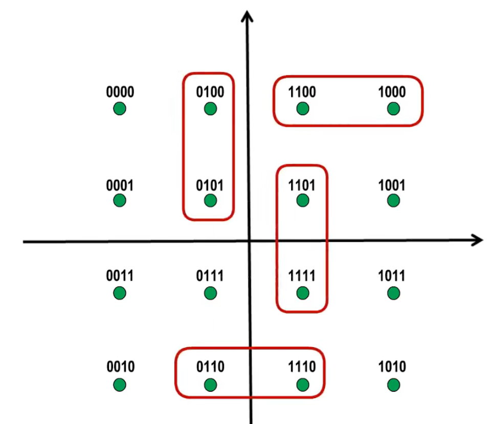

<!--
 * @Author: East
 * @Date: 2022-03-14 21:05:19
 * @LastEditTime: 2022-03-19 20:32:05
 * @LastEditors: Please set LastEditors
 * @Description: 打开koroFileHeader查看配置 进行设置: https://github.com/OBKoro1/koro1FileHeader/wiki/%E9%85%8D%E7%BD%AE
 * @FilePath: \forGreaterGood\computer-networks\Ch2物理层.md
-->

# Ch2. 物理层

## 1. 物理层的基本概念

### 1.1 传输媒体

- 导引型传输媒体
  - 双绞线
  - 同轴电缆
  - 光纤
- 非导引型传输媒体
  - 微波通信(2 ~ 40 GHz)

计算机网络体系结构的物理层，就是要**解决在各种传输媒体上传输 0 和 1 的问题**，进而给数据链路层提供透明传输比特流的服务。

### 1.2 物理层协议的主要任务

> 物理层为解决传输比特流 0 和 1 的任务，主要有以下四个任务

- 机械特性
  - 指明接口所用接线器的形状和尺寸、引脚数目和排列、固定和锁定装置
- 电气特性
  - 指明在接口电缆的各条线上，出现的**电压的范围**
- 功能特性
  - 指明某条线上出现的某一电平的**电压表示何种意义**
- 过程特性
  - 指明对于不同功能的各种可能**事件的出现顺序**

### 1.3 总结

1. 物理层考虑的是怎样才能在连接各种计算机的传输媒体上传输数据比特流
2. 物理层为数据链路层屏蔽了各种传输媒体的差异，使数据链路层只需要考虑如何完成本层的协议和服务，而不必考虑网络具体的传输媒体是什么。

## 2. 物理层下面的传输媒体

> 传输媒体不属于计算机网络体系结构的任何一层，如果非要将它添加到体系中那么只能放在物理层

### 2.1 导引型传输媒体

1. 同轴电缆 
   - 分类
     - 基带同轴电缆(50 Ω)：数字传输，过去用于局域网
     - 宽带同轴电缆(75 Ω)：模拟传输，目前主要用于有线电视
   - 缺点
     1. 价格较贵
     2. 布线不够灵活和方便
   - 后续
     - 随着集线器的出现，双绞线取代了同轴电缆
2. 双绞线
   - 分类
     - 无屏蔽双绞线 UTP 电缆 
     - 屏蔽双绞线 STP 电缆 
   - 绞合的作用
     1. 低于部分来自外界的电磁波感染
     2. 减少相邻导线的电磁干扰
   - 解析
     | 绞合线类别 | 带宽 | 线缆特点 | 典型应用 |
     | --------- | --- | ------- | ------- |
     | 3 | 16 MHz | 2 对 4 芯双绞线 | 模拟电话；曾用于传统以太网(10Mbit/s) |
     | 4 | 20 MHz | 4 对 8 芯双绞线 | 曾用于令牌局域网 |
     | 5 | 100 MHz | 与 4 类相比增加了绞合度 | 传输速率不超过 100Mbit/s 的应用 |
     | 5E(超五类) | 125 MHz | 与 5 类相比衰减更小 | 传输速率不超过 1Gbit/s 的应用 |
     | 6 | 250 MHz | 与 5 类相比改善了串扰等性能 | 传输速率高于 1Gbit/s 的应用 |
     | 7 | 600 MHz | 使用屏蔽双绞线 | 传输速率高于 10Gbit/s 的应用 |
     - 目前家庭带宽主要为 1Gbit/s，选用超五类双绞线电缆可以满足
     - 考虑到未来发展，在经济条件允许的条件下，推荐使用 6A 类双绞线电缆，以满足万兆局域网的需求
3. 光纤

   - 室外四芯光缆(举例说明) 
     - 由于光纤非常细，所以必须将它做成很结实的光缆
     - 一根光缆包括的光纤数量：1 ~ n\*100 根
     - 结构
       - 纤芯直径
         - 多模光纤：50 ~ 62.5 微米
         - 单模光纤：9 微米
       - 包层直径：≤ 125 微米
       - 工作波长
         - 0.85 微米 --- 衰减较大
         - 1.30 微米 --- 衰减较小
         - 1.55 微米 --- 衰减较小
     - 优点
       1. 通信容量大 (25000 ~ 30000 GHz 的带宽)
       2. 传输损耗小，远距离传输时更加经济
       3. 抗雷电和电磁干扰性能好。这在大电流脉冲干扰的环境下尤为重要
       4. 无串音干扰，保密性好，不易被窃听
       5. 体积小，重量轻
     - 缺点
       1. 切割需要专用设备
       2. 光电接口设备较贵
     - 工作原理：
       1. 当光从**高折射率**的媒体射向**低折射率**的媒体时，其**折射角将大于入射角**
       2. 因此，如果**入射角足够大**，就会**出现全反射**，即光碰到包层时，反射回纤芯
     - 分类
       - 多模光纤
         1. 由于色散(模式、材料、波导色散)，光在多模光纤中传输一定距离后必然产生信号失真(脉冲展宽)
         2. 因此，多模光纤只适合**近距离传输**(建筑物内)
         3. 发送光源：发光二极管；接收检测：光电二极管 ---- 便宜
       - 单模光纤
         1. 没有模式色散，在 1.31 微米波长附近材料色散和波导色散大小相等符号相反，两者正好抵消
         2. 单模光纤适合**长距离运输**且衰减小，但其制造成本高，对光源要求高
         3. 发送光源：激光发生器；接收检测：激光检波器 ---- 昂贵

4. 电力线

### 2.2 非导引型传输媒体

1. 无线电波
2. 微波
   - 卫星
     - 传播时延：200 - 300 ms
   - 地面接力通信
3. 红外线
   - 家用电器
   - 以前的笔记本电脑
   - 道理
     1. 点对点无线传输
     2. 直线传输，中间不能有障碍物，传输距离短
     3. 传输速率低(4Mb/s ~ 16Mb/s)
4. 可见光
   - LiFi 处于实验中

## 3. 传输方式

### 3.1 串行传输 + 并行传输

- 串行传输
  - 一个比特一个比特依次传输
  - 一条数据传输线路
  - 计算机外部使用
- 并行传输
  - n 个比特传输
  - n 条数据传输
  - 计算机内部使用

并行传输的速度是串行传输的 n 倍，但成本高

### 3.2 同步传输 + 异步传输

- 同步传输
  - 数据块以稳定的比特流的形式传输，字节之间没有间隔
  - 接收端在每个比特信号的中间时刻进行检测
  - 不同设备的时钟存在差异：因此，在传输大量数据的过程中所产生的判别时刻的累计误差会导致接收端对比特信号的判别错位
  - 需要采取方式使收发双方时钟同步的方法
    1. 外同步：在收发双方之间添加一条单独的时钟信号线
    2. 内同步：发送端将时钟同步信号编码到发送数据中一起传输(例如曼彻斯特编码)
- 异步传输
  - 以字节为独立的传输单位，字节之间的时间间隔不是固定的
  - 接收端仅在每个字节的起始处对字节内的比特实现同步：为此，通常要在每个字节前后分别加上起始位和结束位
  - 总而言之
    1. 字节之间异步(时间间隔不固定)
    2. 字节中的每个比特仍要同步(各比特的持续时间是相同的)

### 3.3 单工 + 半双工 + 双工

- 单工
  - 单向通信
  - 一条信道
- 半双工
  - 双向交替通信：可以双向通信，但不能同时进行
  - 两条信道
- 双工
  - 双向同时通信
  - 两条信道

## 4. 编码与调制

### 4.1 码元

- 定义：在使用时间域的波形表示数字信号时，代表不同离散数值的基本波形
- 即，构成信号的一个波形
- 传输媒体与信道关系
  - 单工：一个传输媒体内只有一个信道
  - 半双工/双工：两个信道
  - 信道复用技术：多个信道

### 4.2 常用编码

- 不归零编码 
  - 接收端如何判断码元的个数？
    - 需要**额外一根传输线来传输时钟信号**，使发送方和接收方同步
    - 对于计算机网络，**宁可利用这跟传输线传输数据信号**，而不是传输时钟信号
  - 不归零编码存在同步问题，计算机的传输不采用这种方法
- 归零编码 
  - **每个码元传输结束后信号都要“归零”**，所以接收方只要在信号归零后进行采样即可，不需要单独的时钟信号
  - 实际上归零编码相当于把时钟信号用“归零”的方式编码在了数据之内，这成为“**自同步**”信号
  - 但是，归零编码中大部分的**数据带宽**，都用来传输“归零”而**浪费**掉了
  - 优缺点：
    - 优点：自同步
    - 缺点：效率低
- 曼彻斯特编码 
  - 码元中间时刻的跳变既表示时钟，又表示数据
  - 传统以太网，10Mb/s
- 差分曼彻斯特编码 
  - 跳变仅表示时钟
  - 码元开始处电平是否发生变化表示数据
  - 比曼彻斯特变化少，更适合较高的传输速率

例题：若下图为 10 BaseT 网卡接收到的信号波形，则该网卡收到的比特串是（ ）
A. 0011 0110 B. 1010 1101 C. 0101 0010 D. 1100 0101

解析：10 BaseT 中的 10 表示带宽为 10Mb/s，base 表示基带传输，T 表示双绞线。--> 使用曼彻斯特编码，正跳变和负跳变表示 0 还是 1，可自行假设

### 4.3 调制方法

- 基本调制方法 
  - 使用基本调制方法，一个码元只能包含 1 个比特的信息
- 混合调制
  - **频率**和**相位**是相关的，即频率是相位随时间的变化率。所以**一次只能调制频率和相位两个中的一个**
  - 通常情况下，**相位**和**振幅**可以结合起来一起调制，称为**正交振幅调制 QAM**
  - QAM - 16 
    - 12 种相位
    - 每种相位有 1 or 2 种振幅可选
    - 可以调制除 16 种码元(波形)，每种码元可以对应表示 4 个比特
    - 码元和 4 个比特的对应关系采用格雷码，任意两个相邻的码元只有 1 个比特不同

## 5. 信道的极限容量

### 5.1 失真

- 输入信号波形 -> 通信质量较好的信道 -> 失真不严重，可以识别
- 输入信号波形 -> 通信质量很差的信道 -> 失真严重，无法识别

- 失真因素

  1. 码元传输速率
  2. 信号传输距离
  3. 噪声干扰
  4. 传输媒体质量

### 5.2 奈氏准则

在假定的理想条件下，为了避免码间串扰，码元传输速率是有上限的。

- 码元传输速率
  - 计算
    - 理想低通信道的最高码元传输速率 = 2W Baud = 2W 码元/秒
    - 理想带通信道的最高码元传输速率 = 2 Baud = 2 码元/秒
    - W：信道带宽(Hz)
  - Baud：波特，即 码元/秒
- 码元传输速率又称为波特率、调试速率、波形速率 or 符号速率。它与比特率有一定关系：
  - 当 1 个码元只携带 1 比特的信息量时，则波特率(码元/秒) 与 比特率(比特/秒)在数值上是相等的。
  - 当 1 个码元只携带 n 比特的信息量时，则波特率(码元/秒) 转换成 比特率(比特/秒) 时，数值要乘以 n。
- 要提高信息传输速率(比特率)，就必须设法使每一个码元能携带更多个比特的信息量，这需要采用多元制。
- 实际信道所能传输的最高码元速率，要明显低于奈氏准则给出的上限数值。
  - 因为这是理想情况，没有考虑传输距离、噪声干扰等

### 5.3 香农公式

带宽受限且有高斯白噪声干扰的信道的极限信息传输速率。

- 信道带宽或信道中信噪比越大，信息的极限传输速率就越高
- 在实际信道上能够达到的信息传输速率要比该公式的极限传输速率低不少。
  - 因为在实际信道中，信号还要受到其他一些损伤，如各种脉冲干扰、信号在传输中的衰减和失真等，这些因素在香农公式中并未考虑

### 5.4 总结

- 在信道带宽一定的情况下，根据奈氏准则和香农公式，要想**提高信息的传输速率**就必须采用**多元制**(更好的调制方法)和努力**提高信道中的信噪比**
- 自从香农公式发表后，各种**新的信号处理和调制方式就不断出现**，其目的都是为了尽可能地**接近香农公式给出的传输速率极限**

【例题】在无噪声情况下，若某通信链路的带宽为 3kHz，采用 4 个相位，每个相位具有 4 种振幅的 QAM 调制技术，则该通信链路的最大数据传输速率是（ ）
A. 12kbps B. 24kbps C. 48kbps D. 96kbps
【解析】：

1. 根据奈氏准则可知，该通信链路的最高码元传输速率 = 2 \* 3k = 6k(Baud) = 6k (码元/秒)
2. 采用 4 个相位，每个相位 4 种振幅的 QAM 调制技术，可以调制出 4 \* 4 = 16 个不同的基本波形(码元)，采用二进制对这 16 个不同的码元进行编码，需要使用 4 个比特。换句话说，每个码元可以携带的信息量为 4 比特
3. 综合 1, 2 可知，该通信链路的最大数据传输速率 = 6k(码元/秒) \* 4(比特/码元) = 24k(比特/秒) = 24bps

## 6. 章节小结

## 7. 课后习题

- 题目
  1. 在物理层接口特性中，用于描述每种功能的时间发生顺序的是（ ）
     A. 机械特性 B. 功能特性 C. 过程特性 D. 电气特性
  2. 下列选项中，不属于物理层接口规范定义范畴的是（ ）
     A. 接口形状 B. 引脚功能 C. 物理地址 D. 信号电平
  3. 在无噪声情况下，若某信道链路的带宽为 3kHz，采用 4 个相位，每个相位具有 4 种振幅的 QAM 调制技术，则该通信链路的最大数据传输速率是（ ）
     A. 12kbps B. 24kbps C. 48kbps D. 96kbps
  4. 若某通信链路的数据传输速率为 2400bps，采用 4 相位调制，则该链路的波特率是（ ）
     A. 600 波特 B. 1200 波特 C. 4800 波特 D. 9600 波特
- 解析
  1. C
     - 机械特性：解耦所用接线器的规格问题
     - 电气特性：在接口电缆的各条线上，出现的电压范围
     - 功能特性：某一电平的电压表示何种意义
     - 过程特性：对于不同功能的各种可能事件的出现顺序
  2. C
     - A 接口形状：机械特性
     - B 引脚功能：功能特性
     - C 物理地址：又称硬件地址 or MAC 地址，属于数据链路层的范畴
     - D 信号电平：电气特性
  3. B
     - 默认低通信道，2W Baud
  4. B
