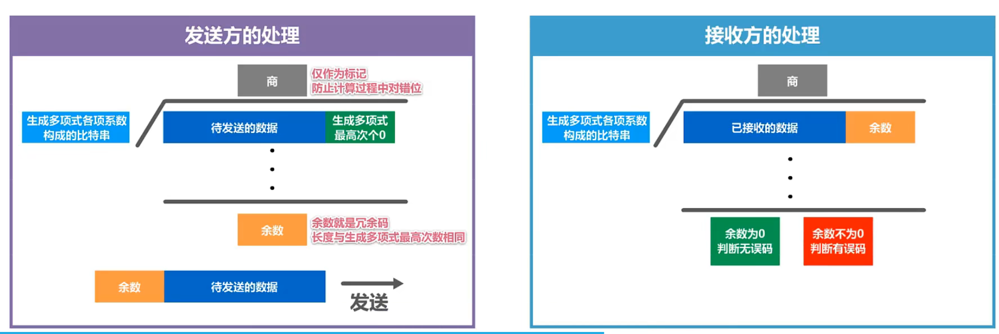
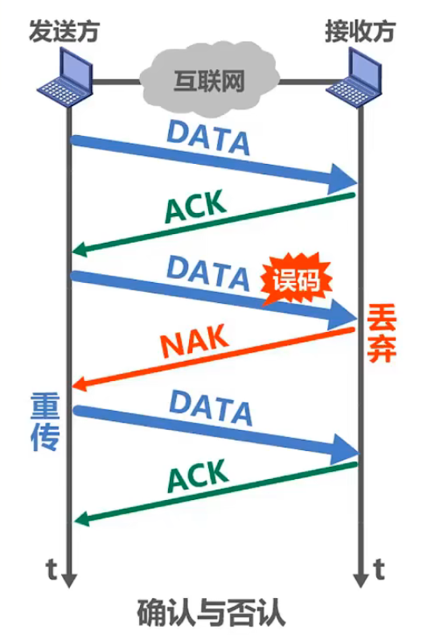

<!--
 * @Author: East
 * @Date: 2022-03-19 20:47:18
 * @LastEditTime: 2022-03-20 19:19:19
 * @LastEditors: Please set LastEditors
 * @Description: 打开koroFileHeader查看配置 进行设置: https://github.com/OBKoro1/koro1FileHeader/wiki/%E9%85%8D%E7%BD%AE
 * @FilePath: \forGreaterGood\computer-networks\Ch3数据链路层.md
-->

# 数据链路层

## 1. 数据链路层概述

### 1.1 名词解析

- 数据链路层在网络体系中所处的位置
- 链路(Link) ：就是从一个结点到相邻结点的一段物理线路，而中间没有任何其他的交换结点
- 数据链路(Data Link)：指把实现通信协议的硬件和软件加到链路上，就构成了数据链路
- 帧：在数据链路层上传输的数据包，又称为帧。
  - 数据链路层以帧为单位传输和处理单位

### 1.2 数据链路层的三个重要问题

- 封装成帧 
  1. 应用层协议数据单元
  2. 应用层协议数据单元 + 运输层协议首部
  3. 应用层协议数据单元 + 运输层协议首部 + 网络层协议首部
  4. 帧尾 + 应用层协议数据单元 + 运输层协议首部 + 网络层协议首部 + 帧头
- 差错检测
  1. 发送方在发送帧之前，基于待发送的数据和检错算法计算出**检错码**，并将其封装在帧尾
     - 以太网版本 2 的 MAC 帧的帧尾 是 4 字节的帧检验序列 FCS 字段
  2. 帧在传输过程中出现了误码
  3. 接收方接收到帧后，通过检错码和检错算法，可以判断出帧在传输过程中是否出现了误码
- 可靠传输

  - 接收方如果检测到误码，是不会接收该帧的，会将其丢弃
  - 如果数据链路层向其上层提供的是**不可靠服务**，那么丢弃就丢弃了，不会再有更多的措施
  - 如果数据链路层向其上层提供的是**可靠服务**，那么就需要其他措施，来确保接收方主机还可以收到被丢弃的这个帧的正确副本 - 即，尽管误码是不能完全避免的，但若能实现发送方发送什么，接收方就能收到什么，就称为可靠传输

### 1.3 使用广播信道的数据链路层(共享式局域网)

- 以上三个问题，是针对使用**点对点信道**的数据链路层来举例的，对于使用广播信道的数据链路层，还需要解决其他问题：
  - 编址问题：源地址 + 目的地址
  - 当总线上多台主机同时使用总线来传输帧时，传输信号就会产生碰撞
    - 以太网采用的协调方法是 使用一种特殊的协议 CSMA/CD
      - 载波监听
      - 多点接入
      - 碰撞检测

## 2. 封装成帧

### 2.1 封装成帧

- 封装成帧：数据链路层将上层交付的协议数据单元添加帧头和帧尾使之成为帧
  - 帧头和帧尾中包含重要的控制信息
  - 帧头和帧尾的作用之一就是 **帧定界**
    - PPP 帧中的帧头和帧尾各有 1 字节的标志
    - 以太网 V2 的 MAC 帧
      - 会在物理层被加上 **8 字节的前导码**
        - 1 字节：帧开始定界符
        - 7 字节：前同步码
      - 规定帧间间隔为 96 比特时间的发送时间 --> 因此不需要结束的帧定界符

### 2.2 透明传输

指**数据链路层对上层交付的传输数据没有任何限制**，就好像数据链路层不存在一样。

- 面向字节的数据链路使用字节填充(或称字符填充)的方法实现透明传输
  - 填充转义字符
- 面向比特的物理链路使用比特填充的方法实现透明传输
  - 每五个连续的 1 后面添加一个 0

### 2.3 总结

- 为了提高帧的传输效率，应当使**帧的数据部分的长度尽可能大些**
- 考虑到差错控制等多种因素，每一种数据链路层协议都规定了帧的数据部分的长度上限，即**最大传送单元 MTU(Maximum Transfer Unit)**

## 3. 差错检测

### 3.1 名词

- 比特差错：实际的通信链路都不是理想的，比特在传输过程中可能会产生差错：1 可能会变成 0，而 0 也可能变成 1。也被称为误码
- 误码率 BER(Bit Error Rate)
  - 在一段时间内，传输错误的比特占所传输比特总数的比率
- 差错检测码：使用差错检测码来检测数据在传输过程中是否产生了比特差错，是数据链路层所要解决的重要问题之一
  - 以太网 V2 的 MAC 帧的帧尾有长度为 4 字节的帧检验序列 FCS 字段
  - PPP 帧的帧尾包含一个长度为 2 字节的帧检验序列 FCS 字段

### 3.2 校验方式

- 奇偶校验
  - 在待发送的数据后面**添加 1 位 奇偶校验位**，使整个数据(包括所添加的校验位在内)中 “1” 的个数为 奇数(奇校验) or 偶数(偶校验)
    - 如果出现 奇位数 的误码，可检出错误；偶位数，则无法检出错误
    - 漏检率较高 ---> 数据链路层一般不会采用这种检测方法
- 循环冗余校验 CRC(Cyclic Redundancy Check) 
  - 收发双方约定好一个**生成多项式 G(X)** 
  - 发送方基于待发送的数据和生成多项式计算出**差错检测码(即冗余码)**，将其添加到待传输数据的后面一起传输
  - 接收方通过生成多项式来计算收到的数据是否产生了误码
  - 示例 
    - 进行异或运算

### 3.3 总结

1. **检错码**只能检测出帧在传输过程中出现了差错，但并**不能定位错误**，因此**无法纠正错误**
2. 要想纠正传输中的差错，可以使用冗余信息更多的**纠错码**进行**前向纠错**。
   - 但纠错码的开销比较大，在计算机网络中较少使用
3. 循环冗余校验 CRC 有很好的检错能力(**漏检率非常低**)，虽然计算比较复杂，但非常**易于用硬件实现**，因此被**广泛应用于数据链路层**
4. 在计算机网络中，通常采用**检错重传方式来纠正传输中的差错** or **仅仅是丢弃检测到差错的帧**，这取决于数据链路层向其上层提供的是可靠传输服务 还是 不可靠传输服务

## 4. 可靠传输

### 4.1 可靠传输的基本概念

- 使用 **差错检测技术**(例如循环冗余校验 CRC)，接收方的数据链路层就可以检测出帧在传输过程中是否出现了误码(比特错误)
- 数据链路层向上层提供的服务类型
  - 不可靠传输服务：**仅仅丢弃有误码的帧**，其他什么也不做
  - 可靠传输服务：想办法实现**发送端发送什么，接收端就收到什么**
- 有线链路 与 无线链路 的区别
  - 一般情况下，**有线链路**的误码率比较低，为了减小开销，并**不要求数据链路层**向上提供**可靠传输服务**。即使出现了误码，可靠传输的问题由其上层处理
  - **无线链路**易受干扰，误码率比较高，因此**要求数据链路层**必须向上层提供**可靠传输服务**
- 传输差错的类型
  - 比特差错
  - 分组丢失
  - 分组失序
  - 分组重复
- **可靠传输服务并不仅局限于数据链路层**，其他各层均可选择实现可靠传输
  - 网络接口层
    - 802.11 无线局域网要求数据链路层实现可靠传输
    - 以太网不要求实现可靠传输
  - 网际层
    - IP 向其上层提供无连接、不可靠传输服务
  - 运输层
    - TCP 向其上层提供 面向连接的可靠传输服务
    - UDP 提供 无连接、不可靠传输服务

可靠传输服务的实现比较复杂，开销也比较大，是否使用可靠传输取决于应用需求。

### 4.2 可靠传输的实现机制

以下三种可靠传输实现机制的基本原理并不仅限于数据链路层，可以应用到计算机网络体系结构的各层协议中。

**不要把思维局限在数据链路层，而应放眼于整个网络体系结构。**

#### 4.2.1 停止 - 等待 协议 SW

##### 4.2.1.1 理想情况

1. 收发双方基于互联网进行通信，而不是局限在一条点对点的数据链路
2. 发送方发送数据分组，接收方收到后对其进行差错检测
   - 若没有误码，则接收该分组，并给发送方发送 确认分组，简称 ACK(Acknowledge character)
   - 若检测到了误码，则丢弃该分组，并给发送方发送 否认分组，简称为 NAK(Negative Acknowledgment)
3. 发送方接收到对所发送数据分组的反馈消息
   - 如果是 ACK，才能发送下一个分组
   - 如果是 NAK，知道之前所发送的分组出现了差错而被接收方拒绝，于是立刻重传该数据分组
4. 然后再发送下一个数据分组，直至发送完毕

因此，发送方每发送一个数据分组，并不能立刻将其在缓存中删除，只有在收到针对该数据分组的确认分组后，才能将其从缓存中删除。

##### 4.2.1.2 实际情况

1. 超时重传 
   - 问题：接收方收不到数据分组，就不会发送 ACK or NAK。如果不采取其他措施，发送方就会一直处于等待接收方 ACK or NAK 的状态
   - 解决：可以在发送方发完一个数据分组时，启动一个**超时计时器**。若到了超时计时器所设置的**重传时间**而发送方仍收不到接收方的任何 ACK or NAK，则重传原来的数据分组
   - 一般可将重传时间选为略大于“从发送方到接收方的平均往返时间”
2. 确认丢失 
   - 为避免分组重复这种传输错误，必须给每个分组带上序号
   - 由于每发送一个数据分组，发送方就停止等待，因此只要保证每发送一个新的数据分组，其发送序号与上次发送的序号不同就可以了。因此用一个比特来编号就够了。
3. 确认迟到 
   - 为避免因确认分组迟到而造成的发送方超时重传问题，需要给确认分组也设置一个序号

##### 4.2.1.3 注意事项

- 接收端检测到数据分组有误码时，将其丢弃并等待发送方的超时重传。但对于误码率较高的点对点链路，为了使发送方**尽早重传**，也可**给发送方发送 NAK 分组**
- 为了让接收方能够判断所受到的数据分组是否是重复的，需要给**数据分组编号**。由于 停止 - 等待 协议的停等特性，**只需 1 个比特**就够了，即编号 0 和 1
- 为了让发送方能够判断所受到的 ACK 分组是否是重复的，需要**给 ACK 分组编号**，所用比特数量**与数据分组编号所用比特数量一样**。数据链路层一般不会出现 ACK 分组迟到的情况，因此在**数据链路层实现 停止 - 等待 协议可以不用给 ACK 分组编号**
- 超时计时器设置的**重传时间**应仔细选择。一般可将重传时间选为**略大于“从发送方到接收方的平均往返时间**
  - 在数据链路层点对点的往返时间比较确定，重传时间比较好设定
  - 然而在运输层，由于端到端往返时间非常不确定，设置合适的重传时间有时并不容易

#### 4.2.2 回退 N 帧 协议 GBN

#### 4.2.3 选择重传 协议 SR
