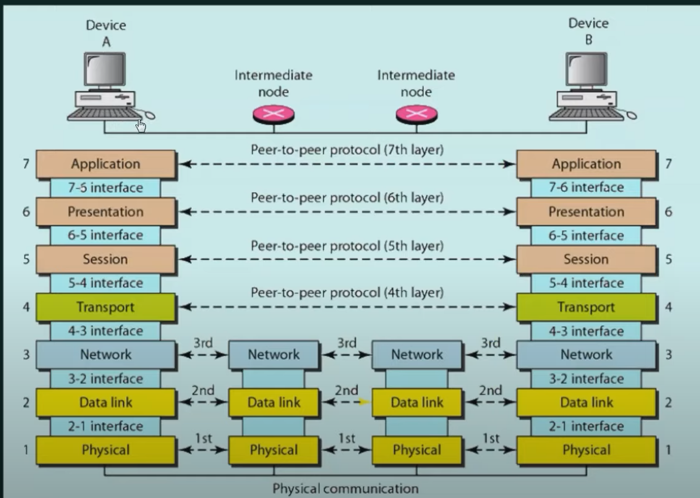

# Computer Networks

> by Neso Academy

## 0. Introduction to Computer Networks

### 0.0 章节介绍

- Chapter 1 Fundamentals: 基本原理
- Chapter 2 Data Link Layer
- Chapter 3 Network Layer
- Chapter 4 Transport Layer
- Chapter 5 Application Layer
- Chapter 6 Network Security

#### 0.0.1 Computer Network 解析

- A computer network is a set of **nodes** connected by **communication links**.
  - nodes:
    - A node can be a computer, printer or any other device capable of(能够) sending/receiving data generated by other nodes in network.
    - examples: Computer, Server, Printer, Security Camera, Switches, Bridges, Routers, etc...
  - communication links
    - A communication link can be a wired link or wireless link. The link carries the information.
      - wired link
      - wireless link
- end nodes and intermediary nodes
  | end devices | intermediary nodes |
  | ----- | ----- |
  | Printer | Cell Tower |
  | Desktop Computers | Switch |
  | Tablet | Router |
  | Web Server | Wireless Router |
  | Smart Phone | Modem |

#### 0.0.2 Summary

- Understand "What is computer network?"
- Identify end devices and intermediary devices

### 0.1 Computer Networks - Basic Characteristics(基本特性)

#### 0.1.1 be able to

1. understand the need for fault tolerant networks
2. understand the need for scalable networks
3. understand Quality of Service(QoS)(服务质量)
4. know the importance of security in computer networks

#### 0.1.2 four basic characteristics

- Fault Tolerance
  1. Continue working despite(尽管) failures
  2. Ensure no loss of service
- Scalability
  1. Grow based on the needs
  2. Have good performance after growth
- Quality of Service
  1. Set priorities
  2. Manage data traffic to reduce data loss, delay etc...
     - real time communication
     - e-mail communication
- Security
  - prevent
    1. unauthorized access
    2. misuse
    3. forgery(伪造品，赝品)
  - provide
    1. confidentiality(保密性)
    2. integrity(完整性)
    3. availability

### 0.2 Network Protocols & Communications

#### 0.2.1 be able to

1. Know "What is Data Communication"?
2. Understand data flow
3. Understand the importance of protocols in computer network
4. Know the elements of protocol

#### 0.2.2 Data Communication and Data Flow

- Data Communication
  - Data communications are the exchange of data between two nodes via(通过) some form of link(transmission medium)(传输介质) such as a cable(电缆).
- Data Flow
  - Simplex(单一的，单工的)
    - 书面定义：Communication is always unidirectional.
    - 通俗来讲：One device can transmit and the other device will receive.
    - examples: keyboards, traditional monitors
  - Half Duplex(双向的)
    - 书面定义： Communication is in both directions but not at the same time.
    - 通俗来讲：If one device is sending, the other can only receive, and vice versa(反之亦然).
    - example: walkie-talkie(步话机)
  - Full Duplex
    - 书面定义：Communication is in both directions simultaneously(同时地).
    - 通俗来讲：Device can send and receive at the same time.
    - example: telephone line

#### 0.2.3 Protocols

- All communication schemes(方案，计划) will have the following things in common:
  1. source or sender
  2. destination or receiver
  3. channel or media
  - Rules or protocols governs all methods of communication.
- Protocol determins:
  1. What is communicated?
  2. How it is communicated?
  3. When it is communicated?
- Human Communication
  1. An identified sender and receiver.
  2. Common language and grammer.
  3. Speed and timming of delivery.
  4. Confirmation or acknowledgement requirements.
- Network Communication
  1. Message encoding
     - message source => encoder(signal) => transmitter => transmission medium(wired/wireless) => receiver => decoder => message destination
  2. Message formatting and encapsulation(封装，包装)
     - agreed format
     - encapsulate the information to identify the sender and the receiver rightly.
  3. Message timing(时间，时机)
     - flow control
     - response timeout
  4. Message size
     - Humans break long messages into smaller parts or sentences.
     - Long messages must also be broken into smaller pieces to travel across a network.
  5. Message delivery options
     - unicast
     - multicast
     - broadcast

#### 0.2.4 Peer-to-Peer network and Client Server Network

- Peer-to-Peer Network
  - No centralized(集中的，中央集权的) administration.
  - All peers are equal.
  - Simple sharing applications
  - Not scalable.
- Client Server Network
  - Centralized administration
  - Request-Response model
  - Scalable
  - Server may be overloaded

### 0.3 Components of a Computer Network

#### 0.3.1 be able to

1. Understand nodes in computer network
2. Understand different media in computer network
3. Understand various services offered by computer network

#### 0.3.2 content

- Components of a Computer Network
  - Nodes
    - end nodes(devices)
      - Computers
      - Network Printers
      - VoIP Phones
      - Security cameras
      - Mobile handled devices: smart phones, tablets, PDAs, wireless debit/credit card reader, barcode(条形码) scanner
    - intermediary nodes(devices)
      - switches
      - wireless access point(无线接入点)
      - routers
      - security devices(firewall)
      - bridges
      - hubs(集线器)
      - repeaters(中继器，转发器)
      - cell tower
  - Media
    - wired medium(guided medium)
      - ethernet(以太网) straight-through(直通) cable 直通双绞线
        - 两端采用同样的线缆标准制作的线缆
        - 用于不同设备连接
      - ethernet crossover(交叉) cable
      - fiber optic(视觉的) cable 光纤
      - coaxial cable 同轴电缆
      - USB cable
    - wireless medium(unguided medium)
      - infrared(红外线的)
        - short range communication
        - example: TV remote control
      - radio(无线电通讯)
        - examples: bluetooth, wi-fi
      - microwaves
        - example: cellular system(蜂窝系统)
      - satellite(卫星传送的)
        - long range communication
        - GPS
  - Services
    - e-mail
    - storage services
    - file sharing
    - instant messaging
    - online game
    - voice over IP
    - video telephony(拨号服务，电话)
    - world wide web

### 0.4 Classification(分级，分类) of Computer Networks

#### 0.4.1 be able to

1. Understand LAN, MAN and WAN
2. Know various devices involved in LAN, MAN and WAN
3. Know the new trends in computer networks

#### 0.4.2 Classification

- LAN
  - Local Area Network
  - 定义：A local area network(LAN) is a computer network that interconnects(相互联系) computers within a limited area such as a residence(住宅), school, laboratory, university campus or office building.
  - LAN devices
    - wired LAN
      - ethernet -- Hub, Swith
    - wireless LAN
      - WI-FI
- MAN
  - Metropolitan(大都市的) Area Network
  - 定义：A metropolitan area network(WAN) is a computer network that interconnects users with computer resources in a geographic region of the size of a metropolitan area(city).
  - MAN devices
    - switches/hub
    - routers/bridges
- WAN
  - Wide Area Network
  - 定义：A wide wrea network is a telecommunications(无线电通讯，远程通信) network that extends over a large geographical(地理的，区域的) area for the primary purpose of computer networking.
  - WAN devices
    - end devices and intermediary devices

#### 0.4.3 New Trends

1. Bring Your Own Device(BYOD)(自备设备办公)
2. Online collaboration(合作)
3. Cloud computing
   - It is the on-demand availability of computer system resources, especially data storage and computing power, without direct active management by the user.

### 0.5 Network Topology(拓扑学)

#### 0.5.1 be able to

1. Understand various network topologies such as bus, ring, star, mesh and hybrid.
2. Understand the advantages and disadvantages of each topology.

#### 0.5.2 Topologies

- Network Topology
  - 定义：Arrangement of nodes of a computer network.
  - 分类
    - physical topology
      - placement of various nodes
    - logical topology
      - deals with the data flow in the network
- logical topology
  - Bus Topology
    1. All data transmitted between nodes in the network is transmitted over this common transmission medium and is able to be received by all nodes in the network simultaneously(同时地).
    2. A signal containing the address of the intended receiving machine travels from a source machine in both directions to all mathines connected to the bus until it finds the intended recipient(接收者).
    - advantages and disadvantages
      | Advantages | Disadvantages |
      | --- | --- |
      | Only one wire - less expensive | Not fault tolerant(No redundancy 冗余) |
      | Suited for temporary network | Limited cable length |
      | Node failures does not affect others | No security |
  - Ring
    1. A ring topology is a bus topology in a closed loop.
    2. Peer-to-peer LAN topology
    3. Two connections: one to each of its nearest neighbors.
    4. Unidirectional
    5. Sending and receiving data takes place with the help of a TOKEN.
    - advantages and disadvantages
      | Advantages | Disadvantages |
      | --- | --- |
      | Performance better than Bus Topology | Unidirectional. Single point of failure will affect the whole network |
      | Can cause bottleneck(瓶颈) due to weak links | ↑ in load => ↓ in performance |
      | All nodes with equal access | No security |
  - Star
    1. Every node is connected to a central node called a hub or switch.
    2. Centralized Management.
    3. All traffic must pass through the hub or switch.
    - advantages and disadvantages
      | Advantages | Disadvantages |
      | --- | --- |
      | Easy to design and implement | Single point of failure affects the whole network |
      | Centralized administration | Bottlenecks due to overloaded switch/hub. |
      | Scalable | Increased cost due to switch/hub |
    - Extended Star Topology
      - Star topologies connected by a repeater.
  - Mesh
    1. Each node is directly connected to every other nodes in the network.
    2. Fault tolerant and reliable.
    - advantages and disadvantages
      | Advantages | Disadvantages |
      | --- | --- |
      | Fault tolerant | Issues with broadcasting messages |
      | reliable | Expensive and impractical(不明智的，不切实际的) for large networks |
  - Hybrid

### 0.6 Basics of Addressing

#### 0.6.1 be able to

- IP address
  1. Understand the basics of IP addressing.
  2. Know how to see the IP address in real device.
  3. Indentify valid and invalid IP addresses.
- MAC address
  1. Understand the basics of MAC addressing.
  2. Understand the difference between IP address and MAC address.
  3. See the MAC address in real devices.
- Port address
  1. Understand the basics of Prot addressing(port number).
  2. Know three key points to ponder.
  3. See port number in real devices.

#### 0.6.2 IP Address

- IP
  - Internet Protocol
  - Every node in the computer network is identified with the help of IP address.
- IP Address(IPv4)
  1. Every node in the computer network is identified with the help of IP address.
  2. Logical address.
  3. Can change based on the location of the device.
  4. Assigned manually or dynamically
  5. Represented in decimal(十进制) and it has 4 octets(八位字节)(x.x.x.x)
  6. 0.0.0.0 to 255.255.255.255(32 bits)

#### 0.6.3 MAC Address

- MAC
  - Media Access Control
  - Every node in the LAN is identified with the help of MAC address.
- MAC Address
  1. Every node in the LAN is identified with the help of MAC address.
  2. Physical address or Hardware Address.
  3. Unique.
  4. Cannot be changed.
  5. Assigned by the manufacturer.
  6. Represented in hexadecimal.
  7. Separator: hyphen(-), period(.), and colon(:)
- IP Address VS MAC Address
  - IP Address = Location of a person
  - MAC Address = Name of the person
    | IP Address | MAC Address |
    | --- | --- |
    | Needed for communication | Needed for communication |
    | 32 bits | 48 bits |
    | Represented in Decimal | Represented in hexadecimal |
    | Router needs IP Address to forward data | Swith ... |
    | example: 10.10.23.56 | example: 80-40-5A-CC-AA-E4 |

#### 0.6.4 Port Address

- analogy
  - Reaching our city = reaching our network(IP Address)
  - Reaching our Apartment = Reaching the host(MAC Address)
  - Reaching the right person = Reaching the right process(Port Address)
- Port Address(Port Number)
  1. in a node, many processes will be running.
  2. Data which are sent/received must reach the right process.
  3. Every process in a node is uniquely identified using port numbers.
  4. Port = Communication endpoint.
  5. Fixed port numbers and dynamic port numbers(0 - 65535).
- 3 keys points to ponder
  - before sending the data, any node must
  1. Attch source IP address and destination IP address.
  2. Attach source MAC address and destination MAC address.
  3. Attach source port number and destination port number.

### 0.7 Switching Techniques

#### 0.7.1 be able to

1. Understand switching.
2. Understand various switching techniques such as circuit switching(电路交换), message switching and packet switching(分组交换).

#### 0.7.2 Content

- Switching
  1. Switching in computer network helps in deciding the best route for data transmission if there are multiple paths in a large network.
  2. One-to-One connection.
  - circuit switching 电路交换
  - message switching 报文交换
  - packet switching 分组交换
    - datagram(数据电报) approach
    - virtual circuit approach
- Circuit Switching
  1. A dedicated(专用的) path is established between the sender and receiver.
  2. Before data transfer, connection will be established first.
  3. Example: Telephone network.
  - 3 phases
    1. Connection established.
    2. Data transfer.
    3. Connection disconnected.
- Message Switching
  - Store and forward mechanism(机制).
  - Message is transferred as a complete unit and forwarded using store and forward mechanism at the intermediay node.
  - Not suited for streaming media and real-time applications.
- Packet Switching
  - The internet is a packet switched network.
  - Message is broken into individual chunks called as packets.
  - Each packet is sent individually.
  - Each packet will have source and destination IP address with sequence number.
  - Sequence(顺序) numbers will help the receiver to
    - Record the packets
    - Detect missing packets
    - Send acknowlegements
  1. Datagram Approach
     - Datagram Packet Switching is also known as connectionless(无连接的) switching.
     - Each independent entity(实体) is called as datagram.
     - Datagrams contain destination information and the intermediary devices uses this information to forward datagrams to right destination.
     - In Data Packet Switching approach, the path is not fixed.
     - Intermediate nodes take the routing decisions to forward the packets.
  2. Virtual Circuit Approach
     - Virtual Circuit Switching is also known as connection-oriented(面向连接的) switching.
     - In the case of Virtual circuit switching, a preplanned route is established before the messages are sent.
     - Call request and call accept packets are used to establish the connection between sender and receiver.
     - In this approach, the path is fixed for the duration of a logical connection.

### 0.8 Layering in Computer Networks

#### 0.8.1 be able to

1. Understand layering in computer network.
2. Understand the benefits of layering.
3. Know the introduction of OSI reference model and TCP/IP model.

#### 0.8.2 Content

- Layering
  - Layering means decomposing(分解) the problem into more manageable components(layers).
  - advantages
    1.  It provides more modular(模块化的) design.
    2.  Easy to troubleshoot(解决问题).
- Protocols
  - It is a set of rules that governs data communication.
  - The protocols in each layer governs the activities of the data communication.
- Layered Architectures
  - The OSI Reference Model
    - OSI: Open System Interconnection(互联)
    - It is a model for understanding and designing a network architecture that is flexible, robust and interoperable(可共同操作的).
    - Developed by the International Standards for Organizations(ISO)
    - The OSI model is not a protocol.
    - It is only a guideline and hence(因此) it is referred as OSI reference model.
    - Purpose: show how to facilitate(推动) communication between different systems without requiring changes to the logic of the underlying hardware and software.
    - The OSI model was never full implemented.
  - The TCP/IP Model
    - TCP/IP: Transmission Control Protocol/Internet Protocol
    - The TCP/IP protocol suite(套，系列) was developed prior to the OSI model.
    - Therefore, the layers in the TCP/IP protocol suite do not exactly match those in the OSI model.
    - TCP/IP is a hierarchical(分等级的，等级制度的) protocol made up of interactive(交互式的) modules, each of which provides a specific funcionality(功能).

### 0.9 The OSI Reference Model

#### 0.9.1 be able to

1. Understand the OSI reference model.
2. List various layers in the OSI reference model.
3. Understand how each layers interact with other layers.
4. Understand the services offered by the 7 Layers.

#### 0.9.2 Content

- Layers in the OSI reference model
  - Application Layer
  - Presentation Layer
  - Session Layer
  - Transport Layer
  - Network Layer
  - Data Link Layer
  - Physical Layer
    
- Services offered
  - Application Layer
    - enables the user to access the network resources.
    1. File Transfer and Access Management.(FTAM)
    2. Mail Service.
    3. Diretory Service.(目录服务)
  - Presentation Layer
    - It is concerned with the syntax and semantics(语义学) of the information exchanged between two systems.
    1. Translation
    2. Encryption 加密
    3. Compression
  - Session Layer
    - establishes, mantains, and synchronizes(同步，对准) the interaction among communicating devices.
    1. Dialog control
    2. Synchronization 同步，同时性
  - Transport Layer
    - is responsible for process to process delivery of the entire message.
    1. Prot addressing
    2. Segmentation and Reassembly 切割与重组
    3. Connneciton control
    4. End-to-End Flow Control
    5. Error Contol
  - Network Layer
    - is responsible for delivery of data from the original source to the destination network.
    1. Logical addressing
    2. Routing.
  - Data Link Layer
    - is responsible for moving data(frames)(帧) from one node to another node.
    1. Framing 组帧
    2. Physical Addressing
    3. Flow Control
    4. Error Control
    5. Access Control
  - Physical Layer
    - is responsible for transmitting bits over a medium. It also provides electrical and mechanical(机械) specification(规范).
    1. Physical characteristics of the media.
    2. Representation of bits
    3. Data rate
    4. Synchronization of bits
    5. Line configuration
    6. Physical topology
    7. Transmission Mode: simplex, half duplex, full duplex

## 1. Fundamentals

### 1.1 Addressing in Networking

#### 1.1.1 be able to

1. Understand the role of Port Addressing, IP Addressing and MAC Addressing in Computer Networks with examples.

#### 1.1.2 content

1. the sender generate `Data` in Application Layer
   - => add Port Address in the Transport Layer (the sender's and the receiver's)
   - => add IP Address in the Network Layer (the sender's and the receiver's)
   - => add MAC Address in the Data Link Layer (the sender's and the next router's)
2. the next router receives the whole data
   - => check MAC Address in the Data Link Layer √
   - => check IP Address in the Network Layer ×
   - => add new MAC Address in the Data Link Layer (the router's and the next router's)
   - => forward the whole data
3. the next router...
4. the receiver receives the whole data
   - => check MAC Address √
   - => check IP Address √
   - => check Port Address and find the end point(the right process)

### 1.2 the TCP/IP Protocol Suite(套，组)

#### 1.2.1 be able to

1. Understand the TCP/IP Protocol Suite.
2. Compare OSI and TCP/IP models.
3. Understand the list of protocols in the TCP/IP Protocol Suite.
4. Know about Protocol Data Unit(PDU).

#### 1.2.2 content

| OSI Reference Model | TCP/IP Model   |
| ------------------- | -------------- |
| Application         | Application    |
| Presentation        | Application    |
| Session             | Application    |
| Transport           | Transport      |
| Network             | Internet       |
| Data Link           | Network Access |
| Physical            | Network Access |

- the TCP/IP Model
  - Application
    - Represents data to the user, plus encoding and dialog control.
    - Services:
      - name system: DNS
      - host config: BOOTP, DHCP
      - email: SMTP, POP, IMAP
      - file transfer: FTP, TFTP
      - web: HTTP
  - Transport
    - Supports communication between diverse(不同的) devices across diverse networks.
    - Services:
      - UDP
      - TCP
  - Internet
    - Determines the best path throught the network.
    - Services:
      - IP: NAT, ARP
      - IP support: ICMP
      - routing protocols: RIP, OSPF, EIGRP, BGP
  - Network Access
    - Controls the hardware(硬件) devices and media that make up the network.
    - Services:
      - IP: ARP
      - PPP
      - Ethernet
      - Interface Drivers
- PDU
  - Protocol Data Unit => PDU
  - are named according to the protocols of the TCP/IP suite: data, segment, packet, frame and bits.
  - Layers map
    - Application Layer -- Data
    - Transport Layer -- Segment
      1. break the whole data into data pieces
      2. add Transport Header to every data piece
    - Network Layer -- Packet
      1. add Network Header
    - Data Link Layer -- Frame
      1. add Frame Header on the head
      2. add Frame Header on the tail
      - Frame are depended by medium(媒介).
    - Physical Layer -- Bits
      1. transform into binary

### 1.3 Basic Networking Commands

#### 1.3.1 be able to

1. Know the basic networking commands such as
   - `ipconfig`
   - `ipconfig/all`
   - `nslookup [域名]`
   - `ping [ip]`
   - `tracert [ip]`

### 1.4 Basics of Cisco Packet Tracer

#### 1.4.1 be able to

- Cisco Packet Tracer
  1. Download and work with Cisco Packet Tracer(CPT)
  2. Know the basics of Cisco Packet Tracer.
  3. Establish an example peer-to-peer networking using CPT.
  4. Know the bascis of Cisco Packet Tracer.
- Hub
  1. Know about hub.
  2. Simulate LAN using hub.
  3. Understand the pros and cons of hub.
- Switch
  1. Learn the Cisco Packet Tracer using switch.
  2. Simulate LAN using switch.
  3. Understand the difference between hub and switch.
- Router
  1. Know the basics of routers.
  2. Understand how to connect two different LAN using router theoretically.
  3. Understand the difference between switch and router.
- Repeater
  1. Understand the basics of repeater.
  2. Know the working of repeater using CPT.
- Bridge
  1. Understand the basics of bridge.
  2. Know the types of bridge.
  3. Understand the working of bridge.
  4. Understand the difference between router and bridge.
- Multi-layer switch(layer 3 switch)
- Brouter
- Modem
- Firewall(Security Device)

#### 1.4.2 Cisco Packet Tracer

- Cisco Packet Tracer
  - an innovative(革新的，新颖的) and powerful networking sumulation tool used for practice, discovery and troubleshooting.

#### 1.4.3 hub

- hub
  1. works at the physical layer of the OSI model.
  2. used to set up LAN.
  3. has multiple ports.
  4. Star topology.
  5. Broadcast: When a packet arrives at one port, it is copied to the other ports so that all segments(部分) of the LAN can see all packets.
  - PROS and CONS
    - pros
      1. cheaper than switches.
      2. works good for smaller network.
    - cons
      1. issues with broadcast.
      2. no memory.
      3. normally runs in half duplex mode.

#### 1.4.4 switch

- switch
  - a networking hardware that connects devices on a computer network to establish a local area network.
  - unlike hub, switch has memory.
    - => to store MAC Address Table
  - Layer 2 Device for setting up LAN
- Cisco Packet Tracer 中 switchi 设备的 CLI
  1. `Switch>`, input `EN`
  2. `Switch#`, input `show mac-address-table`

| Hub                                    | Switch                                           |
| -------------------------------------- | ------------------------------------------------ |
| Layer 1 device                         | Layer 2 device                                   |
| works at Physical Layer                | works at Data Link Layer                         |
| has no memory                          | has memory and store MAC Address Table           |
| not an intelligent device              | intelligent device                               |
| floods the network due to broadcasting | can do unicasting, multicasting and broadcasting |
| security risks are high                | security risks low                               |
| less efficient                         | more efficient                                   |
| half duplex                            | full duplex                                      |

#### 1.4.5 router

- router
  - a networking device that forwards data packets between computer networks.
  - connected to at least two networks, commonly two LANs or WANs or a LAN and its ISP's network.
  - Layer 3 device
  - stores routing table
- Cisco Packet Tracer
  1. need to fill Default Gateway

| Switch                                              | Router                                          |
| --------------------------------------------------- | ----------------------------------------------- |
| connect many devices together on a computer network | connect a local network to other local networks |
| Operates at Data Link Layer                         | at Network Layer                                |
| has memory and stores MAC Address Table             | has memoryand stores Routing Table              |
| decisions are taken based on MAC address            | decisions are taken based on IP address         |
| half/duplex                                         | full duplex                                     |
| LAN                                                 | LAN, MAN, and WAN                               |

#### 1.4.6 repeater

- Repeater
  - 原因：The data signals generally become too weak or corrupted(毁坏的) if they tend(倾向于，往往会) travel a long distance.
  - 作用：regenerates the signal over the same network.
  - operates at the Physical Layer
  - do not amplify(加强，扩增) the signal.
  - 2 port device.

#### 1.4.7 bridge

- Bridge
  - = Repeater + Functionality(功能) of reading MAC address
  - Layer 2 device
  - be used for interconnecting(相互连接) two LANs on the same protocol.
  - a two port device.
- Types of Bridges
  - Transparent Bridges
    1. ths stations are completely unaware of the bridge's existence.
    2. Reconfiguration of the stations is unneccessary even if bridges is added or removed from network.
  - Source Routing Bridges
    1. in these bridges, routing operation is performed by source station and the frame specifies which route to follow.

### 1.5 Physical Layer

#### 1.5.1 Physical Layer and Media

- Outcomes
  1. Understand the fundmental principles of physical layer.
  2. Know about data and signals.
  3. Understand analog and digital signals.
  4. Know various physical layer media.
  5. Compare various physical media.
  6. Understand wired and wireless media.
  7. Understand UTP and STP.
  8. Compare copper media and fiber optic media.
  9. Know the popular wireless technologies.
- content
  1. One of the major functions of the physical layer is to **move data in the form of electromagnetic signals** accross a transmission medium(媒介).
  2. To be transmitted, data must be transformed to electromagnetic signals.
  3. Signal
     - It is a function that represents the variation of a physical quantity with respect to time.
     1. analog signal
        - take any value in the defined range.
        - All real-life signals are analog in nature.
     2. digital signal
        - take on of the finite values(取一个有限值) at any given time.
        - In case of digital signals, we discretize both time and magnitude.
  4. various physical media
     - Copper Cable
     - Fiber Optic Cable
     - Wireless Media
  5. Comparion of various physical media
     | Media | Physical Components | Signal |
     | --- | --- | ---- |
     | Copper Cable(Wired) | UTP/STP, Coaxial, Connectors, NICs, Ports/Interfaces | Electromagnetic Signal |
     | Fiber Optic Cable(Wired) | Single-mode/Multimode Fiber, Connectors, NICs and Interfaces, Lasers and LEDs | A light pulse equals 1, No light pulse is 0 |
     | Wireless Media | Access Points, NICs, Radio, Antennae | Radio waves |
     - NIC: Network Interface Card 网络接口卡
  6. Wired and Wireless media
     - wired
       - copper cable(Ethernet cable)
         - Unshielded Twisted Pair(UTP) 无屏蔽双绞线
         - Shielded Twisted Pair(STP) 屏蔽双绞线
       - copper coaxial(同轴的) cable
       - fiber optic cable
     - wireless
       - WiFi
       - bluetooth
       - Wi MAX
  7. UTP and STP
     - a metallic shield
       1. costlier(costly) 更昂贵的
       2. decrease the crosstalk
          - EMI: Electro-Magnetic Interference 电磁干扰
          - RFI： Radio Frequency Interference 射频干扰
     - UTP: varying the number of twists per wire pair to limit the negative effect of crosstalk.
  8. Comparion of copper media and fiber optic media
     - fiber optic media
       - light waves
       - high speed transmission
         | Implementation Points | Copper | Fiber Optic |
         | --- | --- | --- |
         | Bandwidth(带宽) Supported | 10 Mbps - 10 Gbps | 10 Mbps - 100 Gbps |
         | Range | Relatively short(upto 100m) | Relatively high(upto 100,000)m |
         | Immunity(免疫力) to EMI and RFI | low | high |
         | Immunity to Electrical Hazards(电气危险) | low | high |
         | media and connector costs | low | high |
         | Installation skills required | low | high |
         | safety | low | high |
  9. Wireless Technologies
     - the following areas of concern
       1. Coverage area
       2. Interference
       3. Security
     - technologies
       - WiFi
         1. IEEE 802.11 standard
       - bluetooth
         1. IEEE 802.15 standard
         2. 3 Mb/s
         3. distance: 1 - 100m
       - Wi MAX
         1. IEEE 802.16 standard
         2. 1 Gbps
         3. uses a point-to-multipoint topology to provide wireless bradband access.

#### 1.5.2 Line Configuration

- Outcomes
  1. Recapture the services offered by physical layer of the OSI model.
  2. Understand the line configuration.
  3. Understand the types of line configuration.
- content
  1. services offered by Physical Layer
     - Physical characteristics of the media
     - representation of bits
     - data rate
     - synchronization of bits
     - **line configuration**
     - physical topology
     - transmission mode
  2. For communication to happen, two nodes must be connected to the same link at the same time.
  3. types of line configuration
     - point-point connection
       1. Provides a dedicated link between two devices.
       2. The entire capacity of the link is reserved for transmission between those two devices.
     - multipoint connection(multidrop connection)
       1. Two or more devices share a single link.
       2. The capacity of the channel is shared.
          - spatial sharing 空间
          - temporal sharing 时间上的

## 2. Data Link Layer

### 2.1 Services Provided

- Outcomes
  1. Know the various services offered by data link layer.
  2. Understand the services offered by data link layer.
- content
  1. Various services
     - Framing
     - Physical Addressing
     - Flow Control
     - Error Control
     - Access Control
  2. the services
     - Framing
       - pack bits into frames
       - each frame has to be distinguish from another.
     - Physical Addressing
       - the header of the encapsulation: the source and the destination MAC address are dealt.
     - Flow Control
       - end to end flow control
       - speed matching mechanism
       - coordinates the amount of data that can be sent before receiving an acknowledgement.
     - Access Control
       - Media Access Control
     - Error Control
       - Error Detection
       - Error Correction

### 2.2 Sublayers of the Data Link Layer

- Outcomes
  1. Understand the sublayers of data link layer.
  2. Know the responsibility of LLC or DLC.
  3. Know the responsibility of MAC sublayer.
- content
  1. sublayers of the data link layer
     - Logical Link Control(LLC) or Data Link Control(DLC) Sublayer
     - MAC Sublayer
  2. LLC or DLC Sublayer
     1. hanles comunication between upper and lower layers.
     2. takes the network protocols data and adds control information to help deliver the packet to the destination.(Flow Control)
  3. MAC Sublayer: Implemented by hardware, typically in the computer NIC.
     - Data Encapsulation
       - take place on frame assembly before transmission and frame disassembly upon reception of a frame
       - add a header and trailer to the network layer PDU. -- Physical Addressing or MAC Addressing
     - Media Access Control
     - Framing
     - Error Control
     - other functions
       1. Responsible for the placement of frames on the media and the removal of frames from the media.
       2. Communicates directly with the physical layer.

### 2.3 Framing

#### 2.3.1 basics

- Every node will have an adaptor.
- exchange
  - 前提：Before they start the communication, they mutually agree upon a protocol.
  - then,
    - Bits flow between adaptors
    - Frames flow between hosts
- Frame = Header + Network Layer PDU + Trailer

#### 2.3.2 Types of Framing

- fixed-size framing
  - the size is fixed
  - => **the frame length acts as delimiter** of the frame
  - => no additional boundary bits to identify the start and end of the frame.
- variable-size framing
  - the size may be different
  - => **additional mechanisms are kept to mark** the end of one frame and the beginning of the next frame.

#### 2.3.3 Various framing approaches

- bit oriented approach
  - be viewed as a collection of bits
  - bit oriented protocol
    - HDLC: High-Level Data Link Control
- byte oriented approach
  - be viewed as a collection of bytes(characters)
    - one of the oldest approaches to framing
  - byte oriented protocol
    - BISYNC: Binary Synchronous Communication Protocol
    - DDCMP: Digital Data Communication Message Protocol
    - PPP: Point-to-Point Protocol
- clock based framing

## 3. Network Layer

## 4. Transport Layer

## 5. Application Layer

## 6. Network Security
