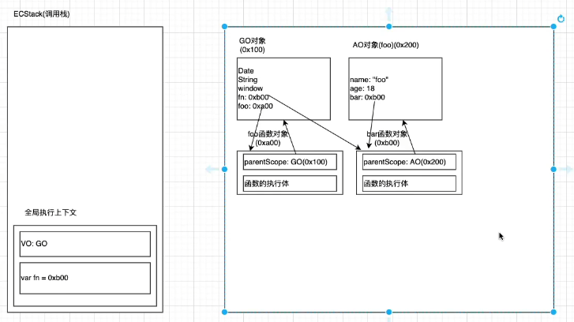

<!--
 * @Author: East
 * @Date: 2021-12-29 11:08:03
 * @LastEditTime: 2021-12-30 09:50:04
 * @LastEditors: Please set LastEditors
 * @Description: 闭包的定义 - 理解 - 内存模型 - 内存泄漏
 * @FilePath: \forGreaterGood\javascript\03-闭包.md
-->

# 闭包

## 一、闭包的定义

### JS 中函数是一等公民

- 在 js 中函数是非常重要的，并且是一等公民
  - 意味着函数的使用非常灵活
  - 函数可以作为另一个函数的**参数**，也可以作为另一个函数的**返回值**
- 高阶函数：接收另一个函数作为参数，或者该函数返回另一个函数作为返回值

  - 数组 api

    ```js
    /** 1. 挑出偶数 */
    var nums = [10, 5, 11, 100, 55];

    // 1.1 常规方法 for 循环
    // 1.2 filter 过滤
    nums.filter((item, index, nums) => item % 2 === 0);

    /** 其他 api */
    // 1 map: --> 映射
    nums.map((item) => item * 10);
    // 2. forEach 迭代，没有返回值
    // 3. find/findIndex
    nums.find((item) => item % 2 === 0); // 返回第一个偶数
    nums.findIndex((item) => item % 2 === 0); // 返回第一个偶数的下标
    // 4. reduce：--> 累加
    nums.reduce((prev, item, nums) => {
      return item % 2 === 0;
    }, 0);
    ```

### JS 中闭包的定义

- 两种角度的定义
  - 计算机科学(维基)
    1. 闭包(closure)，又称词法闭包(lexical closure)，或函数闭包(function closures)
    2. 是在支持**头等函数**的编程语言中，实现词法绑定的一种技术
    3. 闭包在实现上是一个结构体，它存储了一个函数和一个关联的环境(相当于一个符号查找表)
    4. 闭包跟函数最大的区别在于，在捕捉闭包时，它的**自由变量**会在捕捉时被确定，这样即使脱离了捕捉时的上下文，也能正常运行
  - JavaScript(MDN)
    1. 一个函数对其周围状态(lexical environment，词法环境)的引用捆绑在一起，这样的组合就是闭包
    2. 即，闭包让你可以在一个内层函数中访问到其外层函数的作用域
    3. 在 JavaScript 中，每创建一个函数，闭包就会在函数创建的同时被创建出来
- coderwhy 定义
  - 一个普通的函数 function，如果它可以访问外层作用域的自由变量，那么这个函数就是一个闭包
  - 广义角度：JavaScript 中的函数都是闭包
  - 狭义角度：JavaScript 中的一个函数，如果访问了外层作用域的变量，那么它是一个闭包
- 闭包的来源
  - 闭包的概念出现于 60 年代，最早实现闭包的程序是 Scheme
  - JavaScript 中有大量的设计是来源于 Scheme 的

## 二、闭包的内存泄漏

- 堆内存中的函数对象
  ```js
  foo 函数对象 0xa00: {
    parentScope: GO(0x100),
    函数执行体
  }
  ```
- 以下代码执行完毕后的内存显示

  ```js
  function foo() {
    var name = "foo";
    var age = 18;

    function bar() {
      console.log(name);
      console.log(age);
    }
    return bar;
  }

  var fn = foo();
  fn();
  ```

  

  1. 形成了内存泄漏
  2. `fn = null` 即可解决内存泄漏问题
