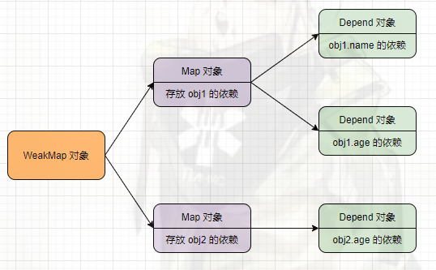

<!--
 * @Author: your name
 * @Date: 2022-01-15 20:36:00
 * @LastEditTime: 2022-01-18 11:32:16
 * @LastEditors: Please set LastEditors
 * @Description: Proxy + Reflect + Vue 的 响应式原理
 * @FilePath: \forGreaterGood\javascript\coderwhy\17-proxy+reflect+响应式原理.md
-->

# Proxy + Reflect + Vue 的 响应式原理

## 一、Proxy

### 1. 引入 -- 监听对象的操作

> 需求：有一个对象，我们希望监听到这个对象中的属性被获取的过程

- 从前的知识 ---- by Object.defineProperty(obj, key, { get/set })

  ```js
  const obj = {
    name: "why",
    age: 18,
  };

  Object.defineProperty(obj, "name", {
    get: function () {
      console.log("监听到obj对象的name属性被访问了");
    },
    set: function (value) {
      console.log("监听到obj对象的name属性被设置了");
    },
  });

  console.log(obj.name);
  obj.name = "code";

  /** 24-31行code优化 */
  Object.keys(obj).forEach((key) => {
    let value = obj[key];

    Object.defineProperty(obj, key, {
      get: function () {
        console.log(`监听到obj对象的${key}属性被访问了`);
        return value;
      },
      set: function (newValue) {
        console.log(`监听到obj对象的${key}属性被设置了`);
        value = newValue;
      },
    });
  });
  ```

  - 缺点
    1. Object.defineProperty()设计的初衷，不是为了去监听一个对象中所有属性的
       1. 设计该方法的初衷是为了定义普通的属性，但是后面我们**强行把它变成了数据属性描述符**
    2. 如果我们想监听更加丰富的操作，如新增属性、删除属性，那么该方法是无能为力的

### 2. Proxy

- 介绍
  - ES6 新增
  - 类
  - 用处：创建一个代理
    - 如果希望监听一个对象的相关操作，则可以先**创建一个代理对象(Proxy 对象)**
    - 之后对该对象的所有操作，都**通过代理对象来完成**，代理对象可以**监听**我们想要对原对象进行哪些操作
  - 优点：
    - 监听某个对象而不修改其内部结构
    - 对代理对象所作的操作，最终都会自动传递到原来的对象中
      - 可以**重写捕获器**
- 实际操作

  ```js
  const obj = {
    name: "why",
    age: 18,
  };

  const objProxy = new Proxy(obj, {}); // 参数：要代理的对象， 捕获器(不知道做什么操作，放个空值即可)

  console.log(objProxy.name); // 'why'
  console.log(objProxy.age); // 18

  objProxy.name = "code";
  objProxy.age = 30;

  console.log(objProxy.name); // 'code'
  console.log(objProxy.age); // 30
  ```

  - 捕获器使用

    ```js
    const obj = {
      name: "why",
      age: 18,
    };

    const objProxy = new Proxy(obj, {
      // 获取值时的捕获器
      get: function (target, key) { // 参数：target -- obj，key -- 属性
        console.log(`监听到对象的${key}属性被访问`, target);
        return target[key];
      },
      //设置值时的捕获器
      set: function (target, key, newValue) {
        console.log(`监听到对象的${key}属性被设置值`, target);
        target[key] = newValue;
      },
      // 监听 in 的捕获器
      has(target, key) {
        console.log(`监听到对象的${key}属性的in操作`, target);
        return key in target
      }
      // delete 捕获器
      deleteProperty(target, key) {}
    }); // 参数：要代理的对象， 捕获器

    objProxy.name = "code";
    objProxy.age = 30;

    console.log(objProxy.name); // 'code'
    console.log(objProxy.age); // 30

    console.log('name' in objProxy) // in 操作
    ```

    - 13 个捕获器
    - handler.apply ---- 函数调用操作 捕获器，参数：target, thisArg( -- this), argArray( -- 参数)
    - handler.constructor ---- new 操作符 捕获器，参数：target, argArray, newTarget

## 二、Reflect

> Proxy 用于代理，经常和 Reflect 一起出现

- 是一个对象，字面意思 -- 反射
- 作用
  - 提供了许多操作 JavaScript 对象的方法
    - Object.getPropertyOf → Reflect.getPropertyOf
    - Object.defineProperty → Reflect.defineProperty
- 原因
  - 在早期的 ECMA 规范中没有考虑到这种对**对象本身**的操作如何设计会更加规范，所以将这些 API 放到了 Object 上
  - 但是 **Object 作为一个构造函数，这些操作放到它身上实际上并不合适**
  - 另外，一些类似于 in、delete 的操作符，让 js 看起来会有一些奇怪(其他语言并没有这些操作符)
  - 所以在 ES6 中新增了 Reflect，让我们把这些操作都集中到了 Reflect 对象上
- 方法(API)
  - 13 种，与 Proxy 一一对应
- 使用

  ```js
  const obj = {
    name: "why",
    age: 18,
  };

  const objProxy = new Proxy(obj, {
    // 参数：target -- obj，key -- 属性
    get: function (target, key) {
      console.log(`监听到对象的${key}属性被访问`, target);
      // return target[key];
      return Reflect.get(target, key);
    },
    set: function (target, key, newValue) {
      console.log(`监听到对象的${key}属性被设置值`, target);
      // target[key] = newValue;
      Reflect.set(target, key, newValue);
    },
  }); // 参数：要代理的对象， 捕获器
  ```

  1. <span style="color: red">Reflect.set()会返回一个布尔值，设置成功返回 true，否则返回 false</span>

### Receiver 参数的作用

1. 引入案例

   ```js
   const obj = {
     _name: "why",
     get name() {
       return this._name;
     },
     set name(newValue) {
       this._name = newValue;
     },
   };

   obj.name = "code";
   console.log(obj.name); // 'kobe'

   /* 改为 Proxy 拦截 */
   const objProxy = new Proxy(obj, {
     get(target, key) {
       return Reflect.get(target, key);
     },
     set(target, key, newValue) {
       Reflect.set(target, key, newValue);
     },
   });
   objProxy.name = "code";
   console.log(objProxy.name);
   ```

   - 访问过程：
     1. 进入 `objProxy` 的 `get` 中，返回 `Reflect.get(obj, 'name')`
     2. 访问 `obj` 的 `get name`，返回 `this._name`(即 `obj._name`)

2. 问题出现：绕了一圈，**还是 `obj._name` 在调用**，而**不是通过代理对象**

   - <span style="color: red">需要将 obj 对象改成 objProxy -- by receiver 参数</span>

     ```js
     const obj = {
       _name: "why",
       get name() {
         return this._name;
       },
       set name(newValue) {
         this._name = newValue;
       },
     };

     const objProxy = new Proxy(obj, {
       // (obj, key, objProxy)
       get(target, key, receiver) {
         console.log("get----------------key---------", key);
         return Reflect.get(target, key, receiver);
       },
       set(target, key, newValue, receiver) {
         console.log("set++++++++++key+++++++++++", key);
         let result = Reflect.set(target, key, newValue, receiver);
         if (result) {
           console.log("成功设置set------------");
         }
       },
     });

     objProxy.name = "code";
     console.log(objProxy.name); // 'code'
     ```

     - `receiver` 用于改变 `[Getter/Setter]` 函数的 `this`
     - 完美欸，成功逻辑闭环了，全都是在代理对象里完成

### Reflect 中的 constructor 作用

```js
function Student(name, age) {
  this.name = name;
  this.age = age;
}

function Teacher() {}

const stu = new Student();
console.log(stu); // 类型为Student

// 执行 Student 函数中的内容，但创建出来的对象是 Teacher 对象
Reflect.constructor(Student, ["name", 18], Teacher);

/**
 * 类 ES6 转 ES5 的代码
 * 要求：通过 Super 类创建实例，但该实例的类型是 NewTarget
 */
var Super = _getPrototypeOf(Derived); // Super = Student.__proto__ = Person
var result;
if (hasNativeReflectConstruct) {
  var NewTarget = _getPrototypeOf(this).constructor; // Student.constructor
  // Person 为目标构造函数
  // arguments: [name, age] 参数
  // newTarget: 新创建的对象的原型的 constructor 属性
  result = Reflect.construct(Super, arguments, NewTarget);
} else {
  // Student.__proto__.call(this, name, age) -> Person.call(this, name, age)
  // -> Student 实例 的 name 和 age，调用了 Person.constructor
  result = Super.apply(this, arguments);
}
```

## 三、响应式

### 3.1 什么是响应式？

> 例：m 有一个初始化的值，有一段代码使用了这个值，那么当 m 有一个新值时，这段代码可以**自动重新执行**

```js
let m = 100;

// 当 m 有新值时，要自动重新执行的代码
console.log(m);
console.log(m * 2);
console.log(m ** 2);

m = 200;
... // 重新执行代码
```

- 这段代码**只是针对一个基本变量**，实际使用中更多的其实是**对象的响应式**

### 3.2 vue3

```js
/** 对象的响应式 */
const obj = {
  name: "why",
  age: 18,
};

// 当 name 属性发生改变时，foo 函数自动执行
function foo() {
  const newName = obj.name;
  console.log("hello, east");
  console.log(obj.name);
}

// bar 函数不需要响应式
function bar() {
  console.log("无关函数");
  console.log("普通函数");
}

obj.name = "code";
```

1. 一般会封装一个 需要响应式的函数 的函数 `function watchFn(fn) {}`

   ```js
   // 需要响应式的函数全都放到一个 数组 中
   const reactiveFns = [];
   function watchFn(fn) {
     reactiveFns.push(fn);
   }

   const obj = {
     name: "why",
     age: 18,
   };

   // 需要响应的函数放进 watchFn
   watchFn(function foo() {
     const newName = obj.name;
     console.log("hello, east");
     console.log(obj.name);
   });

   watchFn(function demo() {
     console.log("-------------------", obj.name);
   });

   // 需要响应的函数放进 watchFn
   function bar() {
     console.log("无关函数");
     console.log("普通函数");
   }

   obj.name = "code";
   // 手动完成响应式的自动执行代码
   reactiveFns.forEach((fn) => {
     fn();
   });
   ```

   1. 缺点
      1. 依赖收集放在了数组(reactives)中，现在只收集 name，后期有了不同的属性，不方便管理
      2. 手动响应式，宝，真实使用中怎么可能这么做...

2. 使用类**收集依赖**

   ```js
   // 封装的类，用于收集依赖
   class Depend {
     constructor() {
       this.reactives = [];
     }

     addDepend(reactiveFn) {
       this.reactives.push(reactiveFn);
     }

     // 通知
     notify() {
       this.reactives.forEach((fn) => {
         fn();
       });
     }
   }

   const obj = {
     name: "why",
     age: 18,
   };

   const depend = new Depend();

   function watchFn(fn) {
     depend.addDepend(fn);
   }

   watchFn(function foo() {
     const newName = obj.name;
     console.log("hello, east");
     console.log(obj.name);
   });

   watchFn(function demo() {
     console.log("-------------------", obj.name);
   });

   function bar() {
     console.log("无关函数");
     console.log("普通函数");
   }

   obj.name = "code";
   depend.notify();
   ```

   1. 优点
      1. 一个属性对应一个类，便于管理 --> 结构清晰啦
      2. 在类中封装 notify 方法，自动 --> 勉强算自动叭 2333

3. **自动监听对象的变化** ---- 监听对象的属性变化 Proxy(vue3) / Object.defineProperty(vue2)

   ```js
   class Depend {
     constructor() {
       this.reactives = [];
     }

     addDepend(reactiveFn) {
       this.reactives.push(reactiveFn);
     }

     notify() {
       this.reactives.forEach((fn) => {
         fn();
       });
     }
   }

   const obj = {
     name: "why",
     age: 18,
   };

   const depend = new Depend();

   function watchFn(fn) {
     depend.addDepend(fn);
   }

   watchFn(function foo() {
     const newName = obj.name;
     console.log("hello, east");
     console.log(obj.name);
   });

   watchFn(function demo() {
     console.log("-------------------", obj.name);
   });

   function bar() {
     console.log("无关函数");
     console.log("普通函数");
   }

   // 使用 Proxy 监听属性变化
   const objProxy = new Proxy(obj, {
     get(target, key, receiver) {},
     set(target, key, newValue, receiver) {
       let result = Reflect.set(target, key, newValue, receiver);
       if (result) {
         depend.notify();
       } else {
         console.log(`${key}属性设置失败`, target);
       }
     },
   });

   objProxy.name = "code";
   ```

   - 优点：

     1. 不再需要手动 `depend.notify();`

   - 弊端：只有一个 `depend` 对象用于收集所有的依赖，无法区分不同属性 + 不同对象

   - `Proxy`, yyds!
     - 注意：一旦使用了代理，其余地方都建议用代理对象

4. 依赖收集的管理：一个对象有多个属性 + 有多个对象 

   1. 我写的

      ```js
      class Depend {
        constructor() {
          this.reactives = [];
        }

        addDepend(reactiveFn) {
          this.reactives.push(reactiveFn);
        }

        notify() {
          this.reactives.forEach((fn) => {
            fn();
          });
        }
      }

      function watchFn(depend, fn) {
        depend.addDepend(fn);
      }

      function bar() {
        console.log("无关函数");
        console.log("普通函数");
      }

      /** obj对象 */
      const obj = {
        name: "why",
        age: 18,
      };
      const objMap = new Map();
      const nameDepend = new Depend();
      const ageDepend = new Depend();
      objMap.set("name", nameDepend);
      objMap.set("age", ageDepend);
      /* 收集依赖 */
      // obj.name
      watchFn(nameDepend, function foo() {
        const newName = obj.name;
        console.log("hello, east");
        console.log(obj.name);
      });
      watchFn(nameDepend, function demo() {
        console.log("-------------------", obj.name);
      });
      // obg.age
      watchFn(ageDepend, function () {
        console.log("----------age----------", obj.age);
      });

      /** info对象 */
      const info = {
        address: "广州市",
      };
      const addressDepend = new Depend();
      watchFn(addressDepend, function () {
        console.log("-------info的address--------", info.address);
      });
      const infoMap = new Map();
      infoMap.set("address", addressDepend);

      // 管理 obj 对象 和 info 对象
      const weakMap = new WeakMap();
      weakMap.set(obj, objMap);
      weakMap.set(info, infoMap);

      // 使用Proxy监听属性变化
      function createProxy(obj) {
        return new Proxy(obj, {
          get(target, key, receiver) {},
          set(target, key, newValue, receiver) {
            let result = Reflect.set(target, key, newValue, receiver);
            if (result) {
              // 获取对应的 Depend 对象
              const map = weakMap.get(target);
              const depend = map.get(key);
              depend.notify();
            } else {
              console.log(`${key}属性设置失败`, target);
            }
          },
        });
      }
      const objProxy = createProxy(obj);
      const infoProxy = createProxy(info);

      objProxy.name = "code";
      objProxy.age = 20;
      infoProxy.address = "北京市";
      ```

5. 如何自动收集依赖？ --> by `Proxy` 的 `get`，见下一个 md 文件
