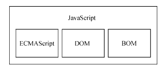

<!--
 * @Author: East
 * @Date: 2022-01-13 17:10:23
 * @LastEditTime: 2022-02-14 05:34:11
 * @LastEditors: Please set LastEditors
 * @Description: 1. js 历史回顾
                 2. js 是什么
                 3. js 与 ECMAScript 的关系
                 4. JavaScript 的不同版本
 * @FilePath: \forGreaterGood\javascript\js红宝书4\1-什么是JavaScript.md
-->

# 什么是 JavaScript？

- 1995 年，JavaScript 问世。
- 当时用于替代 Perl 等服务器端语言**处理输入验证**
- 要真正学好用好 JavaScript，理解其**本质、历史及局限性**是非常重要的

## 1. 简短的历史回顾

> 随着 Web 日益流行，对客户端脚本语言的需求也越来越强烈。

### 1.1 历史前提

- 使用 28.8k bits/s 的调制解调器上网
- 网页变得越来越大、越来越复杂
- 验证简单的表单，需要大量与服务器的往返通信

--> 于是 网景公司将**开发一个客户端脚本语言来处理这种简单的数据验证**提上了日程 -- Brendan Eich

### 1.2 神仙打架

1. 网景公司在 Netscape Navigation 2 发布了 JavaScript 1.0，非常成功。
2. Netscape Navigation 3 中发布 JavaScript 1.1。
3. Netscape Navigation 3 发布后不久，微软发布了 IE 3，其中包含自己名为 JScript 的 JavaScript 实现。
4. 1996 年 8 月，微软重磅进入 Web 浏览器领域。

--> 这意味着出现了两个版本的 JavaScript。但 JavaScript 还**没有规范其语法或特性的标准**，这两个版本的并存让这个问题更加突出。

### 1.3 标准的出现

1. 1997 年，JavaScript 1.1 作为提案被提交给欧洲计算机制造商协会(Ecma)。第 39 技术委员会(TC39)承担了“**标准化一门通用、跨平台、厂商中立的脚本语言的语法和语义**”的任务。
   - 成员来自 网景、Sun、微软、Borland、Nombas 和其他对这门脚本语言有兴趣的公司的工程师
2. 数月后，名为 ECMA-262(即 ECMAScript) 的脚本语言标准被打造完成
3. 1998 年，国际标准化组织(ISO) 和 国际电工委员会(IEC) 也将 ECMAScript 采纳为标准(ISO/IEC-16262)
4. 自此以后，各家浏览器均以 ECMAScript 作为自己 JavaScript 实现的依据，虽然具体实现各有不同。

## 2. JavaScript 实现

完整的 JavaScript 实现包含以下几个部分：

- 核心 ECMAScript
- 文档对象模型 DOM
- 浏览器对象模型 BOM

### 2.1 核心 ECMAScript

- ECMA-262 将这门语言作为一个基准来定义，以便在它之上 再构建 更稳健的脚本语言
- **宿主环境(host environment)**
  - ECMAScript 实现 可能存在的 宿主环境
    1.  Web 浏览器
    2.  Node.js
    3.  Adobe Flash(已被淘汰)
  - 提供
    1.  ECMAScript 的基准实现
    2.  与环境自身交互必须的扩展
        - 扩展(比如 DOM)使用 ECMAScript 核心类型和语法，提供特定于环境的额外功能
- 定义了的东西
  - 语法
  - 类型
  - 语句
  - 关键字
  - 保留字
  - 操作符
  - 全局对象
- 版本更迭
  1.  Ed1：Netscape JavaScript1.1 被删去浏览器特定代码 + 少量细微的修改 + 不支持 Unicode 标准 + 对象(如 Date 对象)与平台有关
  2.  Ed2：编校
  3.  Ed3：真正的更新 —— 字符串处理 + 错误定义 + 数值输出 + 正则表达式的支持 + 支持新的控制语句(?) + `try/catch` 异常处理
      - 标志着 ECMAScript 作为一门真正的编程语言的时代终于到来
  4.  Ed4：彻底的修订，被抛弃
  5.  Ed5：“ECMAScript 3.1” 提案被接受。厘清 Ed3 存在的歧义 + 增加新功能(原生地解析和序列化 JSON + 方便继承和高级属性定义地方法 + 新的增强 ECMAScript 引擎解释 + 严格模式)
  6.  Ed6：俗称 ES6、ES2015、ES Harmony(和谐版)。正式支持 类 + 模块 + 迭代器 + 生成器 + 箭头函数 + Promise + Reflect + Proxy + 其他新的数据类型
  7.  Ed7：`Array.prototype.includes` + 指数操作符
  8.  Ed8：异步函数(async/await) + SharedArrayBuffer + Atomics API + `Object.values` + `Object.entries` + `Object.getOwnPropertyDescriptors` + 字符串填充方法 + 支持对象字面量最后的逗号
  9.  Ed9：异步迭代 + 剩余和扩展属性(rest, ...args) + 一组新的正则表达式特性 + `Promise finally` + 模板字符串
  10. Ed10：`Array.prototype.flat` + `Array.prototype.flatMap` + 字符串前后填充 + `Object.fromEntries` + `Symbol.prototype.descriptor` 属性 + 明确 `Function.prototype.toString()` 的返回值 + 固定 `Array.prototype.sort()` 的顺序 + 解决与 JSON 字符串兼容的问题(?) + `catch` 子句的可选绑定
- 符合性 conformance 实现(前两个重要，后两个无所谓)
  1.  支持 ECMA-262 中描述的所有“类型、值、对象、属性、函数，以及程序语法与语义”
  2.  支持 Unicode 字符标准
  3.  增加 ECMA-262 中未提及的“额外的类型、值、对象、属性和函数”
  4.  支持 ECMA-262 中没有定义的“程序和正则表达式语法”(允许修改和扩展内置的正则表达式特性)
  - 总而言之，这些条件为 实现 开发者 基于 ECMAScript 开发语言提供了极大的**权限和灵活度**
- 浏览器对 ECMAScript 的支持
  - 太繁杂了不看。
  - 总而言之就是 Netscape Navigator 3、Netscape Navigator 4 和 IE4、IE4 都没有遵守 ECMAScript (因为标准还没出来)
  - 2008 年，五大浏览器(IE、FireFox、Safari、Chrome 和 Opera) 全部兼容 ECMAScript 第三版

### 2.2 DOM

文档对象模型(DOM, Document Object Model)是一个应用编程接口(API)，用于在 HTML 中使用扩展的 XML。

DOM 将整个页面抽象为一组**分层节点**。

优势：

1. DOM 通过创建表示**文档的树**，让开发者可以随心所欲地控制网页的内容和结构
2. 使用 DOM API，可以轻松地删除、添加、替换、修改节点。

发展过程：

1. DOM 标准
   1. IE4 和 Netscape Navigator 4 支持不同形式的动态 HTML(DHTML) -> 不刷新页面而修改页面外观和内容 -- Web 技术的巨大进步
   2. 没有统一的标准，会导致人们将来面向浏览器开发网页 -> 万维网联盟(W3C, World Wide Web Consortium) 开始了制定 DOM 标准的进程
2. DOM 级别
   1. DOM Level 1：
      - 1998.10 成为 W3C 的推荐标准
      - 目标：**映射文档结构**
      - 由两个模块组成：DOM Core 和 DOM HTML
        - DOM Core：提供一种映射 XML 文档，从而方便访问和操作文档任意部分的方式
        - DOM HTML：扩展了 DOM Core，并增加了特定于 HTML 的对象和方法
   2. DOM Level 2：
      - 对 DOM HTML 增加了对鼠标和用户界面事件、范围、遍历(迭代 DOM 节点的方法)的支持
      - 通过对象接口支持了 层叠样式表(CSS)
      - 对 DOM Core 扩展了 包含对 XML 命名空间的支持
   3. DOM Level 3：
      - DOM Load and Save 新模块：以统一的方式加载和保存文档的方法
      - 验证文档的方法(DOM Validation)
      - DOM Core：扩展支持了所有 XML 1.0 的特性
   4. DOM 4： - W3C 不再按照 Level 来维护 DOM 了，而是作为 DOM Living Standard 来维护，其快照称为 DOM 4 - 替代 Mutation Events 的 Mutation Observers
3. Web 浏览器对 DOM 的支持情况
   - IE 5 尝试支持 DOM，直到 5.5 才真正支持，实现 DOM Level 1 的大部分。
     - 但 6 和 7 版本都没有实现新特性
     - 8 修复了一些问题
   - Netscape 6 之前都不支持 DOM，7 之后开发资源被转移到了开发 FireFox 浏览器上
   - FireFox 3+ 支持全部的 Level 1、几乎全部的 Level 2，以及 Level 3 的某些部分。
     - Mozilla 开发团队的目标是**打造百分之百兼容标准的浏览器**
   - 总而言之，**支持 DOM** 是浏览器厂商的重中之重，每个版本发布都会改进支持度。

其他 DOM(W3C 推荐标准)：

- SVG 可伸缩矢量图
- MathML 数学标记语言
- SMIL 同步多媒体集成语言

### 2.3 BOM

BOM(Browser Object Model)，用于支持访问和操作浏览器的窗口。

使用 BOM，开发者可以操纵浏览器显示页面之外的部分。

**注意：BOM 是唯一一个没有相关标准的 JavaScript 实现**：

- --> 每个浏览器实现的都是自己的 BOM
  - 有一些所谓的事实标准，如 window 对象和 navigator 对象，每个浏览器都会给它们定义自己的属性和方法
- HTML 5 的出现改变了这个局面：以正式规范的形式涵盖了尽可能多的 BOM 特性。

相关扩展：

- 弹出新浏览器窗口的能力
- 移动、缩放和关闭浏览器窗口的能力
- navigator 对象，提供关于浏览器的详尽信息
- location 对象，提供浏览器加载页面的详细信息
- screen 对象，提供关于用户屏幕分辨率的详尽信息
- performance 对象，提供浏览器内存占用、导航行为和时间统计的详尽信息
- 对 cookie 的支持
- 其他自定义对象，如 XMLHttpRequest 和 IE 的 ActiveXObject

## 3. JavaScript 版本

这种东西去查叭，记怎么可能记得住...

## 4. 小结

1. JavaScript 是一门用来**与网页交互的脚本语言**：
   - ECMAScript：由 ECMA-262 定义并提供核心内容
   - 文档对象模型(DOM)：提供与网页内容交互的方法和接口
   - 浏览器对象模型(BOM)：提供与浏览器交互的方法和接口
2. 对 JavaScript 三大模块的支持：
   1. 所有浏览器基本上对 ES5 提供了完善的支持
   2. 对 DOM 的支持各不相同，但对 Level 3 的支持日趋规范
   3. HTML 5 中收录的 BOM 会因浏览器而异，不过开发者仍然可以假定存在很大一部分公共特性
