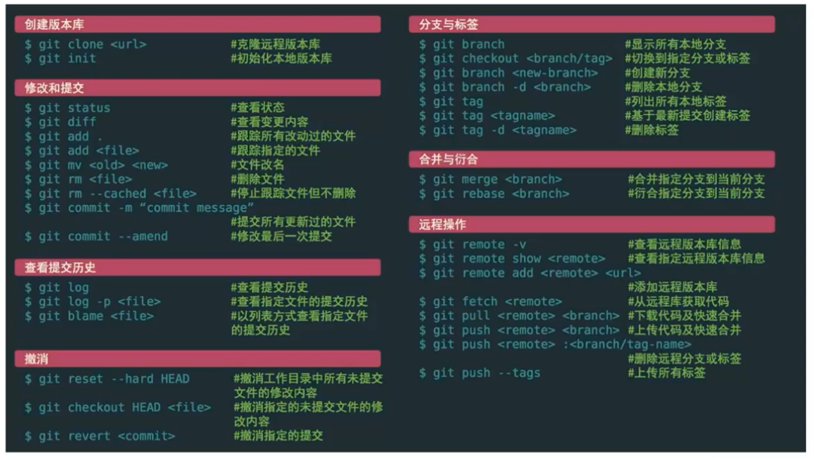

# Git 版本控制工具

## 一、邂逅版本控制工具

### 1.1 版本控制

- version control
  - 维护工程蓝图的标准做法，能追踪工程蓝图从诞生一直到定案的过程
  - 一种软件工程技巧，借此能在软件开发的过程中，确保由不同人所编辑的同一程序文件都得到同步
- 功能(场景解决)
  - 不同版本的存储管理
    - 一个项目会不断地进行版本的迭代，来修复之前的一些问题、增加新的功能、需求，甚至包括项目的重构
  - 重大版本的备份
  - 恢复之前的项目版本
  - 记录项目的点点滴滴
  - 多人开发的项目合并

### 1.2 版本控制的历史

1. 没有版本控制
   - 文件备份，再通过 diff 命令对比两个文件的差异
2. CVS(Concurrent Version System)
   - 第一个被大规模使用的版本控制工具，诞生于 1985 年
   - 集中式版本控制工具
3. SVN(Subversion)
   - 集中式版本工具
4. Git
   - 分布式版本工具

## 二、集中式和分布式区别

### 2.1 集中式版本控制

- Centralized Version Control System(CVCS)
  - 特点：单一的集中管理的服务器，保存所有文件的修订版本
  - 协同开发人员通过客户端连接到这台服务器，取出最新的文件 or 提交更新
  - 优缺点
    - 优点
      1. 相对于老式的本地管理而言，每个人都可以在一定程度上看到项目中的其他人正在做什么
    - 缺点：中心服务器不能出故障
      1. 如果宕机，那么在这期间，无法协同工作
      2. 如果中心数据库所在的磁盘发生损坏，又没有恰当备份，那么将丢失所有数据

### 2.2 分布式版本控制

- Distributed Version Control System(DVCS)
  - 客户端并不只提取最新版本的文件快照，而是把代码仓库完整地镜像下来，包括完整的历史记录
    - 每一次的克隆操作，其实都是对代码仓库的完整备份
  - 优点
    1. 任何一处协同工作用的服务器发生故障，事后都可以用任何一个镜像出来的本地仓库恢复

## 三、Git 的环境安装搭建

### 3.1 Bash, CMD, GUI 的区别

- Bash
  - Unix shell 的一种，Linux 与 Mac OS X 都将其作为默认 shell
  - 基于 CMD，并添加一些新的命令和功能
    - 比如 ssh
- Git CMD
  - 是 Windows 操作系统上的命令行解释程序
  - 可以使用 cmd 来运行 git 命令
- Git GUI
  - 提供一个图形用户界面来运行 git 命令

### 3.2 Git 配置分类

- 一些命令
  - `/etc/gitconfig` 文件：包括系统上每一个用户及他们仓库的通用配置
    - 如果在执行 `git config` 时带上 `--system` 选项，那么它就会读写该文件中的配置变量
    - 由于是系统配置文件，所以需要管理员 or 超级用户权限来修改
    - 基本不用
  - `~/.gitconfig` or C 用户 `C/用户/[用户名]/.gitconfig`：只针对当前用户
    - 可以传递 `--global` 选项让 Git 读写此文件，这对系统上所有仓库生效
  - 当前使用仓库的 Git 目录中的 config 文件即(`.git/config`)：针对该仓库
    - 可以传递 `--local` 选项让 Git 强制读写此文件，索然默认情况下用的就是它
    - 基本不用
- 定制自己的 Git 环境

  - 设置自己的用户名和邮件地址(安装完 Git 后第一件要做的事)

    ```shell
    $ git config --global user.name "[name]"
    $ git config --global user.email "[email]"

    # 查看当前配置
    $ git config --list
    $ git config user.name
    ```

    - 每一个 Git 提交都会使用这些信息，会写入到每一次的提交中，不可更改
    - if 使用了 `--global` 选项，那么该命令只需要运行一次

  - 设置别名
    ```shell
    $ git config --global alias.co checkout
    $ git config --global alias.br branch
    $ git config --global alias.ci commit
    $ git config --global alias.st status
    ```

## 四、Git 初始化本地仓库

### 4.1 初始命令

- `git init/clone`
  - `git init`: 没有项目，初始化一个项目
  - `git clone [项目地址]`: 从远程服务器克隆一个已存在的 Git 仓库

### 4.2 文件的状态划分

- 不同状态
  - 未跟踪：默认情况下，Git 仓库下的文件没有添加到仓库管理中，需要通过 `add` 命令来操作
  - 已跟踪：添加到 Git 仓库管理的文件处于已跟踪状态，Git 可以对其进行各种跟踪管理
    - `staged`: 暂缓区中的文件状态
      - 暂缓区：又叫索引区，Index
    - `Unmodified`: commit 命令，可以将 `staged` 中文件提交到 Git 仓库
    - `Modified`: 修改了某个文件后，会处于 Modified 状态


## 五、Git 记录更新变化过程

- `git status`
  - 查看文件所处状态
  - `git status -s` / `git status --short`: 简洁的信息
- `git log`
  - 修饰符
    - `git log --pretty=oneline`: 在一行显示
    - `git log --pretty=online --graph`: 图结构 -- 在不同分支时使用
  - 后续操作
    - 按 空格键，继续查看
    - 按 `q` 退出
- `.gitignore` 文件
  - git 忽略文件
    - 日志文件
    - 编译过程中创建的临时文件
    - `node_modules` 文件夹
    - 本地环境变量
    - ...
  - 一般脚手架会自动生成，不需要手动创建
- `git commit`
  - `git commit -m`: 将提交信息与命令放在同一行
- git 校验和
  - 本次提交的唯一 id
  - SHA-1 散列(hash)
    - Git 用以计算校验和的机制
    - 一个由 40 个十六进制字符组成的字符串，基于 Git 中文件的内容 or 目录结构计算出来的
- `git reset`: 版本回退
  ```shell
  $ git reset --hard HEAD^
  $ git reset --hard HEAD^^
  $ git reset --hard HEAD~1000
  ```
  - 版本回退的前提：if 要进行版本回退，需要先知道目前处于哪一个分支 —— Git 通过 HEAD 指针记录当前版本
    - HEAD 是当前分支引用的指针，总是指向该分支上的最后一次提交
    - 简单看作 该分支上的最后一次提交的 快照
  - HEAD 的写法
    - 上个版本：`HEAD^`
    - 上上个版本：`HEAD^^`
    - 上 1000 个版本：`HEAD~1000`
    - 可以指定某一个 commit id
      - 可以选择校验和的前几位，只要不重复就行
  - 版本回退后，`git log` 不保存回退版本之后的版本
- `git reflog`
  - 记录每一次的操作

## 六、Git 远程仓库和验证

### 6.1 认识远程仓库

- Remote Repository 远程仓库
  - 通常搭建在某一个服务器上 —— 需要在 Git 服务器上搭建一个远程仓库
    - Git 服务器
      - 第三方的 Git 服务器：GitHub、Gitee、Gitlab 等
      - 在自己的服务器上搭建一个 Git 服务

### 6.2 远程仓库的验证

> 对于私有仓库，想要进行操作，远程仓库会对身份进行验证

- 基于 HTTP 的凭证存储(Credential Storage)
  - HTTP 协议
    - 是无状态的连接 -> 不会记忆上一次的数据
      - so 每一个连接都需要用户名和密码
    - then, Git 拥有一个凭证系统来处理这个事情
  - Git Credential 的选项
    - 默认所有都不缓存，每一次连接都会询问你的用户名和密码
    - "cache" 模式会将凭证存放在内存中一段时间。密码永远不会被存储在磁盘中，并且在 15 分钟后从内存中清除
    - "store" 模式会将凭证用明文的形式存放在磁盘中，并且永不过期
    - if 使用的是 Mac，Git 还有一种 "osxkeychain" 模式，它会将凭证缓存在你的系统用户的钥匙串中(加密)
    - if Windows, 可以安装 Git Credential Manager for Windows 辅助工具
- 基于 SSH 的密钥
  - Secure Shell(SSH): 安全外壳协议，一种加密的网络传输协议，可在不安全的网络中为网络服务提供安全的传输环境
  - SSH 以非对称加密实现身份验证
    - 使用自动生成的公钥-私钥对来简单地加密网络连接，随后使用密码验证进行登录
    - 人工生成一对公钥和私钥，通过生成的密钥进行认证 —— 公钥需要放在待访问的电脑中，而对应的私钥需要由用户自行保管
      ```shell
      $ ssh-keygen -t ed25519 -C "[email]" # ed25519 方式，生成 id_ed25519.pub 文件
      $ ssh-keygen -t rsa -b 2048 -C "[email]" # rsa 方式
      ```
- 添加远程仓库
  ```shell
  git remote -v # 查看远程仓库
  git remote add origin [仓库 git 地址] # 链接远程仓库
  git pull origin master # 从远程仓库的 master 分支拉取
  git branch --set-upstream-to=origin/master # 给本地 master 分支设置上游分支(跟踪分支)
  git fetch
  git merge --allow-unrelated-histories
  git pull # = git fetch + git merge
  ```

## 七、Git 的标签 tag 用法

```shell
git tag v1.0.0 # 打上标签 轻量标签 lightweight
git tag # 查看打过的标签

git tag -a v1.1.0 -m "一些标注" # 附注标签 annotated
git show # 查看详情

git push origin v1.0.0 # push tag 到远程
git push origin --tags # 推送所有 tags 到远程

git tag -d v1.0..0 # 删除本地版本
git push origin --delete [版本] # 删除远程 tag

git checkout v1.1.0 # 切换到某个 tag，一般无法修改其中内容
# 如果想要修改某个 tag，会基于该 tag 重新拉取一个分支
```

## 八、Git 分支的使用过程

```shell
git push origin master:main # 完整写法，[master] 本地, [main] 远程
git push origin master # 将本地 master 分支推送到远程的 master 分支(如果没有，则新建)

git push # if 远程分支与本地分支名字不匹配，则报错
git config push.default upstream # 默认 simple, 同名，找不到就报错

git checkout -b dev # 在本地创建一个新分支 dev
git config push.default current # 与 simple 类似，但找不到会新建分支
git push

git branch [分支名] # 创建新分支，且指向当前最后一次提交
git checkout [分支名] # 切换到新分支 checkout/switch

git branch --merged # 查看所有合并到当前分支的分支
git branch --no-merged # 查看所有没有合并到当前分支的分支

git branch -d [分支名] # 移除分支
```

### 8.1 Git 提交对象(Commit Object)

```shell
git cat-file -t [文件夹名+文件前几位] # 输出 blob，意为二进制文件
git cat-file -p [文件夹名+文件前几位] # 输出内容
```

- - SHA-1 校验和
    - tree 校验和
      - 用于追踪上一次

### 8.2 master 分支

- Git 的分支，本质上仅仅只是指向提交对象的可变指针
  - Git 默认分支为 master，在多次提交操作之后，其实已经有一个指向最后那个提交对象的 master 分支
  - master 分支会在每次提交时自动移动
- master 分支
  - 本质也只是个普通的分支，只是被作为默认分支

## 九、工作中的 Git Flow

- 工作流
  - 在整个项目开发周期的不同阶段，可以同时拥有多个开放的分支
  - 示例
    - master：主分支
    - develop：开发分支 => 有稳定版本时，合并到 master 分支
    - topic：作为某一个主题 or 功能 or 特性的分支进行开发 => 完成后合并到 develop 分支中
- 比较流行的工作流
  - master
  - hotfix
  - release
  - develop
  - feature

## 十、Git 远程分支的管理

- 远程分支也是一种分支结构
  - <remote>/<branch> 形式命令

```shell
git checkout --track origin/main # 创建并切换到 main 分支

git push origin dev # 将本地 dev 分支推送到远程

git checkout dev # 切换到 dev 分支: 现在本地寻找 dev 分支，如果没有，则从远程仓库寻找 dev 分支，并且直接跟踪远程 dev

git push origin --delete dev # 删除远程分支 dev
```

## 十一、Git rebase 的使用

> 将图结构变为线性

```shell
# 在 feature 分支中
git rebase master
git checkout master
git merge fetch
```

**注意：永远不要在主分支上使用 rebase**

## 十二、Git 常见命令速查表


