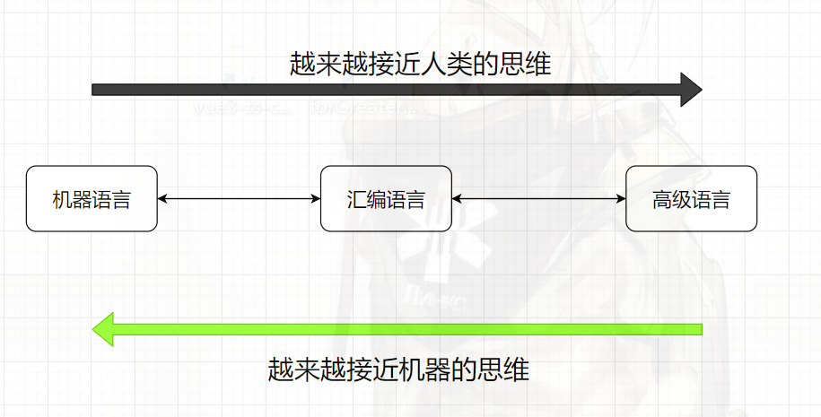

<!--
 * @Author: East
 * @Date: 2021-12-20 17:14:54
 * @LastEditTime: 2021-12-20 21:53:18
 * @LastEditors: Please set LastEditors
 * @Description: 浏览器原理 + v8 引擎 + js 执行原理
 * @FilePath: \forGreaterGood\javascript\01-浏览器原理+v8引擎+js执行原理.md
-->

# 邂逅 Javascript

## 一、引言

- 前端三剑客
  - HTML
  - CSS
  - JavaScript
- 重要性
  1. 前端万丈高楼的根基 —— 要搞 React，js 基础不好可不行
  2. 在工作中至关重要 —— 面试很重要啊喂(#`O′)！
  3. 前端的未来依然是 JavaScript —— 不晓得，高度不够，看不到这么远
- JavaScript 让人迷惑的知识点
  - 作用域
  - 函数、闭包
  - 面向对象
  - ES 新特性
  - 其他...
    - 事件循环，微任务，宏任务，promise 等
- TypeScript 会取代 JavaScript 吗？
  - ts 给 js 带来了类型思维 —— js 本身对变量、函数的参数等类型进行限制
  - 是 js 的超集，最终仍要转换成 js 才能真正运行
  - 不排除有一天 js 本身加入类型检测

## 二、JavaScript 是一门编程语言

- js 是一门高级的编程语言
  - what is 高级？
    - 机器语言：10 指令
    - 汇编语言：mov ax, bx 一些汇编指令
    - 高级语言：C, C++, Java, JavaScript, Python
      - 编译型语言：可直接编译成可执行文件
      - 解释型语言

## 三、浏览器的工作原理

- js 代码下载 
  1. 域名 -> dns 域名解析 -> ip 地址(服务器地址) -> 服务器返回 index.html 网页
  2. 浏览器开始解析该 index.html 页面 -> 遇到 css 文件和 js 文件 -> 去服务器请求下载

### 浏览器内核

> js 被加载之前，需要先了解浏览器内核，js 就是被浏览器内核所解析的。

- 不同浏览器有不同的内核组成
  - Gecko：早期被 Nexscape 和 Mozilla Firefox 浏览器所使用
  - Trident：微软开发，被 IE4~IE11 所使用，但 Edge 浏览器已转向 Blink
  - Webkit：苹果基于 KHTML 开发、开源的，用于 Safari，Google Chrome 之前也在使用
  - Blink：Webkit 的一个分支，Google 开发，目前应该应用于 Google Chrome、Edge、Opera 等
  - ...
- 别名
  - 排版引擎 layout engine
  - 浏览器引擎 browser engine
  - 页面渲染引擎 rendering engine
  - 样板引擎

### 浏览器渲染过程

- 图片解释
  1. HTML 节点 --> DOM Tree: by HTML Parser
  2. js code 在 DOM 对 DOM Tree 做相关的操作: who 来执行？—— js 引擎
  3. CSS 规则会 Attachment 到 DOM 上
  4. Layout 布局引擎

1. HTML 解析的时候如果遇到了 JavaScript 标签，会停止解析 HTML，而去加载和执行 JavaScript 代码
2.
