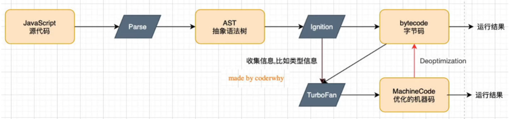
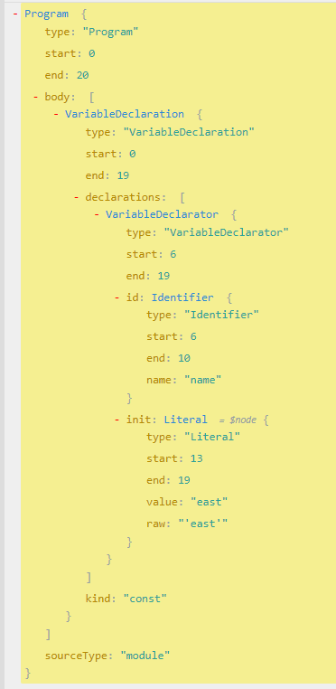

<!--
 * @Author: East
 * @Date: 2021-12-20 17:14:54
 * @LastEditTime: 2021-12-23 10:54:59
 * @LastEditors: Please set LastEditors
 * @Description: 浏览器原理 + v8 引擎 + js 执行原理
 * @FilePath: \forGreaterGood\javascript\01-浏览器原理+v8引擎+js执行原理.md
-->

# 邂逅 Javascript

## 一、引言

- 前端三剑客
  - HTML
  - CSS
  - JavaScript
- 重要性
  1. 前端万丈高楼的根基 —— 要搞 React，js 基础不好可不行
  2. 在工作中至关重要 —— 面试很重要啊喂(#`O′)！
  3. 前端的未来依然是 JavaScript —— 不晓得，高度不够，看不到这么远
- JavaScript 让人迷惑的知识点
  - 作用域
  - 函数、闭包
  - 面向对象
  - ES 新特性
  - 其他...
    - 事件循环，微任务，宏任务，promise 等
- TypeScript 会取代 JavaScript 吗？
  - ts 给 js 带来了类型思维 —— js 本身对变量、函数的参数等类型进行限制
  - 是 js 的超集，最终仍要转换成 js 才能真正运行
  - 不排除有一天 js 本身加入类型检测

## 二、JavaScript 是一门编程语言

- js 是一门高级的编程语言
  - what is 高级？
    - 机器语言：10 指令
    - 汇编语言：mov ax, bx 一些汇编指令
    - 高级语言：C, C++, Java, JavaScript, Python
      - 编译型语言：可直接编译成可执行文件
      - 解释型语言

## 三、浏览器的工作原理

- js 代码下载 
  1. 域名 -> dns 域名解析 -> ip 地址(服务器地址) -> 服务器返回 index.html 网页
  2. 浏览器开始解析该 index.html 页面 -> 遇到 css 文件和 js 文件 -> 去服务器请求下载

### 浏览器内核

> js 被加载之前，需要先了解浏览器内核，js 就是被浏览器内核所解析的。

- 不同浏览器有不同的内核组成
  - Gecko：早期被 Netcape 和 Mozilla Firefox 浏览器所使用
  - Trident：微软开发，被 IE4~IE11 所使用，但 Edge 浏览器已转向 Blink
  - Webkit：苹果基于 KHTML 开发、开源的，用于 Safari，Google Chrome 之前也在使用
  - Blink：Webkit 的一个分支，Google 开发，目前应该应用于 Google Chrome、Edge、Opera 等
  - ...
- 别名
  - 排版引擎 layout engine
  - 浏览器引擎 browser engine
  - 页面渲染引擎 rendering engine
  - 样板引擎

### 浏览器渲染过程

1. HTML 解析的时候如果遇到了 JavaScript 标签，会停止解析 HTML，而去加载和执行 JavaScript 代码

- 图片解释
  1. HTML 节点 --> DOM Tree: by HTML Parser
  2. js code 在 DOM 对 DOM Tree 做相关的操作: who 来执行？—— js 引擎
  3. CSS 规则会 Attachment 到 DOM 上
  4. Layout 布局引擎：对当前浏览器的状态进行布局

2. js 代码由 js 引擎来执行
   1. why need js 引擎？
      - 高级的编程语言都需要转成最终的机器指令来执行
      - 事实上 js 无论交给浏览器 or Node 来执行，最后都需要被 CPU 执行
      - 但 CPU 只认识自己的指令集，即 01 指令
      - 因此需要 js 引擎将 js 代码翻译成 CPU 指令
   2. 常见 js 引擎
      - spiderMonkey：第一款 js 引擎
      - Chakra：IE js 引擎
      - JavaScriptCore：WebKit 中的 js 引擎， Apple 公司开发
      - V8
   3. 浏览器内核组成：HTML 引擎 + js 引擎(以 WebKit 为例)
      - WebCore：负责 HTML 解析、布局、渲染等相关工作
      - JavaScriptCore：解析、执行 js 代码

#### V8 引擎的原理

- 官方定义：
  - 用 C++ 编写的 Google 开源高性能 JavaScript 和 WebAssembly 引擎，用于 Chrome 和 Node.js 等
  - 它实现了 ECMAScript 和 WebAssembly，并在 Windows7 或更高版本，macOS 10.12+ 和使用 x64，IA-32，ARM 或 MIPS 处理器的 Linux 系统上运行
  - V8 可以独立运行，也可以嵌入到任何 C++ 应用程序中
- V8 引擎所做的事
  - Parse
    - 词法分析：切割 --> 生成 tokens: [{ type: 'keyword', value: 'const' }, { type: 'identifier', value: 'name' }, ...]
    - 语法分析：based on tokens --> 生成 AST 树 —— 例, [ast 模拟网站](https://astexplorer.net/), `const name = 'east'` 
      - babel 转化: ts -> ast -> 新 ast -> generate code -> js 代码
      - vue template：ast -> js 代码，createVNode
    - <u>该部分与作用域提升有关</u>
  - Ignition 库
    - 将抽象语法树转成字节码
      - why 不转成 机器码？——js 代码跑在什么环境下不确定，在不同环境拥有不同的 CPU --> CPU 架构不同 --> 执行的机器指令也许有区别
  - TurboFan 库
    - 根据 Ignition 库收集信息，把重复出现的函数标记为 hot，直接转化成机器指令
    - 但有一个问题：如果一个 sum 函数，可以对数字类型和字符串类型的数据做相加 --> 虽然函数相同，但计算机所做的事情不同，v8 会有一个 **Deoptimization** (反向优化)的过程，将机器码转回字节码
      - so：ts 的代码效率更高
- v8 引擎的解析图(官方)
  - Blink: 内核
    - Blink 会把 js 代码以流 Stream 的方式发送给 js 引擎
    - js 引擎会将 js 转化成 Scanner 扫描器，做词法分析
  - parser 与 preparser
    - preparser
      1. js 中函数内部可以继续定义函数
      2. js 引擎对内部函数
         - 不论是没用过，还是用过的，都没有必要被完整地解析 --> 指转成 AST 结构 → bytecode → 运行
         - 但是可能会需要知道里面发生了什么，所以会进行预解析 --> 实现了 lazy parsing 延迟解析
         - 而对函数的全量解析是在函数调用时才会进行的
         - 目的：提高性能

## 四、v8 对 js 代码的处理过程

```js
var name = "why";

var num1 = 20;
var num2 = 30;
var result = num1 + num2;
```

1. 代码被解析
   1. v8 引擎会创建一个对象 `var GlobalObject = {}`
   2. 将内部类放到 GO 里，例：String, Date, Number...，有一个 window 对象
      ```js
      var globalObject = {
        String: "类 ",
        setTimeout: function(...) {...}
        window: this,
      };
      ```
   3. 将 name, num1, num2, result 也会被放到 go 中，但值为 undefined
2. 运行代码
   1. 为了执行代码，v8 会有一个**执行上下文栈(Execution Context Stack, ECStack, 函数调用栈)**
   2. 因为执行的是全局代码，为了全局代码正常执行，需要创建**全局执行上下文(Global Execution Context, 只此一个)**，只有全局代码需要被执行时才会创建 --> 栈底
      - VO(variable object)：全局执行上下文中维护的对象，指向 GO
      - 准备好以上的东西，才开始执行代码
   3. 代码依次执行，给 name, num1, num2, result 依次赋值
