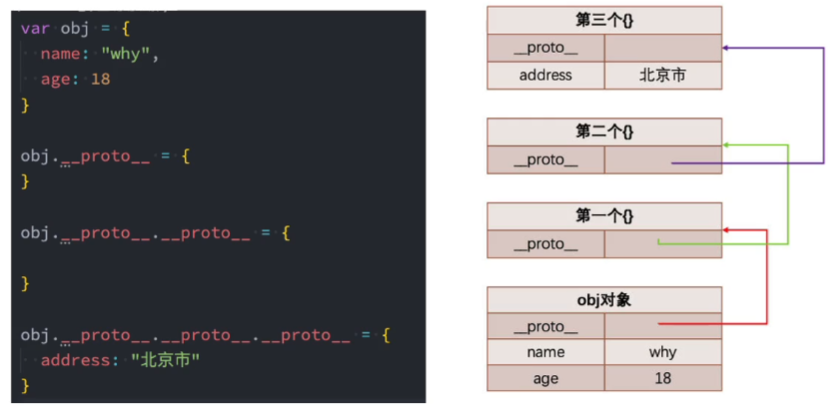
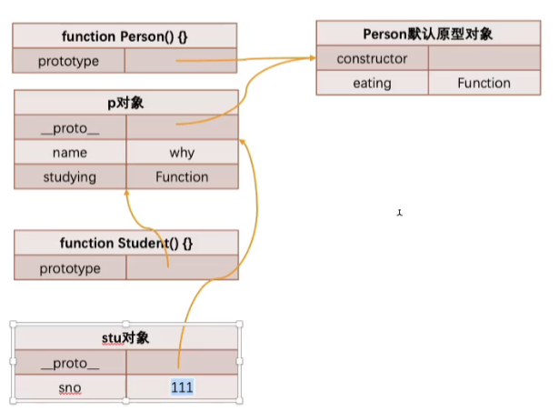
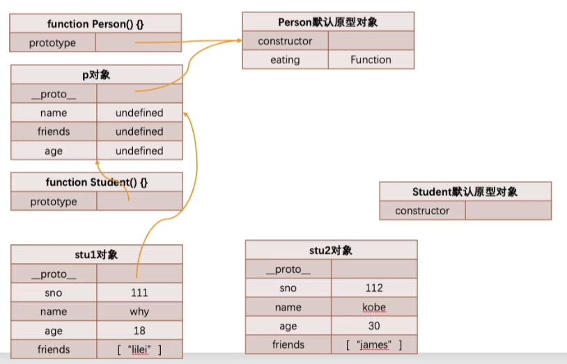

<!--
 * @Author: East
 * @Date: 2022-01-04 15:53:16
 * @LastEditTime: 2022-01-04 17:39:58
 * @LastEditors: Please set LastEditors
 * @Description: 打开koroFileHeader查看配置 进行设置: 面向对象的原型链 + 继承实现
 * @FilePath: \forGreaterGood\javascript\10-原型链+继承实现.md
-->

# 面向对象的原型链和继承实现

## 一、原型链

### 1. JavaScript 中的类和对象

```js
function Person() {}

var p1 = new Person();
var p2 = new Person();
```

普通对象 -> 构造函数 by `new` -> 类(其他面向对象语言的开发者习惯于称呼)

- 如果从面向对象的编程范式角度来看，`Person` 确实可以被称之为类
  - 但早期 `ECMAScript` 没有类的定义

### 2. 面向对象的特性--继承

- 面向对象有三大特性
  - 封装
  - 继承：不仅可以减少重复代码的数量(对代码的复用)，也是多态的前提(纯面向对象中)
  - 多态：不同对象在执行时表现出不同的形态
- JavaScript 中利用原型链的机制实现继承

### 3. 原型链的理解

原型链 prototype chain

- `[get]` 操作 
  1. 在当前的对象中查找属性
  2. 如果没有找到，会去该对象的原型(`__proto__`)对象上查找
  3. 如果原型对象上没找到，再去该原型对象的原型对象上找
  4. 找到顶层结束，返回 `undefined`
- `Object` 的原型 -- 顶层原型
  1. 查看
     ```js
     var obj = {};
     console.log(obj.__proto__); // [Object: null prototype] {}
     console.log(obj.__proto__.__proto__); // null
     ```
  2. 顶层原型是什么？
     1. 两种创建方式本质一样
        ```js
        var obj1 = {};
        var obj2 = new Object();
        ```
        - 即 `obj2.__proto__ = Object.prototype = {}`
     2. `Object.prototype` 实际上不是一个空对象，只是内部不可枚举而已
        ```js
        console.log(Object.getOwnPrototypeDescriptors(Object.prototype));
        // result 如下
        {
          constructor: {
            value: [Function: Object],
            writable: true,
            enumerable: false,
            configurable: true
          },
          __defineGetter__: {
            value: [Function: __defineGetter__],
            writable: true,
            enumerable: false,
            configurable: true
          },
          toString: Function,
          ['__proto__']: {
            get: [Function: get __proto__],
            set: [Function: set __proto__],
            enumerable: false,
            configurable: true
          },
          ...
        }
        ```

### 4. Person 构造函数原型

```js
function Person() {}

console.log(Person.prototype); // {}
console.log(Object.getOwnPropertypeDescriptors(Person.prototype));
/* result
{
  constructor: {
    value: [Function: Person],
    writable: true,
    enumerable: false,
    configurable: true
  }
}
*/
console.log(Person.prototype.__proto__); // [Object: null prototype] {}
console.log(Person.prototype.__proto__.__proto__); // null
```

- `Person.prototype` 中没有出现 `__proto__` 属性是因为这是自主实现，不一定都给加上
- `Person` 继承自 `Object` --> **`Object` 是所有类的父类`**

## 二、继承实现

### 1. why need inheritance?

```js
// 学生构造函数
function Student(name, age, sno) {
  this.name = name;
  this.age = age;
  this.sno = sno;
}
Student.prototype.eating = function () {
  console.log(this.name + "在吃东西...");
};
Student.prototype.studying = function () {
  console.log(this.name + "在学习...");
};
// 教师构造函数
function Teacher(name, age, title) {
  this.name = name;
  this.age = age;
  this.title = title;
}
Teacher.prototype.eating = function () {
  console.log(this.name + "在吃东西...");
};
Teacher.prototype.teaching = function () {
  console.log(this.name + "在上课...");
};
```

1. 存在大量重复的代码：属性 + 方法
2. 把这些重复的代码**抽取**到父类中，子类通过继承获得

### 2. 实现方案 1 -- 原型链的继承方案

```js
// 父类：公共的属性和方法
function Person() {
  this.name = "why";
  this.friends = [];
}
Person.prototype.eating = function () {
  console.log(this.name + "在吃东西...");
};

// 子类：特有的属性和方法
function Student() {
  this.sno = 111;
}
// 通过原型链继承
Student.prototype = new Person();
Student.prototype.studying = function () {
  console.log(this.name + "在学习...");
};

// 检测
var stu = new Student();
console.log(stu.name); // 'why'
stu.eating(); // 'why 在吃东西...'
stu.studying(); // 'why 在学习...'
```



- 弊端

  1. 打印 stu 对象，继承的属性是看不到的，如 `stu.name`
  2. 创建出来的两个对象，继承的引用属性相互影响

     ```js
     var stu1 = new Student();
     var stu2 = new Student();
     // 直接修改对象上的属性，是给本对象添加了一个新属性
     stu1.name = "east";
     console.log(stu2.name); // 'why'

     // 获取引用，修改引用中的值，会相互影响
     stu1.friends.push("wind");
     console.log(stu1.friends); // ['wind']
     console.log(stu2.friends); // ['wind']
     ```

  3. 在实现类的过程中，都没有传递参数

### 2. 实现方案 2 -- 借用构造函数继承

为了解决原型链继承中存在的问题，开发人员提供了一种新的技术：**constructor stealing**

```js
/** 父类 */
function Person(name, age, friends) {
  this.name = name;
  this.age = age;
  this.friends = [];
}
Person.prototype.eating = function () {
  console.log(this.name + "is eating...");
};

/** 子类 */
function Student(name, age, friends, sno) {
  Person.call(this, name, age, friends);
  this.sno = 111;
}
const p = new Person();
Student.prototype = p; // 这里是为了 Person 类中的方法
Student.prototype.studying = function () {
  console.log(this.name + "is studying...");
};

// 检测
var stu1 = new Student("why", 18, ["lilei"], 111);
console.log(stu1); // Person { name: "east", age: 22, friends: ["lilei"], sno: 111 }
stu1.eating(); // 'east is eating...'
var stu2 = new Student("kobe", 30, ["james"], 112);
```



- 弊端

  1. Person 函数被调用了两次，在每次创建一个新的 `Student` 对象时，都会被调用一次
  2. name, age, friends 属性会保存两份，原型中不应该存在

     ```js
     /** Student 的 prototype(即 p)中 */
     const p = new Person();
     p.name = undefined;
     p.age = undefined;
     p.friends = undefined;

     /** Student 实例中 */
     const s = new Student("east", 22, ["wind"], 111);
     Person.call(this, "east", 22, ["wind"]);
     s.name = "east";
     s.age = 22;
     s.friends = ["wind"];
     ```
