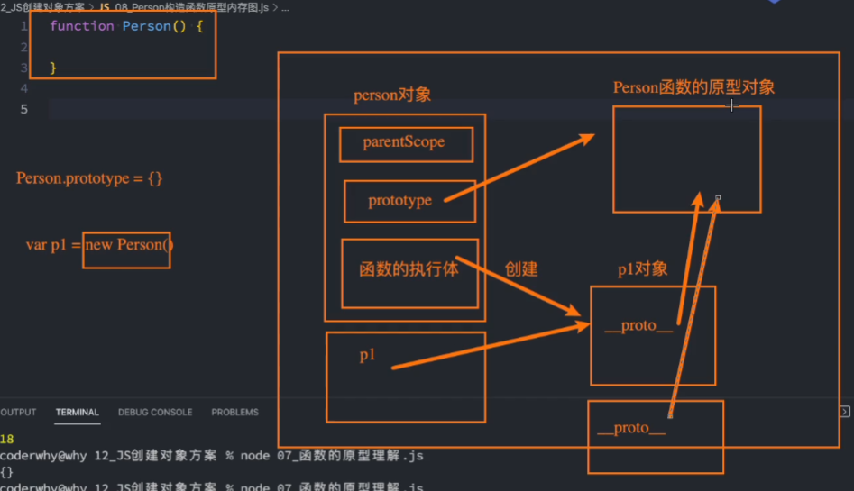

<!--
 * @Author: East
 * @Date: 2022-01-03 16:41:04
 * @LastEditTime: 2022-01-04 15:49:25
 * @LastEditors: Please set LastEditors
 * @Description: 对象+原型+函数原型+创建对象
 * @FilePath: \forGreaterGood\javascript\09-对象+原型+函数原型+创建对象.md
-->

# 对象 + 原型 + 函数原型 + 创建对象

## 一、对象

### Object.deifneProperties

```js
var obj = {
  _age: 18,
};
Object.deifneProperties(obj, {
  name: {
    configurable: true,
    enumerable: true,
    writable: true,
    value: "east",
  },
  age: {
    configurable: false,
    enumerable: false,
    get: function () {
      return this._age;
    },
    set: function (newVal) {
      this._age = newVal;
    },
  },
});
```

- 以 `_` 开头的属性，大家都约定是私有属性
  - 实际上 js 中没有私有属性
- `set` 和 `get` 的另一种写法
  - 原本写法
    ```js
    var obj = {
      _age: 18,
    };
    Object.deifneProperties(obj, {
      name: {
        configurable: true,
        enumerable: true,
        writable: true,
        value: "east",
      },
      age: {
        configurable: true,
        enumerable: true,
        get: function () {
          return this._age;
        },
        set: function (newVal) {
          this._age = newVal;
        },
      },
    });
    ```
  - 另一种写法
    ```js
    var obj = {
      _age: 18,
      set age(newVal) {
        this._age = newVal;
      },
      get age() {
        return this._age;
      },
    };
    ```

### 获取属性描述符

1. 获取某个特定属性的属性描述符

   ```js
   var obj = {};
   Object.deifneProperties(obj, {
     name: {
       configurable: true,
       enumerable: true,
       writable: true,
       value: "east",
     },
   });
   console.log(Object.getOwnPropertyDescriptor(obj, "name"));
   ```

2. 获取对象的所有属性描述符 `Object.getOwnPropertyDescriptors(obj)`

### Object 的方法对对象进行限制

```js
var obj = {
  name: "why",
  age: 18,
};

// 1. 禁止对象继续添加新的属性
Object.preventExtensions(obj);

obj.height = 1.88;
console.log(obj); // height 属性没有加进去

// 2. 禁止对象配置 / 删除里面的属性
Object.seal(obj);

delete obj.name;
console.log(obj); // name 属性没有删除

// 3. 禁止修改属性
Object.freeze(obj);

obj.name = "east";
console.log(obj); // name 属性没有修改
```

严格模式下，以上代码会报错

## 二、创建多个对象的方案

> 如果我们现在希望创建一系列的对象，比如 Person 对象，包括张三、李四、王五等，信息各不相同。

### 1. 字面量 or `new Object()`

> 最直观的方式

```js
var p1 = {
  name: "张三",
  age: 18,
  height: 1.88,
  address: "广州市",
  eating: function () {
    console.log(this.name + "在吃东西...");
  },
};
var p2 = {
  name: "李四",
  age: 20,
  height: 1.88,
  address: "北京市",
  eating: function () {
    console.log(this.name + "在吃东西...");
  },
};
...
```

缺点

1. 存在大量的重复代码

### 2. 工厂模式

- 一种常见的设计模式
- 通常会有一个工厂方法，通过该工厂方法可以产生想要的对象

```js
function createPerson(name, age, height, address) {
  var p = {};
  p.name = name;
  p.age = age;
  p.height = height;
  p.address = address;
  p.eating = function () {
    console.log(this.name + "在吃东西...");
  };
}

var p1 = createPerson("张三", 18, 1.88, "广州市");
var p2 = createPerson("李四", 20, 1.88, "北京市");
var p3 = createPerson("王五", 22, 1.88, "杭州市");
```

缺点：

1. 应该都是 `Person` 类型，但仍是 `Object` 类型
   - 万一有狗呢，人畜不分[手动 dog]
   - 即，获取不到对象最真实的类型

### 3. 构造函数

- 什么是构造函数？
  - 构造函数也称之为构造器(constructor)，通常是我们在创建对象时会调用的函数
  - 在其他面向对象的编程语言中，构造函数是存在于类中的一个方法，称之为构造方法
  - 但是 js 中的构造函数有点不太一样
    1. 构造函数也是一个普通的函数，从表现形式来说，跟其他普通的函数没有区别
    2. 如果一个普通的函数被 _`new`_ 操作符调用了，那么这个函数就被称之为是一个构造函数
- 构造函数不同的地方
  1. `new foo` 也可以调用 `foo` 函数
     - 后面加括号一般是为了传参
  2. **调用后执行的操作的不同**
     1. 在内存中创建一个新的对象(空对象)
     2. 这个对象内部的 `[[prototype]]` 属性会被赋值为该构造与函数的 `prototype` 属性
     3. 构造函数内部的 `this`，会指向创建出来的新对象
     4. 执行函数的内部代码(函数体代码)
     5. 如果构造函数没有返回非空对象，则返回创建出来的新对象
  3. 一般约定构造函数的函数名首字母大写
- 使用

  ```js
  function Person(name, age, height, address) {
    this.name = name;
    this.age = age;
    this.height = height;
    this.address = address;
    this.eating = function () {
      console.log(this.name + "在吃东西...");
    };
  }

  var p1 = new Person("张三", 18, 1.88, "广州市");
  var p2 = new Person("李四", 20, 1.88, "北京市");
  var p3 = new Person("王五", 22, 1.88, "杭州市");
  ```

  - 优点：
    1. 类型正确，是 `Person` 了
  - 缺点：
    1. 函数对象每次都是新的，浪费空间

### 4. 原型

#### 4.1 前提 1--对象的原型理解

1. 介绍原型
   - 早期的 ECMA 是没有规范如何去查看 `[[prototype]]` 的
     - 浏览器自主提供了一个属性 `__proto__`，可以让我们查看这个原型对象
       ```js
       var obj = {};
       console.log(info.__proto__); // [Object: null prototype] {}
       ```
     - ES5 之后提供 `Object.getPrototypeOf(obj)`
   - 每个对象都有一个 `[[prototype]]`，这个属性可以称之为对象的原型(一般叫做隐式原型)
2. 原型的用处
   - 从一个对象中获取一个属性时，会触发 `[get]` 操作
     1. 首先在当前对象中查找对应的属性，如果找到就直接使用
     2. 如果没有找到，就沿着原型链去查找 `[[[prototype]]]`

#### 4.2 前提 2 -- 函数的原型理解

```js
function foo() {}
```

- 函数是一个对象 --> 作为对象而言，函数也有 `[[prototype]]` 隐式原型
- 函数是一个函数 --> 多一个显式原型属性 `prototype`(ECMAScript 已规定)
  - 在使用 `new` 关键字调用构造函数创建对象时，内存中的新对象的 `[[prototype]]` 属性会被赋值为该构造函数的 `prototype` 属性
    ```js
    function Foo() {
      var moni = {}
      this = moni
      this.__proto__ = Foo.prototype
    }
    ```
- 函数原型内存图 
- 函数原型上的属性

  ```js
  function foo() {}

  console.log(foo.prototype); // {}
  console.log(Object.getOwnPropertyDescriptors(foo.prototype));
  /* result:
  {
    constructor: {
      value: [Function: foo],
      writable: true,
      enumerable: false,
      configurable: true
    }
  }
  */
  ```

  1. `foo.prototype.constructor` 是 ECMAScript 要求的，指向 `foo`
  2. `foo.name` 为 foo
  3. 可以在原型(`foo.prototype`)上添加自己的属性
  4. 直接修改整个 `prototype` 对象：
     ```js
     foo.prototype = {
       name: "east",
       age: 2,
     };
     Object.defineProperty(foo.prototype, "constructor", {
       configurable: true,
       enumerable: false,
       writable: true,
       value: foo,
     });
     ```

#### 4.3 进入正题--原型+构造函数

```js
function Person(name, age, height, address) {
  this.name = name;
  this.age = age;
  this.height = height;
  this.address = address;
}
Person.prototype.eating = function () {
  console.log(this.name + "在吃东西...");
};

var p1 = new Person("张三", 18, 1.88, "广州市");
var p2 = new Person("李四", 20, 1.88, "北京市");
var p3 = new Person("王五", 22, 1.88, "杭州市");
```
