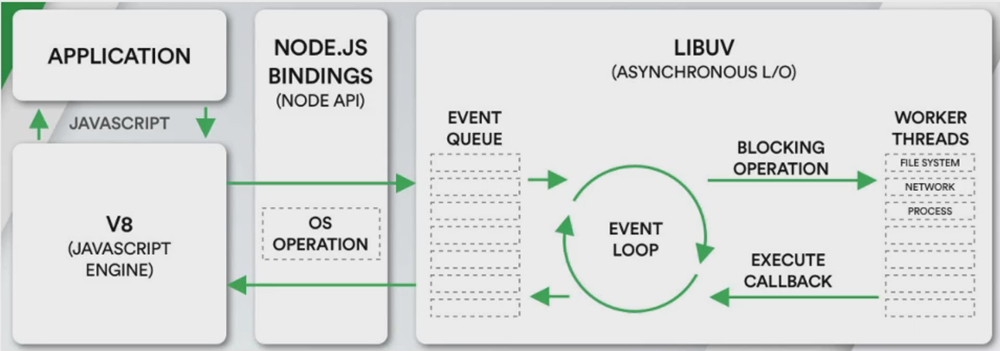

<!--
 * @Author: East
 * @Date: 2022-02-16 16:11:30
 * @LastEditTime: 2022-02-16 22:28:57
 * @LastEditors: Please set LastEditors
 * @Description: 浏览器Node的事件循环 + 微任务 + 宏任务
 * @FilePath: \forGreaterGood\javascript\coderwhy\23-浏览器Node的事件循环+微任务+宏任务.md
-->

# 浏览器 Node 的事件循环 + 微任务 + 宏任务 + 面试题

## 一、浏览器的事件循环

### 1.1 引入

耗时操作(类似于 setTimeout、网络请求、Promise.then、点击事件)，不会放在 js 线程里运行，否则会阻塞

### 1.2 浏览器的事件循环

- js 线程进行从上到下的单线程操作
- 计时器 or 其他耗时操作 在 到点了 or 触发 时，将对应的回调函数加入到 **事件队列**

## 二、微任务 + 宏任务

- 脚本的主要代码 main script
- 事件队列
  - 微任务队列 macrotask queue
    - ajax
    - setTimeout
    - setInterval
    - DOM 监听
    - UI Rendering
    - ...
  - 宏任务队列 microtask queue
    - Promise 的 then 回调
    - Mutation Observer API
    - queueMicrotask

执行顺序：

1. main script 中的代码优先执行(编写的顶层 script 代码)
2. 在执行任何的宏任务之前，都需要先保证微任务队列已经被清空

## 三、面试题

### 3.1 面试题 1

结果：
promise1
2
then1
queueMicrotask1
then3
setTimeout1
then2
then4
setTimeout2

### 3.2 面试题 2

结果：
script start
async1 start
async2
promise1
script end
async1 end
promise2
setTimeout

### 3.3 面试题 3

结果：
0
1
2
3
4
5
6

1. 不是普通的值，推迟一次微任务
2. 不是普通的值，且又有一个 `then`，则总共推迟两次微任务

## 四、Node 的事件循环

### 4.1 引入

node xxx.js：

1. 先开启一个 node 进程
2. node 进程也是多线程
3. js 线程 -> 执行 js 代码
4. 其他线程执行耗时操作 -> 操作完成，将回调事件添加到队列中
   - 如 `setTimeout`、文件读取等
5. js 线程再从队列中执行代码

### 4.2 Node 架构

> 浏览器中的 EventLoop 是根据 HTML5 定义的规范来实现的，不同的浏览器可能会有不同的实现，而 Node 中是由 libuv 实现的
> 

- libuv 中主要维护了一个 EventLoop 和 worker threads(线程池)
- EventLoop 负责调用系统的一些其他操作：文件的 IO、Network、child-processes 等

libuv 是一个多平台的专注于异步 IO 的库，它最初是为 Node 开发的，但现在也被使用到 Luvit、Julia、pyuv 等其他地方

### 4.3 Node 事件循环的阶段

1. **事件循环像是一个桥梁，是连接着应用程序的 JavaScript 和 系统调用之间的通道：**

   - 无论是我们的文件 IO、数据库、网络 IO、定时器 还是 子进程，在完成对应的操作后，都会将对应的结果和回调函数放到事件循环(任务队列)中
   - 事件循环会不断地从任务队列中取出对应的事件(回调函数)来执行

2. 但是**一次完整的事件循环 Tick 分成很多个阶段**：都是宏任务队列
   - 定时器(Timers)：本阶段执行已经被 `setTimeout()` 和 `setInterval()` 的调度回调函数
   - 待定回调(Pending Callback)：对某些系统操作(如 TCP 错误)执行回调，比如 TCP 连接时接收到的 ECONNREFUSED
   - idle, prepare：仅系统内部使用
   - 轮询(Poll)：检索新的 I/O 事件；执行与 I/O 相关的回调
   - 检测(check)：`setImmediate()` 回调函数在这里执行
   - 关闭的回调函数：一些关闭的回调函数，如：`socket.on('close', ...)`

js 应用在 浏览器：

1. 服务器开发对于编程语言有什么样的要求？--- IO 操作
   - IO 操作 指，
     - Input：读取一些东西到程序里面
     - Output：写入一些东西到程序外面
   - 包含：文件、数据库等
2. js 调用 libuv，libuv 完成这些操作，随后将结果和回调函数返回给 js

### 4.4 Node 的宏任务和微任务

> 从依次事件循环的 Tick 来说，Node 的事件循环更复杂，它分为微任务和宏任务

- 宏任务(macrotask)：`setTimeout`, `setInterval`, IO 事件, `setImmediate`, close 事件
- 微任务(microtask)：Promise 的 then 回调, process.nextTick, queueMicrotask

但，Node 中的事件循环不只是 微任务队列 和 宏任务队列：(也是执行顺序)

- 微任务队列：
  - next tick queue: process.nextTick
  - other queue: Promise 的 then 回调, queueMicrotask
- 宏任务队列：
  - timer queue
  - poll queue
  - check queue
  - close queue
