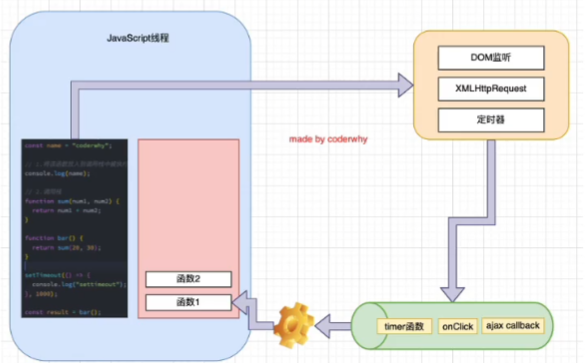
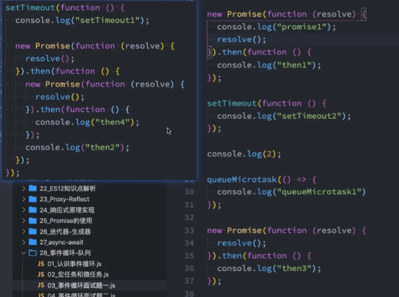
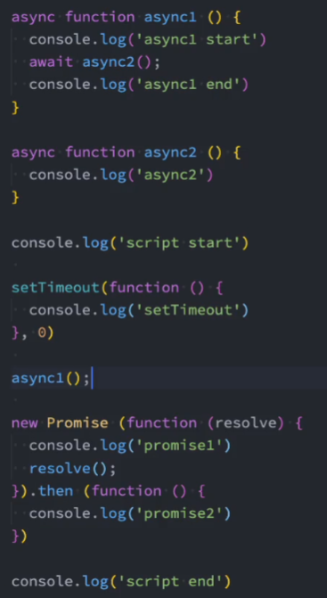
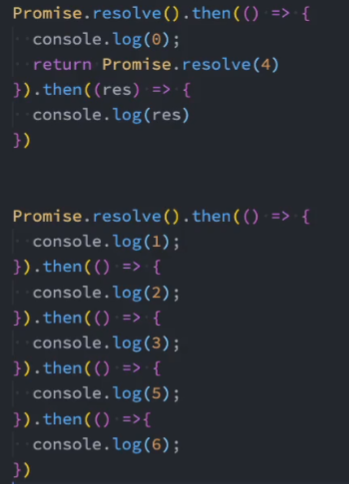

<!--
 * @Author: East
 * @Date: 2022-02-16 16:11:30
 * @LastEditTime: 2022-02-16 17:45:40
 * @LastEditors: Please set LastEditors
 * @Description: 浏览器Node的事件循环 + 微任务 + 宏任务
 * @FilePath: \forGreaterGood\javascript\coderwhy\23-浏览器Node的事件循环+微任务+宏任务.md
-->

# 浏览器 Node 的事件循环 + 微任务 + 宏任务 + 面试题

## 一、浏览器 Node 的事件循环

### 1.1 引入

耗时操作(类似于 setTimeout、网络请求、Promise.then、点击事件)，不会放在 js 线程里运行，否则会阻塞

### 1.2 浏览器的事件循环

- js 线程进行从上到下的单线程操作
- 计时器 or 其他耗时操作 在 到点了 or 触发 时，将对应的回调函数加入到 **事件队列**

## 二、微任务 + 宏任务

- 脚本的主要代码 main script
- 事件队列
  - 微任务队列 macrotask queue
    - ajax
    - setTimeout
    - setInterval
    - DOM 监听
    - UI Rendering
    - ...
  - 宏任务队列 microtask queue
    - Promise 的 then 回调
    - Mutation Observer API
    - queueMicrotask

执行顺序：

1. main script 中的代码优先执行(编写的顶层 script 代码)
2. 在执行任何的宏任务之前，都需要先保证微任务队列已经被清空

## 三、面试题

### 3.1 面试题 1

结果：
promise1
2
then1
queueMicrotask1
then3
setTimeout1
then2
then4
setTimeout2

### 3.2 面试题 2

结果：
script start
async1 start
async2
promise1
script end
async1 end
promise2
setTimeout

### 3.3 面试题 3

结果：
0
1
2
3
4
5
6
