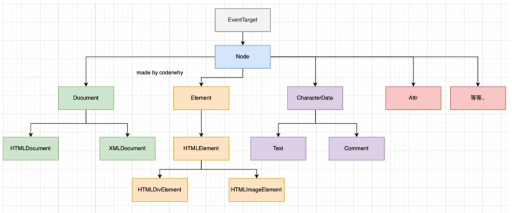

<!--
 * @Author: East
 * @Date: 2022-02-17 14:29:45
 * @LastEditTime: 2022-02-17 17:41:41
 * @LastEditors: Please set LastEditors
 * @Description: DOM 操作架构 + 浏览器事件
 * @FilePath: \forGreaterGood\javascript\coderwhy\30-DOM操作架构+浏览器事件.md
-->

# DOM 操作架构 + 浏览器事件

前端渲染：前端获取数据，通过 js 代码 转成 html 代码，渲染页面

## 一、DOM 操作架构

DOM：Document Object Model，沟通 HTML 元素 与 js 代码 的 桥梁

- 浏览器是用来展示网页的，而网页中最重要的就是里面的各种标签元素，JavaScript 很多时候是需要操作这些元素的
  - js 如何操作元素呢？ -- by Document Object Model(DOM，文档对象模型)
  - DOM 给我们提供了一系列的模型和对象，让我们可以方便地来操作 Web 页面



### 1.1 EventTarget

DOM 都支持 EventTarget：`addEventListener`, `removeEventListener`

- 一个 HTML 页面被解析，就会自动创建一个 Document 对象

### 1.2 Node

DOM 都支持 Node：

- 都有 `nodeName` 属性，返回大写的元素类型

  ```js
  const divEl = document.querySelector("#div");
  console.log(divEl.nodeName); // 'DIV'
  ```

- `nodeType`
- `childNodes`
- `nodeValue`：文本节点才有，否则为 `null`
- `appendChild()`

**注意**：虽然 document 对象继承自 Node 类，但浏览器不允许其使用 `appendChild()` 方法，一般使用 `document.body.appendChild()`

### 1.3 document

1. 属性
   - `document.body`
   - `document.title`
   - `document.head`
   - `document.children`：HTMLCollection 整个 html 元素
   - `document.location`：和 `window.location` 是同一个对象
2. 方法
   - 创建元素
     ```js
     /* 以下两种方法相同 */
     const imgEl1 = document.createElment("img");
     const imgEl2 = new HTMLImageElement();
     ```
   - 获取元素
     ```js
     const div1 = document.getElementById("div1");
     const div2 = document.getElementsByTagName("div"); // 获取到的是一个数组
     const div3 = document.getElementsByName("title"); // 获取到一个数组，因为可能有多个元素用相同的 name
     const div4 = document.querySelector("#content"); // 获取第一个
     const div4 = document.queryAll("#content"); // 获取所有
     ```

### 1.4 Element

#### 1.4.1 属性

```js
const div = document.querySelector("#content");
div.id; // 'content'
div.tagName; // 'DIV'
div.children; // HTMLCollection 数组
div.className; // 字符串形式，以空格隔开
div.classList; // 数组形式
div.clientWidth; // 元素宽度
div.clientHeight; // 元素高度
div.offsetLeft; // 距离左边的距离
div.offsetTop; // 距离顶部的距离
```

#### 1.4.2 方法

```js
const div = document.querySelector("#content");
div.getAttribute("age"); // age 属性的值
```

## 二、浏览器事件

### 2.1 认识事件监听

> 前面讲到了 JavaScript 脚本和浏览器之间交互时，浏览器给我们提供的了 BOM、DOM 对象模型。事实上，还有一种需要和浏览器经常交互的事情就是 **事件监听**。浏览器在某个时刻可能会发生一些事件，比如鼠标点击、移动、滚动、获取、失去焦点、输入内容等一系列的事件

我们需要以某种方式(代码)来对这些事件进行响应，进行事件的处理

- 在 Web 中，事件在浏览器窗口中被触发，并且通过绑定到某些元素上 or 浏览器窗口本身，我们就可以给这些元素 or window 窗口来绑定事件的处理程序，对事件进行监听。

- 如何进行事件的监听？
  1. 方式一：在元素中直接监听
  2. 方式二：通过元素的 `on` 来监听：重复会被覆盖 ---- DOM 0
  3. 方式三：通过 `EventTarget` 中的 `addEventListener` 来监听 ----- DOM 2

### 2.2 认识事件流的由来

- 对于事件，有一个概念叫做**事件流**，为什么会产生事件流呢？
  1. 我们可以想到一个问题：当在浏览器上对一个元素点击时，你点击的不仅仅是这个元素本身
  2. 这是因为我们的 HTML 元素是存在**父子元素叠加层级**的
  3. 比如 一个 `span` 元素是放在 `div` 元素上的，`div` 元素是放在 `body` `元素上的，body` 元素是放在 `html` 元素上的

#### 2.2.1 冒泡

从内到外的事件流称为事件冒泡：addEventListener(eventName, callback)

#### 2.2.2 捕获

从外向内的事件流称为事件捕获：addEventListener(eventName, callback, true)

#### 2.2.3 解释

为什么会产生两种不同的处理流呢？

- 因为早期浏览器开发时，不管是 IE 还是 Netscape 公司都发现了这个问题，但他们采用了完全相反的事件流来对事件进行传递

  - IE：事件冒泡
  - Netscape 事件捕获

- 如果同时存在冒泡和捕获，则捕获先处理

### 2.3 事件对象(event)的属性和方法

- 属性
  ```js
  divEl.addEventListener("click", (event) => {
    console.log("被点击了", event);
    console.log("事件的类型：", event.type); // 'click'
    console.log("事件的元素：", event.target); // 被点击的元素对象
    console.log("当前处理的元素：", event.currentTarget); // 回调函数的目标元素对象
    console.log("事件发生的位置：", event.offsetX, event.offsetY);
  });
  ```
- 方法
  1. `preventDefault()`：阻止默认行为
  2. `stopPropagation()`：阻止事件进一步传递
  3. `stopImmediatePropagation()`：多个回调函数，只执行这一个
