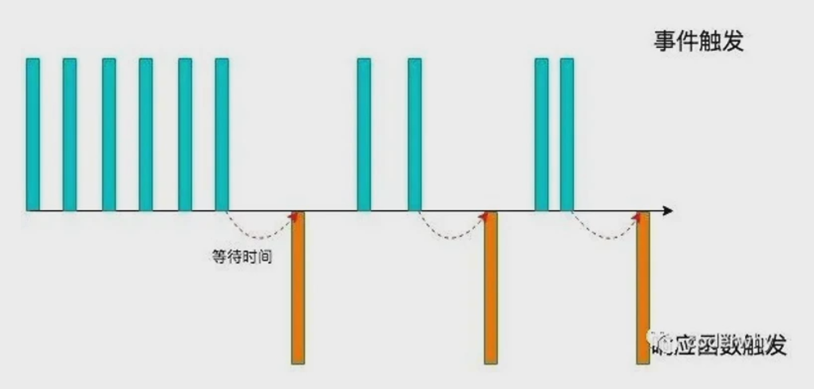
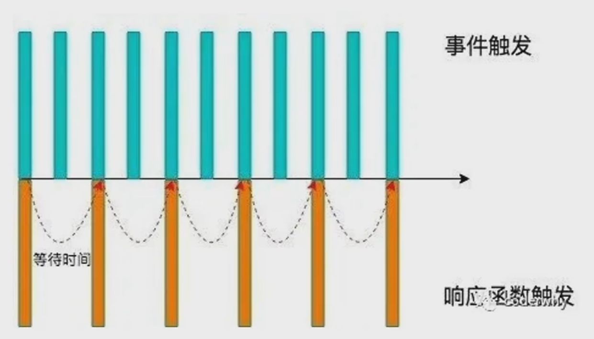

<!--
 * @Author: East
 * @Date: 2022-02-17 17:43:31
 * @LastEditTime: 2022-02-17 23:52:25
 * @LastEditors: Please set LastEditors
 * @Description: 防抖 + 节流函数实现
 * @FilePath: \forGreaterGood\javascript\coderwhy\31-防抖+节流函数实现.md
-->

# 防抖 + 节流函数实现

- 防抖和节流的概念其实最早并不是出现在软件工程中，防抖是出现在电子元件中，节流出现在流体流动中
  - 而 JavaScript 是事件驱动的，大量的操作会触发事件，加入到事件队列中处理
  - 而对于某些频繁的事件处理会造成性能的损耗，对此我们可以通过防抖和节流来限制事件频繁地发生
- **面试经常被问到**

## 一、防抖

### 1.1 认识 防抖 debounce 函数



- 过程理解：
  - 当事件被触发时，相应的函数并**不会被立即调用**，而是会**等待一定的时间**
  - 当事件**被密集触发**时，函数的调用会**被频繁地推迟**
  - 只有等待了一段时间也没有事件触发，才会真正地执行响应函数
- 应用场景：
  1. 输入框频繁地输入内容，搜索 or 提交信息
  2. 频繁地点击按钮，触发某个事件
  3. 监听浏览器滚动事件，完成某些特定的操作
  4. 用户缩放浏览器的 resize 事件

### 1.2 案例

1. 要求：

   - 监听 input 的输入，通过打印模拟网络请求

     ```html
     <input class="search" type="text>
     ```

     ```js
     // 1. 获取输入框
     const search = document.querySelector(".search");

     // 2. 监听输入内容，发送请求
     let counter = 0;
     function searchChange() {
       couter++;
       console.log(`发送第 ${counter} 网络请求`);
     }

     // 3. 绑定 oninput 事件
     search.oninput = searchange;
     ```

2. 使用第三方库：Underscore 库

   ```html
   <!-- cdn 引入 -->
   <script src="https://cdn.jsdelivr.net/npm/underscore@1.3.1/underscore-umd-min.js"></script>
   ```

   ```js
   const inputChange = _.debounce(searchInput, 2000);
   search.oninput = inputChange;
   ```

### 1.3 手写

#### 1.3.1 基本实现

```js
function debounce(fn, delay) {
  let timer = undefined;
  const _debounce = function (...args) {
    timer && clearTimeout(timer); // 防止第一次输入时也取消，会出错
    // 延迟执行
    timer = setTimeout(() => {
      fn.apply(this, args);
    }, delay);
  };

  return _debounce;
}
```

### 1.3.2 立即执行功能

> 有的人会需要立即执行，有的人不需要

```js
function debounce(fn, delay, immediate = false) {
  let timer = undefined;
  let isInvoke = false; // 是否立即执行过
  const _debounce = function (...args) {
    timer && clearTimeout(timer); // 防止第一次输入时也取消，会出错
    // 判断是否需要立即执行
    if (immediate && !isInvoke) {
      fn.apply(this.args);
      isInvoke = true;
    }
    // 延迟执行
    timer = setTimeout(() => {
      fn.apply(this, args);
      isInvoke = false;
    }, delay);
  };

  return _debounce;
}
```

### 1.2.3 取消功能

## 二、节流

### 2.1 认识节流 throttle 函数



- 过程理解：
  - 当事件触发时，会执行这个事件的响应函数
  - 如果这个事件被频繁触发，那么节流函数会按照一定的频率来执行函数
  - 不管在这个中间有多少次触发这个事件，执行函数的频率总是固定的
- 应用场景：
  1. 监听页面的滚动事件
  - 鼠标移动事件
  - 用户频繁点击按钮的操作
  - 游戏中的一些设计

### 2.2 案例

同 1.2

```html
<!-- cdn 引入 -->
<script src="https://cdn.jsdelivr.net/npm/underscore@1.3.1/underscore-umd-min.js"></script>
```

```js
const inputChange = _.throttle(searchInput, 2000);
search.oninput = inputChange;
```
