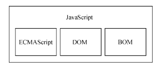

<!--
 * @Author: East
 * @Date: 2022-01-13 17:10:23
 * @LastEditTime: 2022-01-17 21:36:31
 * @LastEditors: Please set LastEditors
 * @Description: 1. js 历史回顾
                 2. js 是什么
                 3. js 与 ECMAScript 的关系
                 4. JavaScript 的不同版本
 * @FilePath: \forGreaterGood\javascript\js红宝书4\1-什么是JavaScript.md
-->

# 什么是 JavaScript？

- 1995 年，JavaScript 问世。
- 当时用于替代 Perl 等服务器端语言**处理输入验证**
- 要真正学好用好 JavaScript，理解其**本质、历史及局限性**是非常重要的

## 1. 简短的历史回顾

> 随着 Web 日益流行，对客户端脚本语言的需求也越来越强烈。

### 1.1 历史前提

- 使用 28.8k bits/s 的调制解调器上网
- 网页变得越来越大、越来越复杂
- 验证简单的表单，需要大量与服务器的往返通信

--> 于是 网景公司将**开发一个客户端脚本语言来处理这种简单的数据验证**提上了日程 -- Brendan Eich

### 1.2 神仙打架

1. 网景公司在 Netscape Navigation 2 发布了 JavaScript 1.0，非常成功。
2. Netscape Navigation 3 中发布 JavaScript 1.1。
3. Netscape Navigation 3 发布后不久，微软发布了 IE 3，其中包含自己名为 JScript 的 JavaScript 实现。
4. 1996 年 8 月，微软重磅进入 Web 浏览器领域。

--> 这意味着出现了两个版本的 JavaScript。但 JavaScript 还**没有规范其语法或特性的标准**，这两个版本的并存让这个问题更加突出。

### 1.3 标准的出现

1. 1997 年，JavaScript 1.1 作为提案被提交给欧洲计算机制造商协会(Ecma)。第 39 技术委员会(TC39)承担了**“标准化一门通用、跨平台、厂商重力的脚本语言的语法和语义”**的任务。
   - 成员来自 网景、Sun、微软、Borland、Nombas 和其他对这门脚本语言有兴趣的公司的工程师
2. 数月后，名为 ECMA-262(即 ECMAScript) 的脚本语言标准被打造完成
3. 1998 年，国际标准化组织(ISO) 和 国际电工委员会(IEC) 也将 ECMAScript 采纳为标准(ISO/IEC-16262)
4. 自此以后，各家浏览器均以 ECMAScript 作为自己 JavaScript 实现的依据，虽然具体实现各有不同。

## 2. JavaScript 实现

完整的 JavaScript 实现包含以下几个部分：

- 核心 ECMAScript
- 文档对象模型 DOM
- 浏览器对象模型 BOM
