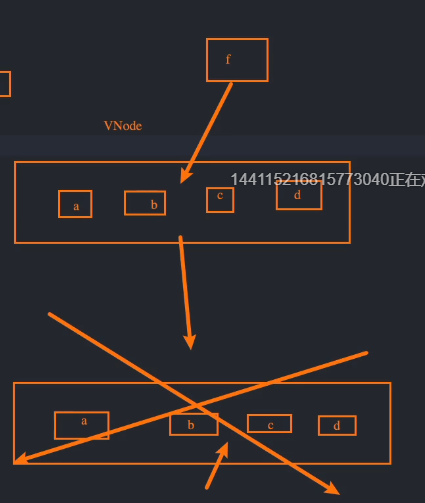

<!--
 * @Author: your name
 * @Date: 2021-11-04 15:59:08
 * @LastEditTime: 2021-11-04 16:53:39
 * @LastEditors: Please set LastEditors
 * @Description: diff 算法 ---- key
 * @FilePath: \vue3+ts\03-diff算法.md
-->
# diff 算法
## v-for 中 key 的作用
> 在使用 v-for 进行列表渲染的时候，我们一般推荐给每一项绑定一个 key 属性
### 官方解释
1. key 属性主要用在 Vue 的虚拟 DOM 算法，在新旧 nodes 对比时辨识 VNodes；
2. 如果不使用 key，Vue会使用一种最大限度减少动态元素并且尽可能地尝试就地修改/复用相同类型元素的算法；
3. 而使用 key 时，它会基于 key 的变化重新排列元素顺序，并且会移除/销毁 key 不存在的元素

### 认识 VNode
+ 全称 Virtual Node，也就是虚拟节点
+ 事实上，无论是组件还是元素，它们最终在 Vue 中表现出来的都是一个个 VNode
+ 本质：JavaScript 对象
+ VNode 树
  - 如果我们不只是一个简单的 div，而是有一大堆的元素，那么它们会形成一个 VNode Tree
  - template --> 虚拟 DOM(Virtual DOM) --> 真实 DOM
    * 虚拟 DOM：树结构
    * 真实 DOM：树结构

### key ---- 插入 F 案例
> 对数组 [a, b, c, d] 进行列表渲染，然后在中间插入一个 f 元素
1. 最低效的方法 ---- 全部删掉重新渲染
2. 较好的办法 ---- a，b不变，将 c，d 改为 f，c，添加 d
3. 最好的办法 ---- a，b，c，d都不变，在 b 与 c 之间插入 f

> 事实上，Vue 事实上会对 key 的有无分别调用不同的方法
+ 有 key --> patchKeyedChildren 方法
  - 第三种方法
  - 步骤
    1. 先从头部开始遍历，使用 while 循环，比较节点是否相同 ---- type 与 key
       1. 相同，比较下一对
       2. 不同，跳出循环
    2. 从尾部开始遍历，比较节点
    3. 如果仍有新节点，挂载 patch()
    4. 如果旧节点比较多，卸载 unmount()
    5. 如果中间是无序变化
+ 无 key --> patchUnkeyedChildren ---- 第2种方法，对比 type 和内容
