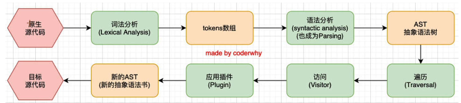

<!--
 * @Author: your name
 * @Date: 2021-11-07 20:14:45
 * @LastEditTime: 2021-11-08 16:40:26
 * @LastEditors: Please set LastEditors
 * @Description: 打开koroFileHeader查看配置 进行设置: https://github.com/OBKoro1/koro1FileHeader/wiki/%E9%85%8D%E7%BD%AE
 * @FilePath: \forGreaterGood\vue3\08-Babel和vue文件打包.md
-->

# Babel 和 .vue 文件打包

## Babel

### 介绍 babel

- why need babel?
  - es6+
  - ts
  - react
    - jsx 代码需要通过 babel 转成普通的 js 代码
- babel 是一个工具链
  - 主要用于旧浏览器或者环境中将 ES6+ 代码转换为向后兼容版本的 js 代码
    - 包括语法转换、源代码转换

### 使用 babel

[官网](https://babeljs.io)

#### babel 命令行使用

- 本身可以作为一个独立的工具，不和 webpack 等构建工具配置来单独使用
- 需要安装的库
  - @babel/core：babel 的核心代码，必须安装
  - @babel/cli：可以让 babel 在命令行使用

1. `npm install @babel/core @babel/cli -D`
2. ES6+ 的代码

   ```js
   const msg = "hello";
   const names = ["a", "b", "c"];

   names.forEach((item) => console.log(item));
   ```

3. `npx babel demo.js --out-dir dist` --> 仍然是 ES6 的语法，没有转换
   - 需要转换什么，就要用专门的插件
4. 用了箭头函数 --> 使用箭头函数插件 `npm install @babel/plugin-transform-arrow-functions -D`
5. `npx babel demo.js --out-file test.js --plugins=@babel/plugin-transform-arrow-functions`
6. 常量定义 const `npm install @babel/plugin-transform-block-scoping -D` --> `npx babel demo.js --out-file test.js --plugins=@babel/plugin-transform-arrow-functions,@babel/plugin-transform-block-scoping`
7. ...要吐了

##### babel 的预设 preset

1. `npm install @babel/preset-env -D`
2. `npx babel demo.js --out-file test.js --presets=@babel/preset-env`

### Babel 的底层原理

> babel 是如何将一段代码(es6、ts、react)转成另外一段代码(es5)？

- 这是**编译器**的工作，可以将 babel 看成是一个编译器
- babel 也拥有编译器的工作流程
  - 解析阶段 Parsing
  - 转换阶段 Transformation
  - 生成阶段 Code Generation
#### Babel 编译器执行原理

1. 原生源代码：ES6+、TS
2. 词法分析：分割，分析关键字 --> tokens 进入数组
3. 语法分析：分析语法，比如 const 等 --> 生成 AST 树
4. 遍历 AST 树：例如，找到 const，通过应用插件，转换 const 关键字为 var --> 生成新的 AST 树
5. 根据新的 AST 树，生成新的代码

### babel 在 webpack 中的使用
1. `npm install babel-loader`
   + 注意，需要提前安装 @babel/core
2. webpack.config.js 配置
   ```js
   {
     test: /\.js$/,
     loader: 'babel-loader'
   }
   ```
3. 没有转换：没有应用插件 --> 配置改进：插件也需要提前安装
   ```js
   {
     test: /\.js$/,
     use: {
       loader: 'babel-loader',
       options: {
         plugins: ['@babel/plugin-transform-arrow-functions', '@babel/plugin-transform-block-scoping']
       }
     }
   }
   ```
4. 配置太麻烦了，用 preset
   ```js
   {
     test: /\.js$/,
     use: {
       loader: 'babel-loader',
       options: {
         presets: ['@babel/preset-env']
       }
     }
   }
   ```
#### Babel 的配置文件
+ 常见配置文件的编写
  - babel.config.json(or .js, .cjs, .mjs)
    * 现在常用配置(babel7 开始)，可以直接作用于 Monorepo 的方式
  - .babelrc.json(or .babelrc, .js, .cjs, .mjs)
    * 早期配置
+ 具体实现
  ```js
  /** babel.config.js */
  module.exports = {
    presets: ['@babel/preset-env']
  }
  /** webpack.config.js */
  {
     test: /\.js$/,
     loader: 'babel-loader'
   }
  ```
## .vue 文件打包
### webpack 对 Vue 源代码的打包
1. 安装 Vue：`npm install vue@next`
2. Vue 代码
   ```js
   /** main.js */
   import { createApp } from 'vue'

   createApp({
     template: `<h2>渲染</h2>`,
     data() {
       return {
         title: 'hello'
       }
     }
   }).mount('#app')
   ```
3. `npm run build` --> 会报警告，因为默认的 runtime-only 不支持 template 写法
   - runtime+compiler
      - 支持 template
   + runtime-only
     - 默认版本
4. 指定 Vue 版本 `import { createApp } from 'vue/dist/vue.esm-bundler'`

### Vue 打包后不同版本解析
+ vue(.runtime).global(.prod).js
  - 通过浏览器的 `<script>` 直接使用
  - CDN 和下载的 Vue文件 都是这个版本
  - 会暴露出一个全局的 Vue 来使用
+ vue(.runtime).esm-browser(.prod).js
  - 用于通过原生 ES 模块导入使用(`<script type='module'>`)
+ vue(.runtime).esm-bundler.js
  - 用于 webpack、rollup、parcel 等构建工具
  - 构建工具中默认的是 vue.runtime.esm-bundler.js
  - 如果需要解析模板 template，则需要手动指定 vue.esm-bundler.js
+ vue.cjs(.prod).js
  - 服务端渲染使用
  - 通过 require() 在 Node.js 中使用
### 运行时 + 编译器 VS 仅运行时
> Vue 开发过程中有三种方式来编写 DOM 元素
+ 方式一：template 模板
  - template 必须通过源码中的一部分代码来进行编译
+ 方式二：render 函数的方式，使用 h 函数来编写渲染的内容
  - h 函数直接返回一个虚拟节点，即 Vnode 节点
+ 方式三：.vue 文件中的 template 来编写模板
  - .vue 文件中的 template 可以通过 vue-loader 来堆砌进行编译和处理
+ 因此有 运行时+编译器 VS 仅运行时
  - 运行时+编译器：包含了对 template 模板的编译代码，更加完善，但也更大一些
  - 仅运行时：不包含对 template 模板的编译代码，相对更小一些

### SFC
> 真实开发中，我们使用 SFC(single-file components) 单文件组件
1. 代码编写
    ```js
    /** main.js */
    import { createApp } from 'vue'

    import App from './vue/App.vue'

    const app = createApp(App)
    app.mount('#app')
    ```
    ```vue
    <template>
      <h2>我是 Vue 渲染出来的</h2>
      <h2>{{ title }}</h2>
    </template>

    <script>
      export default {
        data() {
          return {
            title: 'hello'
          }
        }
      }
    </script>

    <style>
      h2 {
        color: red;
      }
    </style>
    ```
2. `npm run build` --> 打包失败，需要一个合适的 loader -- vue-loader
3. `npm install vue-loader@next -D`
4. webpack.config.js 配置
   ```js
   {
     test: /\.vue/,
     loader: 'vue-loader'
   }
   ```
5. `npm install @vue/compiler-sfc -D` ---- 真正解析 .vue 文件
6. webpack.config.js
   ```js
   const { VueLoaderPlugin } = require('vue-loader/dist/index')

   plugins: {
     new VueLoaderPlugin()
   }
   ```

### 配置
+ \_\_VUE_OPITIONS_API__：对 vue2 做适配
  - 如果不需要，则会 tree-shaking 掉适配 vue2 的代码
+ \_\_Vue_PROD_DEVTOOLS__：调试工具
+ 具体配置
  ```js
  /** webpack.config.js */
  plugins: [
    new DefinePlugin({
      BASE_URL: "'./'",
      __VUE_OPITIONS_API__: true, // 适配 vue2
      __Vue_PROD_DEVTOOLS__: false // 不要
    })
  ]
  ```
