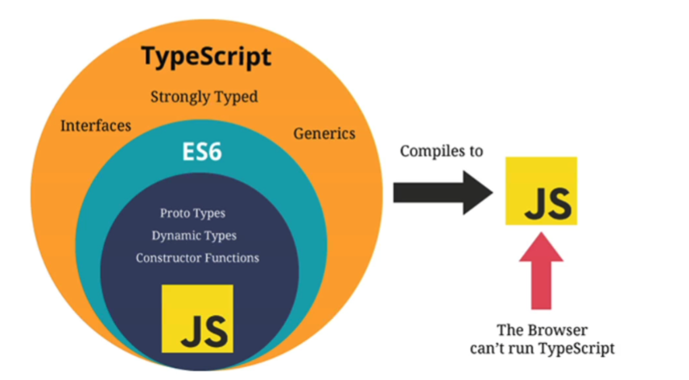

<!--
 * @Author: East
 * @Date: 2021-11-22 18:48:39
 * @LastEditTime: 2021-11-22 19:56:20
 * @LastEditors: Please set LastEditors
 * @Description: 打开koroFileHeader查看配置 进行设置: https://github.com/OBKoro1/koro1FileHeader/wiki/%E9%85%8D%E7%BD%AE
 * @FilePath: \forGreaterGood\vue3\27-ts数据类型和类型操作.md
-->
# TypeScript 数据类型和类型操作
[官网](https://typescriptlang.org)

## 数据类型
### JavaScript 和 TypeScript 的数据类型

+ ts 是 js 的超集
  + strongly typed：强类型
  + generics：泛型
  + interface：接口
+ 类型
  + number：不区分 int 和 float
    - let num: number = 100
    - 0b100 -- 二进制
    + 0o100 -- 八进制
    + 0x100 -- 十六进制
  + boolean: `let flag: boolean = true`
  + string
  + Array
    - 良好的习惯：存放的数据类型固定
    - 写法
      - `const name: Array<string> = []` -- 开发中不推荐，因为在 jsx 中有冲突，html 标签也用了尖括号，编译器不知道如何解析
      - `const name: string[] = []`
  + object
    - 建议让其自行推导
      ```js
      const info = {
        name: 'why',
        age: 18
      }
      ```
  + null
    - null 类型的值为 null
    - 如果推导的话，会推导为 any 类型
  + undefined
  + symbol
  + any
    - 某些情况下，无法确定变量类型时使用
+ 如果可以推导出对应的标识符的类型时，一般不加类型注解(type annotation)
