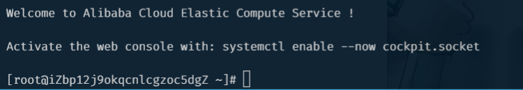
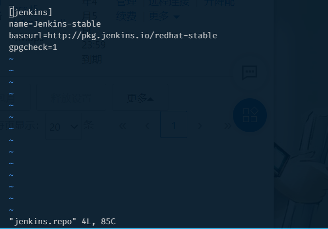

<!--
 * @Author: East
 * @Date: 2021-12-18 12:26:16
 * @LastEditTime: 2021-12-18 19:44:02
 * @LastEditors: Please set LastEditors
 * @Description: 项目打包和自动化部署
 * @FilePath: \forGreaterGood\vue3\44-项目打包和自动化部署.md
-->

# 项目打包和自动化部署

## why 项目需要部署？

1. 在自己的电脑上运行项目
   - 在自己的浏览器上使用
   - 问题：给别人做的工作，是别人要用
2. 部署到云服务器上
   1. 获取到一个云服务器：购买 or other ways
   2. 一个云服务器对应一个公网 ip (可映射域名)
   3. 其他任何电脑都可以通过这个 公网 IP 访问这个云服务器

## 项目部署

### 一、传统的开发模式

- 步骤
  1. 需求整理
  2. 开发 code
  3. build 打包上线
  4. test 测试
  5. release
  6. operate
- 弊端
  1. 工作的不协调：开发人员在开发阶段，测试和运维人员其实是处于等待的状态。等到测试阶段，开发人员等待测试反馈 bug，也会处于等待状态
  2. 线上 bug 的隐患：项目准备交付时，突然出现了 bug，所有人员需要加班、等待问题的处理

### 二、DevOps 开发模式

- DevOps 是 Development 和 Operations 两个词的结合，将开发和运维结合起来的模式

### 三、持续集成 + 持续交付

- 持续集成
- 持续交付 or 持续部署

### 正式开始阿里云

1. 购买云服务器
   1. 操作系统 --- 一般 CentOS or Ubuntu
   2. 安全组 --- 开放的端口
      - 授权对象 0.0.0.0 表示所有人都可以访问
   3. 自定义密码
      1. 默认登录名 root
      2. 设置密码
2. 重置服务器
3. 停止
4. 更换操作系统
   1. 镜像 --- CentOS 8.2 64 位
   2. 系统盘 --- 高效云盘 40 GiB
   3. 自定义密码
      - root
      - Greater111
   4. 勾选服务协议

### 使用服务器

1. 连接 by git bash
   1. `ssh root@[公网 ip]`
   2. Are you sure you want to continue connecting (yes/no/[fingerprint])? --- `yes`
   3. root@[公网 ip]'s password: `Greater111`
   4. 连接成功 
2. 进入 root 目录
   1. `cd ..`
   2. `cd /root/` --- 即一开始进入的目录
3. 搭建环境
   1. 安装 Jenkins ---- 需要有 dnf，用于管理操作系统包的工具，类似于 npm
      1. 需要先安装 Java：`dnf search java-1.8`
      2. 会搜索到好多，安装第一个：`dnf install java-1.8.0-openjdk.x86_64`
      3. Is this ok [y/N]? --- `y`
      4. `java` 测试是否安装成功
      5. `dnf search jenkins`：嘿嘿，想不到吧，搜不到，只能搜到 python 的
      6. `wget –O /etc/yum.repos.d/jenkins.repo http://pkg.jenkins-ci.org/redhat-stable/jenkins.repo` ：远程下载工具，去 Jenkins 官网下载，下载到 /etc/yum.repos.d/ 文件夹下，命名为 jenkins.repo
      7. 在当前 root 目录下查看，发现下载到了 root 目录下，需要移动 `mv jenkins.repo /etc/yum.repos.d/`
      8. 导入 GPG 密钥以确保您的软件合法: `rpm --import https://pkg.jenkins.io/redhat/jenkins.io.key`
      9. 需要对 jenkins.repo 需要更改：`vi jenkins.repo` 
      10. 删除官网网址后的 `-stable`
      11. 保存并退出：i --> shitf + : --> wq --> enter
      12. 安装：`dnf install jenkins`
      13. Is this OK? ---`y`
      14. 启动：`systemctl start jenkins`
          1. 查看是否启动成功：`systemctl status jenkins`
          2. 退出：ctl + c
      15. 使 jenkins 随着操作系统的启动而启动：`systemctl enable jenkins`
          - 根据提示敲命令，Executing 后续部分
      16. Jenkins 默认跑在 8080 端口
          1. 在安全组中 8080 端口需要开启
          2. `cat /var/lib/jenkins/secrets/initialAdminPassword`：cat 命令为查看
          3. 安装推荐的插件
          4. 创建第一个管理员用户
             - 用户名：hello
             - 密码：Greater111
             - 邮箱地址：谷歌邮箱
          5. 保存
   2. 配置 nginx 环境
      1. `dnf install nginx`
      2. 启动
         1. `systemctl start nginx`
         2. `systemctl status nginx`
         3. `systemctl enable nginx`
4. 部署网页

   1. `cd /root/`
   2. 创建文件夹：`mkdir mall_cms`
   3. 在 mall_cms 下创建一个 index.html：`cd mall_cms/`, `touch index.html`
   4. 修改 ngxin 配置文件：`vi /etc/nginx/nginx.conf` --- 通过 vscode 修改

      1. 安装 remote ssh 插件
      2. 点击插件图标(屏幕)，点击 + ，在弹出框输入 `ssh root@[公网 ip]`，选择第一个
      3. 对新出现的 ip 地址，右键选择 Connect to Host in Current Window
      4. 选择 /etc/nginx/nginx.conf 文件

         ```yaml
         user root; # 第五行，将 user nginx 改成这个
         server {
            ...;
            # root /usr/share/nginx/html; #注释掉这句
            location / { # 添加配置
               root /root/mall_cms;
               index index.html;
            }
            ...;
         }
         ```

      5. 重新打开公网地址，得到新页面

5. 自动化部署 by Jenkins
   1. 新建 Item，命名 mall-cms
   2. 选择 FreeStyle project
   3. 源码管理选择 Git
      1. `dnf install git`
      2. 在 Repository URL 中粘贴 git 链接
      3. Crdential 选择 添加 -> Jenkins -> 用户名和密码 ->
