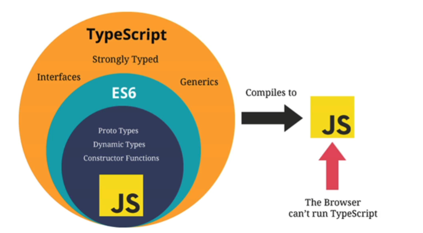

<!--
 * @Author: East
 * @Date: 2021-11-22 18:48:39
 * @LastEditTime: 2021-11-23 10:58:18
 * @LastEditors: Please set LastEditors
 * @Description: 打开koroFileHeader查看配置 进行设置: https://github.com/OBKoro1/koro1FileHeader/wiki/%E9%85%8D%E7%BD%AE
 * @FilePath: \forGreaterGood\vue3\27-ts数据类型和类型操作.md
-->
# TypeScript 数据类型和类型操作
[官网](https://typescriptlang.org)

## 数据类型
### JavaScript 和 TypeScript 的数据类型

+ ts 是 js 的超集
  + strongly typed：强类型
  + generics：泛型
  + interface：接口
+ 类型
  + number：不区分 int 和 float
    - let num: number = 100
    - 0b100 -- 二进制
    + 0o100 -- 八进制
    + 0x100 -- 十六进制
  + boolean: `let flag: boolean = true`
  + string
  + Array
    - 良好的习惯：存放的数据类型固定
    - 写法
      - `const name: Array<string> = []` -- 开发中不推荐，因为在 jsx 中有冲突，html 标签也用了尖括号，编译器不知道如何解析
      - `const name: string[] = []`
  + object
    - 建议让其自行推导
      ```js
      const info = {
        name: 'why',
        age: 18
      }
      ```
  + null
    - null 类型的值为 null
    - 如果推导的话，会推导为 any 类型
  + undefined
  + symbol
  + any
    - 某些情况下，无法确定变量类型时使用
    - `let message: any = 'hello'; message = 123`：可以改变类型
    - 当进行一些类型断言 `as any` 时使用
    - 不想给某些 JavaScript 代码添加具体的数据类型(与原生 JavaScript 一样)
    - 讨巧的 ts 手段
  + unknown
    - 无法赋值给其他类型
  + void：没有返回值，可以返回 undefined 或 null
  + never：永不返回结果
    - 应用场景：提醒别人，代码有问题，需要添加对 boolean 的处理
      ```js
      function handleMessage(message: string | number | boolean) {
        switch (typeof messaga) {
          case 'string':
            console.log('string 处理方式')
            break
          case 'number':
            console.log('number 处理方式')
            break
          default:
            const check: never = message
        }
      }

      handleMessage(true) // 报错
      ```
  + tuple：元组类型，多种元素的组合
    ```ts
    // 'why', 18, 1.88 个人信息
    const info: [string, number, number] = ['why', 18, 1.88]
    ```
    + react 中的例子
      ```js
      // hook: useState
      // const [counter, setCounter] = useState(10)
      function useState(state: any) {
        let currentState = state

        const changeState = (newState: any) => {
          currentState = newState
        }

        const tuple: [any, (newState: any) => void] = [currentState, changeState]

        return tuple
      }

      const [counter, setCounter] = useState(10)
      setCounter(11)
      ```
      + 优化 -- 泛型
        ```js
        function useState<T>(state: T) {
          let currentState = state

          const changeState = (newState: T) => {
            currentState = newState
          }

          const tuple: [T, (newState: T) => void] = [currentState, changeState]

          return tuple
        }

        const [counter, setCounter] = useState(10)
        setCounter(11)
        ```
  + 函数类型： `() => void`
    - 参数类型：`(num1: number, num2: number) => {}`
    - 返回值类型：`(num1: number, num2: number): number => { return num1 + num3 }`
      - 开发中，通常情况下可以不写返回值类型，会自动推导
      - 某些第三方库为方便使用者理解，会明确指定返回类型(主要看个人爱好)
    - 匿名函数参数类型
      ```ts
      const names = ['abc', 'cba', 'nba']
      names.forEach((item) => {})
      ```
      - 此时参数可以不作类型注解 ---- 根据上下文环境推导
    + 参数为对象类型
      ```ts
      function printPoint(point: {x: number, y: number, z?: number}) {
        console.log(point.x)
        console.log(point.y)
        console.log(point.z)
      }

      printPoint({x: 123, y: 321})
      ```
  + 联合类型(Union Type)
    ```ts
    function printId(id: number | string) {
      console.log(id)
      if (typeof id === 'string') { // narrow
        console.log(id.toUpperCase())
      }
    }

    printId(132)
    printId('111')
    ```
    + 类型个数 >= 2
    + 这些类型中的任一种类型
    + 联合类型中的每一个类型被称为联合成员(union's menber)
    + 类型别名：`type UnionType = string | number | boolean`
      - type 用于定义类型别名
  + 可选类型
    ```ts
    function foo(message?: string) {
      console.log(message)
    }

    foo()
    foo('123')
    ```
    + 但参数是一个可选类型时，该参数本质上是 `类型 | undefined` 的联合类型
+ 如果可以推导出对应的标识符的类型时，一般不加类型注解(type annotation)
